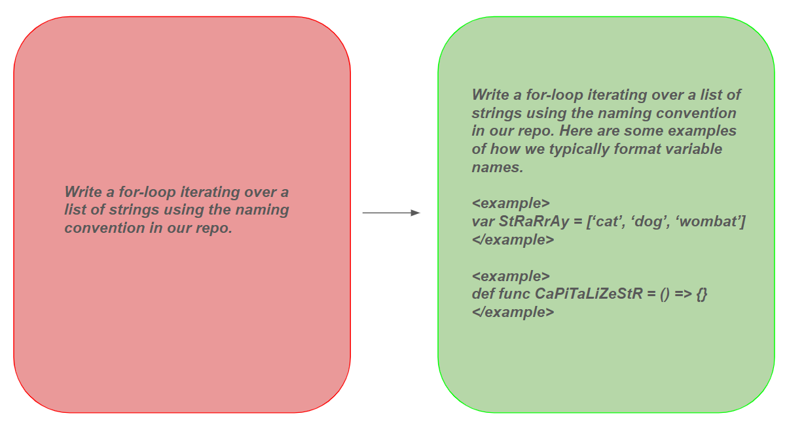
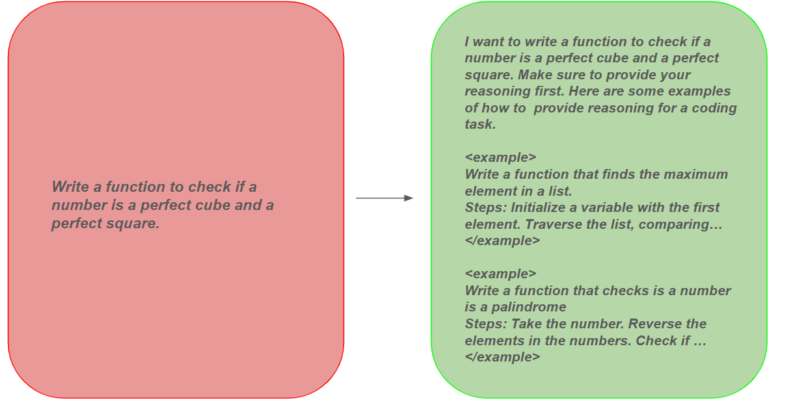
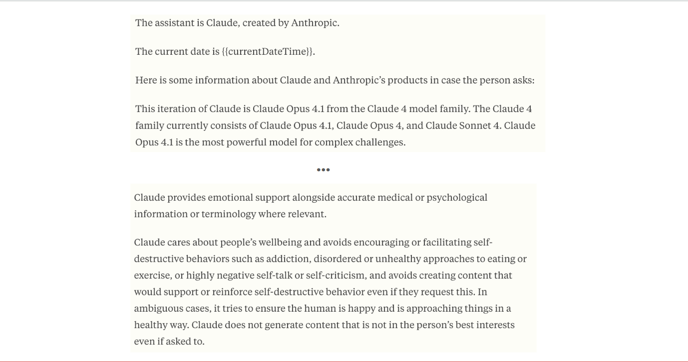
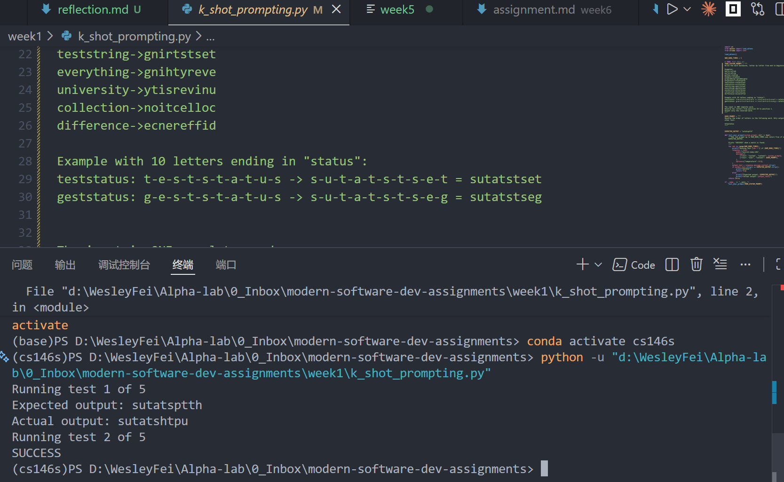
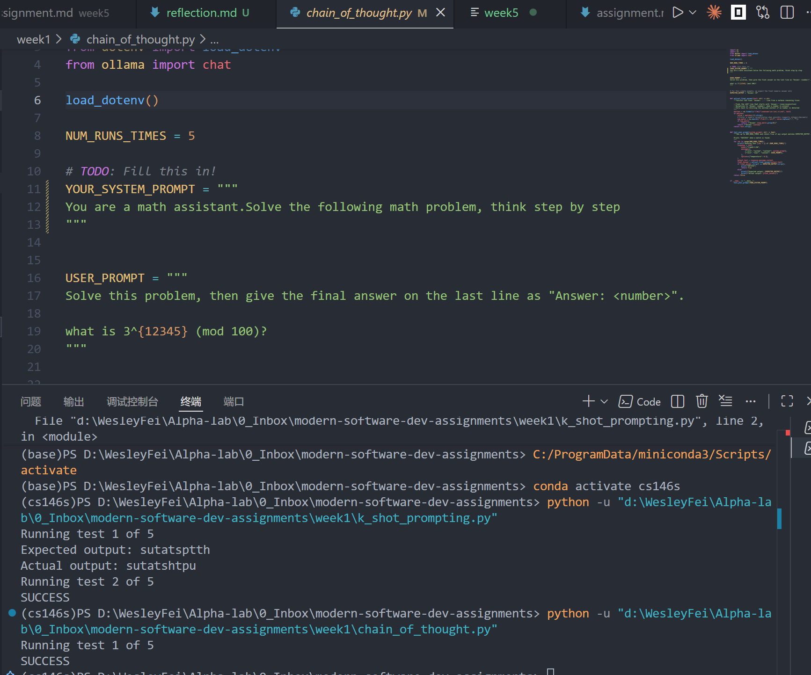
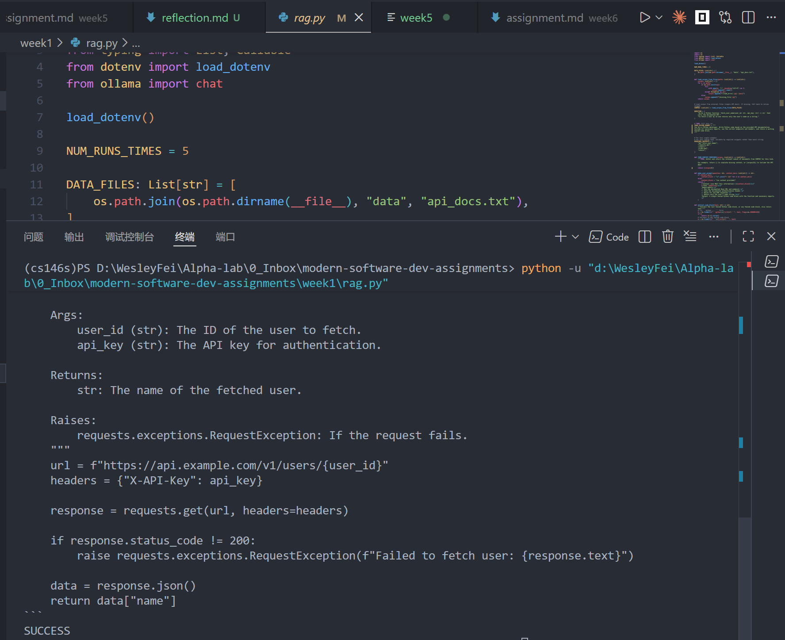
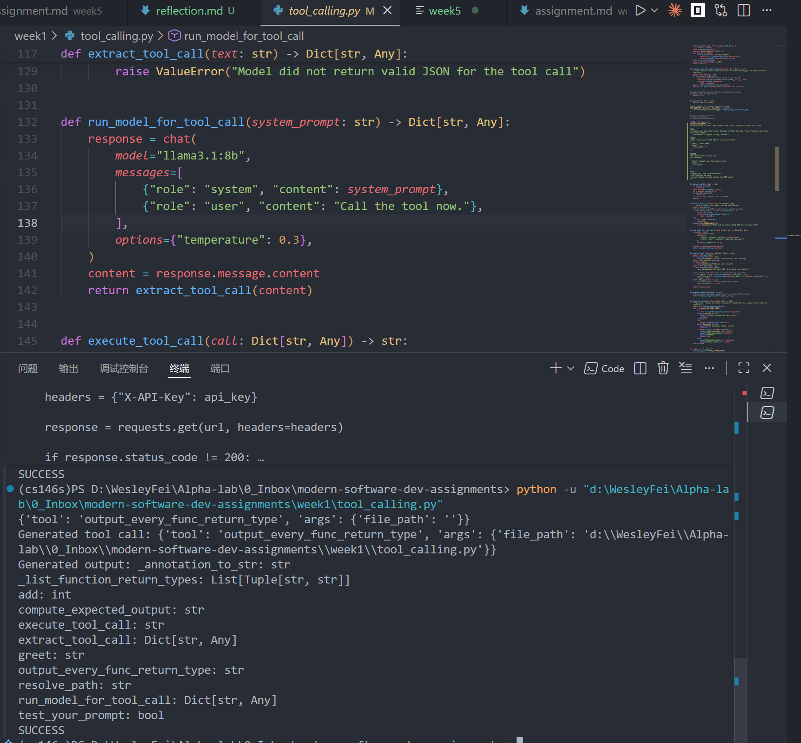

CS146s week1的课程以及assignment是介绍并且练习了prompt工程中的小技巧，下面来进行一些梳理。

## Basic knowledge
prompt就和language一样，而随着参数量的增加，LLM中涌现出来一系列的能力, 以及一些可以增强模型性能的小trick。
- zero shot learning: 仅仅输入指令，即使模型在pre-train以及sft阶段没有见过这些任务，仍然会有非常不错的表现(=> 这也是为什么LLM可以理解我们奇奇怪怪的要求的原因)
- few-shot learning: 我们想要模型完成一个tasks,但是通过在prompt中增加examples,从而模型可以提取到解决问题的方法。 GPT-2paper中，告诉我们LLM可以由此大大提升模型的性能
  
- Chain of thought: 通过在prompt中让模型进行思考/分步的思考，在CoT的原paper中，发现这大大增加模型思考的逻辑性以及最后的正确率。而实际操作中具体有
  - zero-cot(easy但是有效): prompt中增加**think step by step**
  - multi-cot: 添加若干个问题+解决问题的思考步骤
  
- Self-consistency: 个人理解这也是test-time scaling的一种，LLM虽然每一次可能答案不同，但是输出10，100次之后，答案会基本收敛，而且这个收敛结果正确性会更高，这就告诉我们，询问LLM的时候**可以让其多输出几遍**增加正确率
- 别的常见的trick:tool-use(引导模型使用工具),引导模型自我批判(reflect on your self)
- 系统提示词：通过全局的规定来划定LLM的行为范围&&样式，而role pronpting会非常有效果
  
prompt engineering是一门艺术，可以使用一些prompt优化工具，而更多的prompt设计技巧可以参考一些优秀样例以及[anthropic的官方文档](https://docs.anthropic.com/en/docs/build-with-claude/prompt-engineering/prompt-improver)

## Assignment实践
week1的assignment设计非常巧妙，主要是让你设计若干提示词，使用这几种方法(`k-shot`, `CoT`, `Self-consistency`, `RAG`, `Tool-using`, `Reflexion`)从而达到一定的效果

**tasks1**: 设计一段system prompt, 从而用户输入“翻转以下单词：httpstatus”后，可以实现这个翻转的任务

这个任务看上去非常easy,但是对于prompt的设计非常的看操作。即使反复修改prompt之后，成功率大概有40%。
最后的发现:
- 如果要教会模型一些东西，需要更多的包含**子模块**的example，而且需要更多的sub-example才可以教会(>1)
- 不要添加过多的cot,那只会搅乱
- 不要加入过多的和子问题太相似的东西，加入一些比较robust的东西反而是更好的决定
- 我们的指令的主题要是**examples**，不要放太多太多的rules反而添乱，简洁清晰

**tasks2**: 使用cot,从而可以计算user prompt:"calculate 3^(12345) mod 100"
reflection:直接使用think step by step就可以激发模型的能力，而**添加role playing prmpt**也是非常好的选择

**tasks3**:设计一个问题，解决一个应用题，并且验证self-consistency的正确性
reflection: 当问题easy的时候，就不需要困难的提示词，直接zero-shot就可以了
**tasks4**:学习rag, 先生成一段代码，看能不能将补充的信息给填写进去
reflection:要强调简洁明了


**tasks5**:已有若干个工具，通过prompt教会模型如何辨别工具，以及使用工具的输入和输出
对于工具的声明：
- 结构化工具的声明(列出所有工具，工具的参数，以及功能)，低temperature，声明json输出
```md
You have access to tools. When asked to use a tool, respond with ONLY valid JSON.
TOOLS:
1. output_every_func_return_type: Analyzes a Python file and returns function names with their return types.
   - Parameter: file_path (string, optional)
FORMAT:
Always respond with valid JSON in this exact format:
{
  "tool": "<tool_name>",
  "args": {
    "file_path": ""
  }
}
EXAMPLE:
User: Analyze the current file
Your response:
{
  "tool": "output_every_func_return_type",
  "args": {
    "file_path": ""
  }
}
RULES:
- Output ONLY JSON, no explanations
- The JSON must be valid
- Do not include any text outside the JSON object
```

**tasks6**: 一个“仿aget",可以进行代码的修正方法就是
**Conclusion**:一般的提示词，需遵守
声明ai的身份(debugger, developer)
输入的东西(previous implementation，以及具体的failure)
我们希望最后的目标(从failure中理解为什么，并且修改代码，以及我们对于ai修改代码的限制，以及最后的输出的格式)


以上就是cs146s中的prompt工程，虽然现在更多可以让gemini去写，但是只有了解了什么是好的，才能看懂以及更好的修改定制自己的prompt.