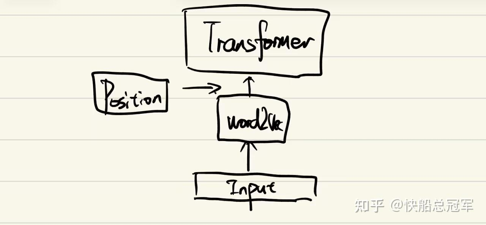
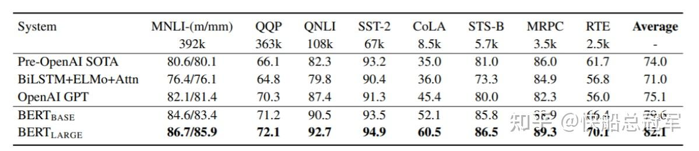
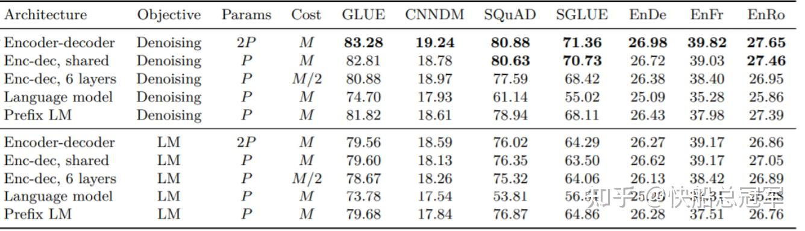
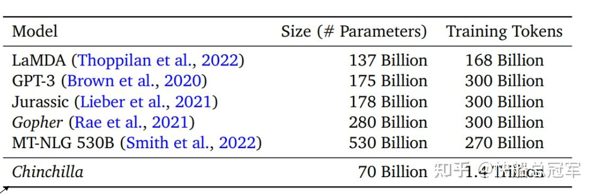
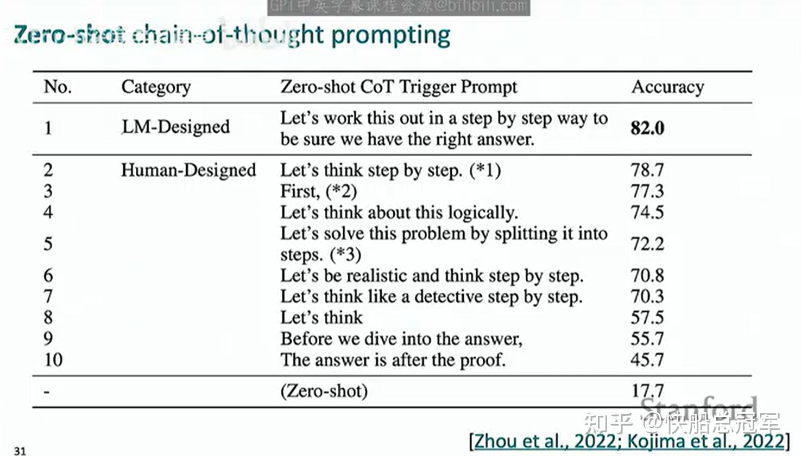
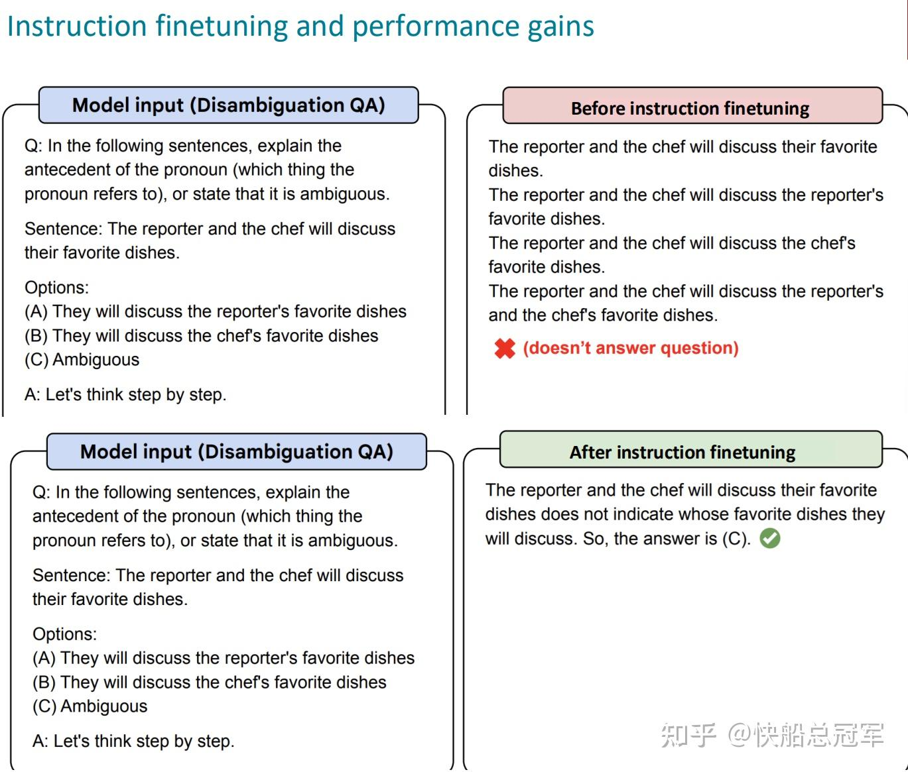
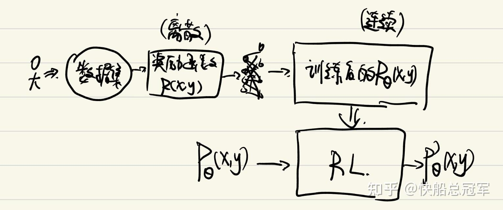

---
title: 'CS224N: Between Transformer and GPT4'
publishDate: 2026-01-11
updatedDate: 2026-01-11
description: '深入探讨Transformer到GPT4之间的技术演进，包括模型预训练、微调技术和LLM训练的重要里程碑。'
category: tech
tags:
  - cs224n
  - nlp
  - dl
  - llm
language: zh
heroImage:
  src: 'images/background.jpg'
  color: '#75c9f4'
---


我们已经知道了什么是transformer了，但是在transformer只是只是对于输入信息的理解更加深刻，而输出的时候还是以一个比较”天真“的方式，一个一个token进行输出。因此在学完transformer之后，自然就会像**transformer和GPT4之间的东西是什么**


## 模型预训练

cs224n的lecture8,9,10,11就解答了这个问题，介绍了从17年的transformer到如今的24年这7年中的重要milestone以及如今LLM训练的常见步骤。

我们的LLM的大体训练步骤为

* 首先通过**有趣的数据集** ，训练出来一个原始模型**base-model** ，其目的是**理解语言+世界知识**
* **模型微调** ：

+ 专业任务微调：由bert开创，通过固定参数以及添加少量参数可以大大在base model上提升相关能力，目的是为了提升**专业的能力**
+ 指令微调：通过** 特殊的数据集**教会模型学会进行推理的思考

* **强化学习阶段** ：为了让模型可以响应人类的指令，我们需要设置一个奖励函数来对模型的参数进行进一步的调整

+ R(x,y)用来表示人类对于在x条件下产生y的喜好程度，我们使用它对于原有模型进行进一步的修正
+ RLHF: 使用强化学习进行这一个步骤
+ DPO: 结构简单的，性价比高的简化RLHF

* **评测方式** ：评测的方式有非常多，而有几个非常有趣的评测

+ zero-shot learning && few-shot learning: 让模型学会如何通过比较少的数据中得到一个普遍的规律

构建base-model的过程就是耳熟能详的预训练，而模型微调则是我们的后训练阶段。pre-training预训练

### word的表示形式

回忆一下传统的词语的表示方式，使用one-hot去表示(语义不明显，而且当词语数量非常大时，空间浪费)，再往后，使用训练好的word2vec将每一个词语对应成一个向量，但是**问题还是**

* **p1:** 对于没有见过的词语没有变成相应的向量，比如

taaaaaaaaasty->UNK(unkown),显然这个是为了加强语气表示的

* **p2:** 忽略了词语是由sub-word组成的，比如

un\_natural\_linguistic\_representation->UNK(unknown)，对于这种由大量词缀组成的词语，还是会变成UNK。

* **p3:** 同时使用传统的word2vec，我们的one-hot->vec的矩阵应该和上下文有关，因此理论上应该**放到模型中一起训练**

对于第3个问题，我们只要在原有的transformer上面进行如下改进即可



而对于第1，2个问题，我们将会使用** sub-word**处理输入，而常见的算法是** byte-pair encoding**

* 初始的词表只有26个字母
* 统计词表中 $x_1,x_2$ 同时出现的概率，将其中最为常见的两个 $x_i,x_j$ 的组合 $x_i,x_j$ 作为新的结果存储近词表，并且进行合并

**example** :如果语料为low,lower,newest,widest

ite1:经过统计，(e,s)出现的最多，将(es)添加到词表

以此类推，最后可以将语料变成

```
lower → low er
newest → new est
widest → wid est
```

### 模型预训练+微调机制

传统的RNN是在word2vec(固定的词向量)输入上对于模型进行训练，而这个固定的词向量可以认为是一种特殊的**预训练**

而对于大型的LLM的

* 预训练就是**对于整个模型在预训练数据集继续训练** ，而在此基础上
* 模型微调**以预训练结果为初始参数再进行训练**

这种训练体制是在[Bert](https://link.zhihu.com/?target=https%3A//arxiv.org/abs/1810.04805)这篇论文提出的

### why fine-tune

** 为什么**我们要使用模型微调？之前我们的模型训练时都要使用非常复杂的数据集合，我们将** 介绍世界知识**以及传授** 重要的能力**的数据集合一起传递给模型，会导致** 数据集利用不充分**。

因此我们将模型训练分成预训练以及模型微调两个步骤，对于两个阶段使用的数据的** 质量和精度**有所不同。

预训练数据集构造方式** 非常简单，数据容易寻找，同时可以高效学习到关于世界的基本知识**

而** fine-tune**则是将原有模型在** 特别的数据集**，对于模型的** 特殊位置进行参数调整**，进行再训练(当然，会在输出部分进行略略的添加一些参数)。

而bert表明** 使用fine-tune**的模型对于特定的任务的表现比同参数量的模型性能有** 明显的提升**。



我们常见的两种transformer架构:** encoder only**以及** decoder only**，分别对应不同的** 预训练数据集构建**，下面以GPT以及Bert为例子进行介绍

### Encoder only(Bert及其衍生)

encoder only的架构可以对于输入的数据进行全面的理解，我们的Bert是构建了** 预测任务**

* 对于像“I went to the store”这样一句话，将“I \_\_\_ to the store”作为输入，然后进行监督学习
* 使用的原始的语料库为**bookcorpus**

当然，原始论文中，不是直接挖空，而是对一个句子中** 15%的词语进行预测**，包括 $80\% mask, 10\% random, 10\% unchanged$

之后也有非常多的改进任务，包括构建不同的** 预训练数据集**，但总的来说，encoder only model的预训练数据集大都是** 根据上下文对于部分进行预测**

### Decoder-Encoder(T5及其衍生)

这一块的代表作品是2018的[T5 model](https://link.zhihu.com/?target=https%3A//arxiv.org/abs/1910.10683)

而它的预训练数据集构建方式是** 随机掩盖连续的文本片段，并且通过decoder输出模型被掩盖的部分**

实验结果表明，T5在NLP相关任务上面表现异常优异。



### Decoder only（GPT及其衍生）

** GPT1**主要进行的是** 判断是否是两个句子是否是相连的任务**，具体构造方式为

* 对于一段连着的句子” The man is in the doorway The person is near the door“
* 通过对于前半句话”The man is in the doorway“，后半句”The person is near the door“进行不同的标签区分句子，最后进行预测任务

**GPT2** 的使用了类似的数据构造方式，但是规模更大(数据集扩大了10倍)

**GPT3** 则是让模型进行**in-context learning** ，目的是提升模型的**提取规律能力**

* 比如输入为

```
1+1=2
  2+4=6
  4+5=9
```

* 然后要求回答进行”2+3=？？？“的预测任务


以上我们介绍了预训练部分，当前我们的模型越来越大，所需要的参数量也越来越大，而由[Scaling laws , Kaplan,et](https://link.zhihu.com/?target=https%3A//arxiv.org/abs/2001.08361)告诉我们，同种模型参数量和loss成正比。



当今的模型也从Bert的几亿参数，几十亿token训练数据到现在的参数动辄几百亿。预训练阶段，**就需要平衡好其参数量和token的关系，才能达到最好的效果。**

## 模型微调方法

以上是预训练部分，接下来就要进行** 模型的微调**(这一块我还没有深入挖掘，只能列举一些常见的，lecture中提到的技术)

模型微调能教会模型各种各样的能力，包括** 翻译，计算，。。。**，为了得到不同的能力，我们会设计** 大量的微调数据集,使用不同的技术**锻炼模型的能力。

### 模型微调方法

* ful-finetuning:对于全部的参数进行微调，**风险最大，算力要求高，但是效果最好**
* **prefix-tuning** :在**每一层的（Q,K,V)** 上添加一些pre-paramseters并且使用我们的数据集进行微调
* **prompt tuning** :在**input** 中添加一些prompt，并且添加一些可以学习的参数


* **LoRA微调** ：直接对于一个 $W=R^{x\times y}$ 的矩阵进行微调可能参数量过大,但是如果我们可以进行间接调整： $A=R^{x\times k},B=R^{k\times y}$ ,从而用 $W=W+AB$ 去替代，就可以大大的减少计算量，这种技术也被称为是[Lora](https://link.zhihu.com/?target=https%3A//arxiv.org/abs/2106.09685)

以上只是一些可行的方向，之后我会阅读更多论文来得到更加全面的理解

### 泛化能力

世界上有各种各样的能力，我们不可能将所有的东西全部交给ai，ai也需要有自己的理解，然后就是最为神奇的一点：对于一个模型在它**从没有见过的东西上，也有解决它的能力！！！** ，更进一步的，**如果我们给出几个案例，那么LLM可以提取出一般的规律，并且得到非常好的结果！！！**

以上这两点就是** zero-shot&&few shot learning**，而进一步的我们如果添加上一定的指令之后，通过设置不同的指令，可以有非常有趣的结果，比如在论文[Large language models are reasoners](https://link.zhihu.com/?target=https%3A//arxiv.org/abs/2205.11916)中可以发现

> 在添加了”let’s think step by step”之后，模型准确率大幅提升！！！！！



关于zero(few)-shot, cot的理解我在阅读了相关论文之后会给出更多的解答，但是总结而言

* **通过大量的模型微调，模型可以获得一定的理解解答问题的能力**
* **使用prompt可以对于模型的行为产生非常大的影响**

## Post training

从基本的预训练以及模型微调阶段，我们的模型已经学会了世界的基本知识，而且具有了解决一些特定任务的能力，但是这和我们使用到的** 善解人意，按照我们指示回答的GPT**好像还有一定的差距，这就需要进行** post-training**,我们的post-training主要包括** 指令微调**以及** 强化学习**两个部分

### 指令微调

所谓的指令微调，就是制造大量的(instruction, pair)的对子，包含人的指令以及应该做出怎么样的回答，通过这种方式就可以让模型** 学会应该如何回答问题**

课堂中有个例子



在instruction finetuning之前，模型什么都回答不出来，而之后可以发现模型开始学会贴合人的思考方式了

## 强化学习阶段

只用指令微调我们只能让模型** 听懂人话**，但是只有通过强化学习，模型才能做出符合人类价值与偏好的输出。

而我们的实现方式有两种，** RLHF**(reinforce learning human preference)&&** Dpo**(简化的RLHF)

### RLHF

RLHF的流程如下，接下来我们就每一个步骤进行介绍



### Part 1:数据集构建

使用强化学习进行微调，自然需要设立** 能反映人类的喜好程度的奖励函数**，这自然可以请人去标注数据

* **try1:** 比如模型生成一个答案，问一个人”你会打1-10中的几分”

缺点是这种方式的噪声非常大，不同人的打分标准不同，有人可能觉得9分就挺高的，有的人觉得7分已经不错了

真实的RLHF的数据集的构建，让人打分非常困难，但是让人**判断两个中那个相对简单比较容易**

* 比如有模型做出两个回答 $y_1,y_2$ ，人认为 $y_1>y_2$ 这就是一组数据

使用这种方法，数据集就是 $D=(x,y^w,y^l)$

### Part2:奖励函数训练

但是通过这种方式我们只能生成对于 $数据集中的y的奖励$ ，我们想要对于**所有的模型输出y都进行奖励预测**,因此我们就需要对于** 奖励函数进行训练**

由** Bradley-Terry的心理学论文**知，可以用 $log\sigma(RM_\phi(x,y^w)-RM_\phi(x,y^w))$ 是人类对于 $y_w>y_l$ 时内心的衡量标准。

因此对于奖励函数的训练的损失函数变为

$ J_{RM}(\phi) = -\mathbb{E}_{(x,\, y^w,\, y^l) \sim D} \left[ \log \sigma(RM_\phi(x, y^w) - RM_\phi(x, y^l)) \right] $

从而有了训练之后的** 奖励函数** $RM_\phi (x,y)$

### Part3:强化学习部分

RL核心是** 希望奖励函数** $RM_\phi(x,y)$ ** 减小生成那些让人不满意答案的概率**，从而将** 人类偏好**也作为信息编入模型中

因此我们的RL就是

* 奖励函数 $RM_\theta(x,\hat{y})$ (已经训练好了)
* 期望： $\mathbb{E}_{\hat{y} \sim p_{\theta}^{RL}(\hat{y}|x)} \left[ RM_{\phi}(x, \hat{y}) \right]$ 我们希望最大化这个东西

但是事实发现，我们如果这样的话

* 会生成非常多的迎合人类喜好且不回答问题的答案
* 我们**原本的模型还不错，我们不希望改进之后的** $p_\theta(x|y)$ ** 偏离** $p(x|y)$ ** 太多**

因此加上一个log的损失项目之后的RL阶段的期望便是

$ \mathbb{E}_{\hat{y} \sim p_{\theta}^{RL}(\hat{y} \mid x)} \left[ RM_{\phi}(x, \hat{y}) - \beta \log \left( \frac{p_{\theta}^{RL}(\hat{y} \mid x)}{p^{PT}(\hat{y} \mid x)} \right) \right] $

### DPO

可以发现，RLHF是非常** 复杂**的，我们还需要通过中间奖励函数的训练，我们希望可以直接通过人类标签的数据集改进原始的参数，因此我们做出了一个比较合理的假设。

* **step1:** 我们直接对于RL中的期望使用**变分法** (p(y|x)的和为1为约束)，得到在给定的 $RM_{标签数据}(x,y)$ 上的最佳结果

$ p^*(\hat{y} \mid x) = \frac{1}{Z(x)} p^{PT}(\hat{y} \mid x) \exp\left( \frac{1}{\beta} RM(x, \hat{y}) \right) $

* step2:因此理论上，训练得到的奖励函数就是

$ RM_\theta(x, \hat{y}) = \beta \log \frac{p_\theta^{RL}(\hat{y} \mid x)}{p^{PT}(\hat{y} \mid x)} + \beta \log Z(x) $

* **step3:** 从而我们可以使用监督学习去进行参数优化，损失函数就是

$ J_{DPO}(\theta) = -\mathbb{E}_{(x,\, y^w,\, y^l) \sim D} \left[ \log \sigma\left( RM_\theta(x, y^w) - RM_\theta(x, y^l) \right) \right] $

当然RLHF/DPO会有一定危害，具体可以参考视频

[horny gpt](https://link.zhihu.com/?target=https%3A//www.youtube.com/watch%3Fv%3DqV_rOlHjvvs)便是一个非常好的讲解视频


以上就是我们的大概流程，而对于每个阶段的重要论文

* 模型预训练提出者Bert
* 模型预训练数据集构建：Bert,T5,GPT
* 测试数据集合构建：zero-shot,few-shot
* 提示词微调鼻祖：zero-shot CoT论文
* RLHF&&DPO
* 一系列的模型微调论文

