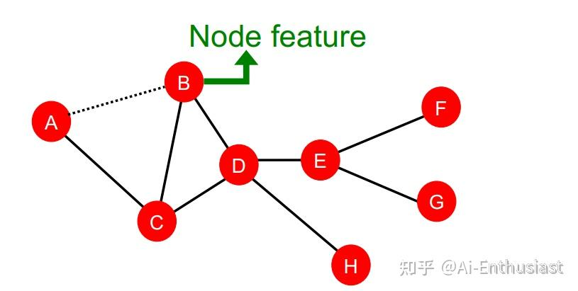
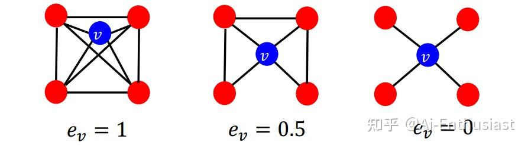
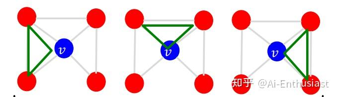
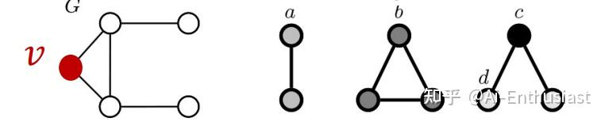
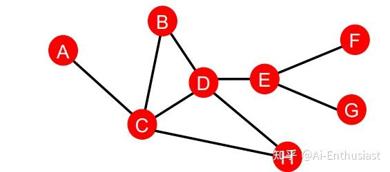
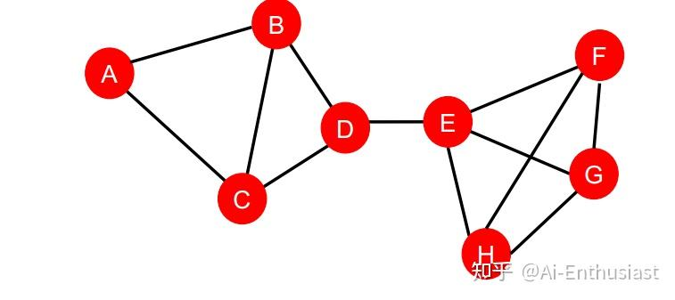
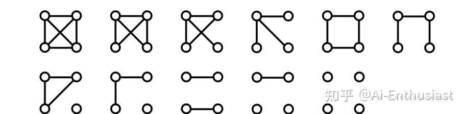

---
title: 'CS224W(1): ML图特征设计'
publishDate: 2026-01-11
updatedDate: 2026-01-11
description: '机器学习图特征设计的详细介绍，包括图结构分析和特征工程技巧。'
category: tech
tags:
  - cs224w
  - ml
language: zh
heroImage:
  src: 'images/background.jpg'
#   color: '#D58388'
---

cs224w的lecture1-2主要介绍了graph deep learning的任务，以及**图的几何结构** 特征的设计思路

不同于传统的序列的文字，或者网格的图片，实际中的数据，如人际关系，都是以**graph** 的形式呈现的。ML in Graph所进行的任务，自然便是

* 节点node, 边edge, 以及子图graph表示方法&&任务

而ML的任务是**为nodes/links/graphs** 设计一些特征，而接下来的讨论中，会为设计特征提供一些思路

## 节点node tasks&&features

对于上面一张图，我们的节点有那些需要考虑的特征呢，像**度，周围的节点聚集程度，这个节点在那些部分的子图中** ，这些都是可能入手的考虑方法

* **度** ：节点的**度** ，即为邻居节点的个数自然是可以考虑的对象，上图中 $d_A=1,d_B=2,d_C=3,d_D=4...$ 。

但是缺点是**没有区分其邻居节点**

* **节点聚集度:** 这个性质反映了节点是否在图的中心，比如上图D就是在中心，但是a显然不是

+ ** 特征值中心**: 我们需要区分** 节点的重要程度**,自然想到了将** 邻居的值全部加起来**。

设节点v的值为 $c_v$ ，那么有 $c_v=\dfrac{1}{\lambda} \Sigma_{u\in N(v)} c_u$   
 因此有 $\lambda c=Ac$ ,其中A为邻接矩阵，** 最大的 $\lambda$ 应的特征值**就反映了** 聚集程度**

+ ** 路径中心**: 如果一个节点在G的中心，那么应该有更多的路径经过它，于是对于** 是否在最短路径中**是一个可以考虑的标准

$c_v=\Sigma \dfrac{\# s到t的最短路径中含有v}{\# s到t的最短路径}$

> 举个例子，上图中考察 $c_c$ =3,因为(A-C-B,A-C-D,A-C-D-E)中包含C这个点

* **最短路径** : 对于在中心的点，到**到别的节点的距离应该比较近** 因此有

$c_v=\dfrac{1}{\Sigma_u u到v的最短路径长度}$

> 举个例子，上图中，如果不考虑hgf的话， $c_A=1/(2+1+2+3)=1/8$

* **聚类程度** :单单只看节点v和它的邻居显然不够，如果一个节点在图的中央，**那么它的邻居之间应该也有比较多的边**

​ 因此有 $e_v=\dfrac{\# v的邻居之间的边数目}{C_2^{d_v}}$

比如

* **特殊子图考虑** ：再次观察聚类程度，我们实际上是在考虑三角形

​ 之前高中数学竞赛的时候，有的时候像**角，四边形等** 也是常见的思考模型，因此**特殊子图graphlets** 也是反映节点的重要性质之一

​ 最为常见的一个特征**子图向量** : 计算包含节点v的特殊子图的个数

考虑如图的G中v的子图向量，包含v的子图a,b,c,d分别有2，1，0，2个，因此[2,1,0,2]就可以反映这个特征

以上是一些常见的将图结构转换成节点信息的方式。

## 关系link tasks&&features

关系预测也有非常多的应用，比如社会关系的预测，朋友的朋友是不是朋友等。接下来是点之间关系特征设计的可以考虑的思路

* **最短路径** : 对于点与点之间关系，最短距离显然是需要考虑的。(但是对于路径数量等都没有区分)

> 比如上图中 (A,B)=2,(B,G)=3

* **路径数量** :我们可以发现，**邻接矩阵A** 有 $A^n_{uv}$ 表示了u到v的长为n的路径的数量(参考markov链的性质)。因此可以**将路径数量整体作为反映图性质的因素**

$ S_{V_1V_2}=\Sigma^{\infty}_{l=1}\beta^l A_{v_1v_2}^l\\ \Rightarrow S=\Sigma^{\infty}_{l=1}\beta^l A^l=(I-\beta A)^{-1}-I $

​ 即可将** 长度，路径数量都考虑进去**

* **节点的共同的邻居数量:** 顾名思义，也是可能的因素之一

## 图graph features&&tasks

**目标** ：找到一些可以反映整张图的features

我们要计算图G,G’之间的相似度，可以使用类似SVM的想法， $K(G,G')=\phi (G)^T \phi (G')$ ,因此我们只需要**设计 $\phi$**

* **子图特征** ：类似于node中的子图向量，**如果我们事先规定一些特别的子图，并且在图G中计算他们的数量作为图的特征**, 比如如图的k=4的1个graphlet

​ 但是对于图越大，这个f肯定越大，因此需要做一个normalization: $h_g=\dfrac{f_G}{sum(f_G)}$

* **W-L kernel** : wl kernel的设计思路类似于**扩散模型** ，对于G使用 $c^{k+1}(v)=HASH({c^k(v),{c^k(u)_{u\in neighbor}}})$

其核心是对于开始每个点都为1，而从**图上点的信息可以进行传播** 。

以上介绍了node,link,graph的常见特征设计思路，可以发现，使用**距离，degree，子图，扩散模型** 等思路，都可以设计出比较合适的特征，而这些特征设计思路在之后的GNN设计中也会有所体现

