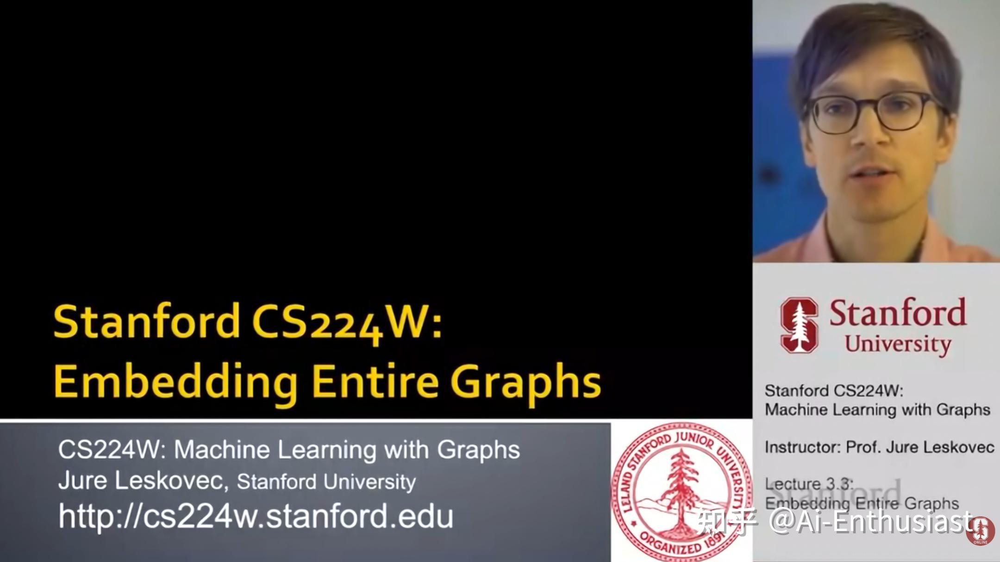

---
title: 'CS224W 食用指南'
publishDate: 2026-01-11
updatedDate: 2026-01-11
description: 'CS224W课程学习指南，包括学习方法和资源推荐。'
category: tech
tags:
  - cs224w
  - ml
language: zh
heroImage:
  src: 'images/background.jpg'
  color: '#D58388'
---

在对LLM略有了解之后，我在想ai的未来会是什么，对于知识的建立，LLM无论是数据，还是参数，都是以**网格状/线性** 的方式去建立，这和人脑的**千奇百怪的连接方式** 有非常大的距离。而使用**G=(V,E)** 的图论是更加贴近人的语言，带着这个观点，我开始学习著名的**CS224W**

关于这门课程，我使用的资料是

* 21winter视频课

* 25fall的slides以及作业，总共包括3份homework以及6个实验

主讲老师Jure Leskovec是GraphSAGE:推动GNN走向大规模学习的奠基人，除了口音有点重以外，上课**有非常多的工业案例** 。

我的食用方法大致为

* 21win包含**“图 ML → 图表示学习 → GNN → 理论 → 规模化** ”的整个过程，为了体系的完整性，选择这个的视频课进行观看
* 对于前沿GNN科技，25fall包括transformer in Graph，规模化等技术，**可以使用25Fall进行补充**
* 作业&&实验使用25fall的版本

这门课的基本结构

* 21win lecture1-5:**ML in Graph** 介绍图性质刻画以及图上的ML算法
* 21win lecture6-8:介绍GNN以及经典模型
* 21win lecture8-9:GNN的应用案例
* **21win lecture10-12** :GNN理论局限性，一些常见问题
* 对于GNN前沿，如知识图谱，推荐系统等，看25fall lecture8-11的slides

这个老师听说是stanford最帅的professor

这门课的实验以及作业不是特别多(点名批评cs336),希望可以在12月结束之前干完。

