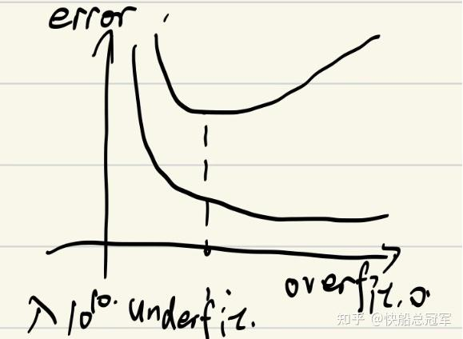
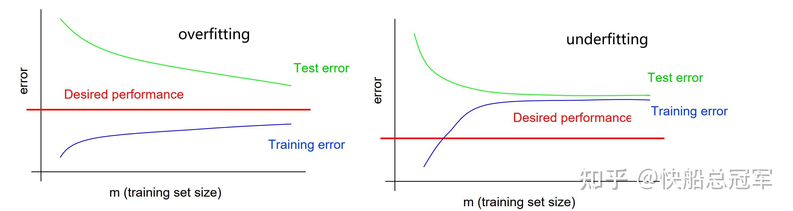

---
title: 'CS229：优化理论（一）——数据预处理与基本模型优化方法'
publishDate: 2026-01-11
updatedDate: 2026-01-11
description: 'CS229：优化理论（一）——数据预处理与基本模型优化方法'
category: tech
tags:
  - cs229
  - ml
language: zh
heroImage:
  src: 'images/background.jpg'
  color: '#ca6980'
---

之前我们学习了若干种模型，我们可以去训练这些模型，但是在得出一个结果之后，我们该如何分析这些结果，并尝试进行优化呢？

在Lecture9,10,13中，我们就学习了解决这个问题的基本方法，Andrew Ng介绍了数据处理与分配的方法，并介绍了若干种分析优化模型的观点：

调整优化方法：从**几何直观，数学推导** 的角度介绍了分析模型的**bias 和variance** 的方法，并且将其应用到对于一个已知模型，使用bias/variance分析去优化他；使用**决策树** 结合多种machine减小方差（**random forest** ）并使用若干种方法调整其中的权重（**boosting method** ）；

错误分析：ablative analysis

## 数据分配与处理

训练之前，首先需要把数据给准备好，这就包括选择什么作为feature输入以及相应的output,以及怎么对于数据进行分配。

### 数据处理：特征选择

对于我们采集到的数据，有  $(x_1,x_2...x_n)^m$  为采集到的数据，但是我们该如何选择采集到的数据作为模型的输入会影响到数据输入的**时间** （对于数据量过大会影响batch的大小，进而影响到效率与结果），以及**过拟合** 的程度。

因此选择所需要的feature的时候可以采用以下的feature-selection method: **Forward-Search**

** Forward-Search 步骤：**

对于待放入的特征集合  $F=\phi$  ,以及待选择的特征  $x_1,x_2,...x_n$

(1)分别使用  $x_1,x_2,...x_n$  来作为模型的输入，并对模型进行评估，选择其中表现最好的，并加入到F中

(2)从剩余的特征中，考虑  $F+x_1,F+x_2,...F+x_n$  作为模型的输入，再次选出表现最好的，加入到F中

(3)知道再次操作的时候，若F的正确率比任何的  $F+x_i$  都要好，或者  $F+x_i$  对于正确率的提升不够明显的时候，停止操作。

### 数据分配

我们之前在进行训练时会发现一般会有train\_dataset，test\_dataset以及valid\_dataset，其定义是

* **train\_dataset** :使用该类数据集中的东西去训练一个模型
* **valid\_dataset** :通过比较不同模型在该数据集上面的正确率，对于不同的模型进行评价。
* **test\_dataset** :对于选中的模型。得出该模型在该数据集上的正确率

对于有一堆的数据进行分配的时候，需要坚持：train，valid,test数据集两两不相交，否则就会将在正确率上有一定的影响，以下是一些常见的分配方法：

* 当数据量比较大的时候：

一般而言是按照60%，20%，20%**随机** 分配（random shuffle）分配给train,valid，test上面。

但是这个比例也不是一定的，如果对于模型比较的时候，若不同模型之间的正确率差距较大（到了1%，2%）的时候，可以适当降低valid\_dataset的比例并提高train\_dataset的比例，而反之，如果不同模型之间的正确率差异较小，会增大valid\_dataset。

* 当数据量较小的时候：

有的时候对于像医学领域的数据采集，可能没有办法采集到大量的数据，而如果按照以上的方法，对于valid,test数据集都被浪费了，因此我们采用改进的方法：**k折交叉检验** （k-fold cross validation)

**k-fold cross validation步骤：**

(1)将数据集均匀的划分为k份

(2)对于每一次，取k份数据中的一份作为valid\_dataset，其余作为train\_dataset，进行训练，求得所有模型响应的正确率

(3)最后求得模型对于每一个数据集的正确率的均值，并进行比较。

以上的方法可以较为高效的利用数据，但是相应的** 训练时间会比较的长**。且最好在数据量比较小的时候使用。常见的k我们取10

## 模型优化诊断1：bias/variance 分析

### 定义及不同角度理解

对于一个模型的bias 和variance, ** 定义**为：对于一个数据集  $X=(x_1,x_2,...x_n)$  ,  $bias=E(Y-h_{\theta}(X))$  ,而variance定于为  $var=E((Y-E(Y))^2)$

而在图像上来看就是对于给定的一组训练数据，通过某种算法得到了一个响应函数，响应函数对应的曲线和真实的数据的差距可以看成是bias,而如果稍微改变一点训练数据集就会导致variance改变巨大，那么可以看成是该模型有High variance.

bias/variance

从几何的角度去理解，即为对于训练数据训练出的模型对应坐标系中的一个点  $X_i$  ，对于每一组训练数据产生的模型构成在坐标系中的一个圆  $X_1,X_2,...X_n \in O$  （或者高维情况下的类似东西）。而实际上的最佳的模型对应坐标系中的一个点T， 如果对于high bias就说明** 圆  $O$  的圆心和点  $T$  的差距较大**，而对于high variance就是圆  $O$  的** 半径较大**。

bias/variance

对于欠拟合：训练模型没有从数据集中得到足够多的信息，导致f(x)与y之间的差距较大。

过拟合：训练模型与数据集的关系过于紧密，导致训练数据发生微小变化，模型参数就有巨大的变化。

** 直观上，**如果一个模型有较大的bias，说明该模型还需要更多的训练，即为欠拟合，而响应的，如果有较大的variance，比如使用100次的函数去拟合线性模型，显然会导致过拟合。

** 理论上，**我们评价一个模型，由于要包含欠拟合与过拟合两者，考虑

$Test=E((y-\hat{f}(x))^2),y=f(x)+\epsilon$  其中  $\epsilon$  为n元正态分布且  $\Sigma=kI_n$  ，则若模型为过/欠拟合则Test值越大。因此有  $Test =E((f(x)-\hat{f}(x)+\epsilon)^2)\\ =E(\epsilon^2)+E(\epsilon)E (f(x)-\hat{f}(x)))+E((f(x)-\hat{f}(x))^2)\\ =\sigma^2+E^2(f(x)-\hat{f}(x))+Var(f(x)-\hat{f}(x))\\ =\sigma^2+Bias^2+Var$

因此对于当bias较大的时候，有Test较大，故为欠拟合，同理，Variance较大的时候，为过拟合

从而有以下结论

$\textbf{High}\ \textbf{Bias} \Leftrightarrow \textbf{underfitting}\\ \textbf{High}\ \textbf{Variance} \Leftrightarrow \textbf{overfitting}\\$

### 数据分析

接下来我们将会通过** 数据/正确率的曲线图**去分析该模型是过拟合还是欠拟合。

对于过拟合的模型，由于过拟合，在训练数据集上表现过于优秀，而响应的提取了过多的训练数据的信息，测试数据集有一定的变化，导致正确率比较差。因此对于数据量增大，过拟合趋势会减小，从而其训练数据集正确率下降，而测试数据集正确率上升。

对于欠拟合模型，欠拟合在会中训练数据和测试数据集的表现差不多，但是总体和较好的模型有一定的正确率差距。从而对于数据量增大，欠拟合并不会改变其“bias”的大小，从而有整体正确率变化不大。

因此对于一个模型，如果发现** 随着数据量增大，训练数据集和测试数据集的正确率均有较大的变化，则为过拟合，反之为欠拟合**。

underfitting & overfitting

### 常见解决方法

对于模型出现了过拟合的情况，我们会使用一个叫** 正则化**的东西来减缓过拟合的趋势

** 正则化：**对于模型损失函数为  $J(\theta)$  ,考虑新的损失函数  $J'(\theta)=J(\theta)+\lambda||\theta||^k$  ，称之为  $L_k$  正则化。

可以理解为将模型的参数的大小加入到损失函数的考虑范围内。而随着  $\lambda$  的增加，当  $\lambda$  接近0的时候，就还是原来的模型，因此过拟合的模型还是过拟合。而对于  $\lambda$  非常大的时候，损失函数会把  $\theta$  会被拟合成0,此时会变成欠拟合，从而** 对于  $\lambda$  /model complexity曲线**为

因此使用** bias/variance分析**来解决模型：

** Step 1.**首先根据模型在训练和测试数据集上的表现判断是过拟合还是欠拟合

** Step 2.**过拟合：（1）增大数据量 （2）正则化 （3）减少输入数据的维数 （4）使用其余的模型

欠拟合：（1）加大数据的维数（2）训练更多个周期 （3）使用别的模型

## 模型优化诊断：不同模型的比较与融合

对于实际应用模型分析的时候，模型的正确率与训练所花费的时间都是需要考虑的因素，因此我们会考虑将不同的模型融合起来综合考虑，或者通过不同的模型之间的比较来改进自己的模型

### 改进算法：Ensembling Method(决策树，随机森林，boosting提升法)

由于篇幅限制，这一块将会留到下一篇文章写。但总结而言，就是** 将不同的模型通过不同的方式进行结合**

### 改进损失函数：比较法（comparison)

有的时候，模型的问题在于没有选择效果更好的损失函数（毕竟对于机器学习种的每一个模型都是根据我们的假设产生的）。因此改进损失函数也是比较重要的方法，结合训练时间也是需要重点考量的因素，我们可以使用比较的方法来修改我们的损失函数。

举个例子：在对于邮件进行分类的时候（spam or not spam）

* 使用Bayes Model:对于spam错误律为2%，not spam错误率为2%（显然太高了）
* 使用SVM:对于spam错误率为10%，not soam错误率0.0001%

我们需要使用函数  $a(\theta)=\Sigma^m_{i=1} w^i 1\{h_{\theta}(x^i)=y^i\}$  来评估不同模型的正确率(不同的权重是因为我们希望将所有的not spam的邮件留下)。同时又希望使用Bayes Model(时间快）,但是SVM的效果更好，因此理论上我们有

$a(\theta_{SVM})>a(\theta_{BLR})$

对于改进之后的损失函数  $J(\theta)=\Sigma^m_{i=1} log(w^ip(y^i|x_i,\theta))-\lambda ||\theta||^2$  ，对于SVM在这个模型上训练得到的参数为  $\theta_{SVM}$  以及我们使用  $BLR$  训练得到的数据  $\theta_{BLR}$

如果有  $J(\theta_{SVM})>J(\theta_{BLR})$  那么就可以认为这个损失函数是比较有效的。

使用以上的方法可以大体的判断我们的改进后损失函数的效果，并由整体趋势判断我们的损失函数应该如何调整。

## 错误分析：ablative analysis

对于使用了  $x_1,x_2,...x_n$  有了n个feature的输入，我们需要找到那个feature对结果的影响最大，并在此方面进行改进。这就需要使用到ablative analysis.

ablative analysis步骤：

（1）对于  $x_1,x_2,...x_n$  作为模型的输入，得到一个正确率

（2）依次除去  $x_1,x_2,...x_n$ 中的一个变量，分别进行训练，得到相应的正确率

（3）根据以上n个正确率与原本的正确率比较得到结论那个变量的影响最大。

通过以上的分析我们可以对于数据结果进行进一步的分析。

以上是我们对于模型训练中的常见的步骤，包括数据的预处理部分，对于模型优化，我们需要使用多种方法，包括bias/variance分析，改进算法，改进损失函数，同时对于模型最后的结果我们也可以由此进行分析。

虽然如此，对于改进模型不能只用以上的方法，更多的方法需要借助于前沿论文研究去考虑，但是对于初步的研究的时候，我们可以从这些方面进行考虑，对于我们的模型进行优化。

