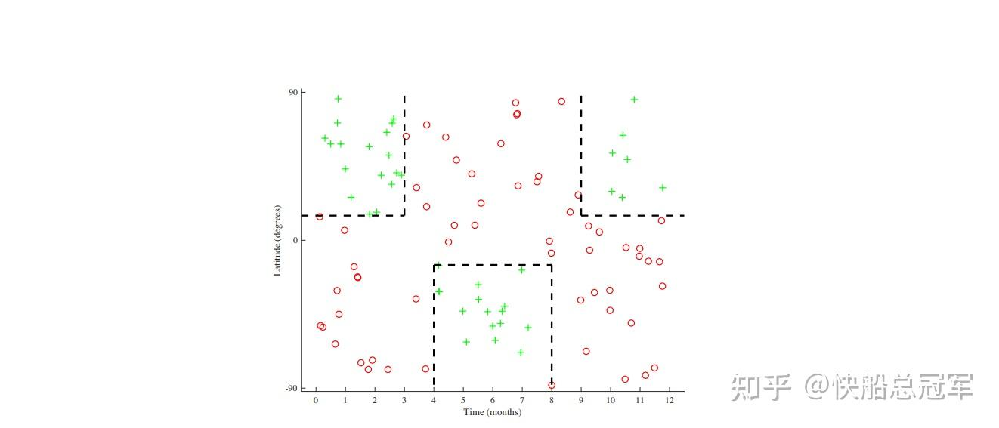
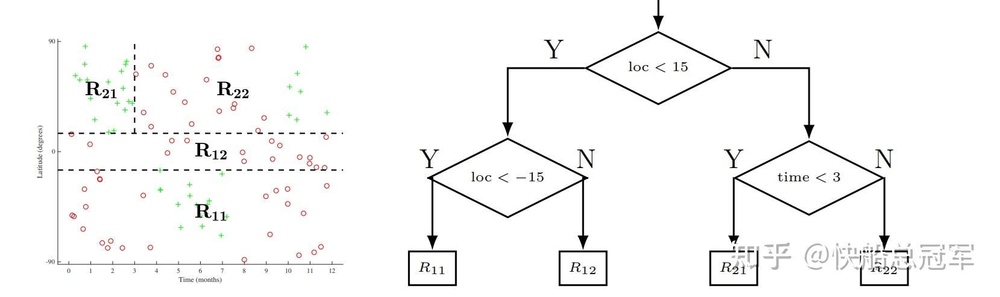
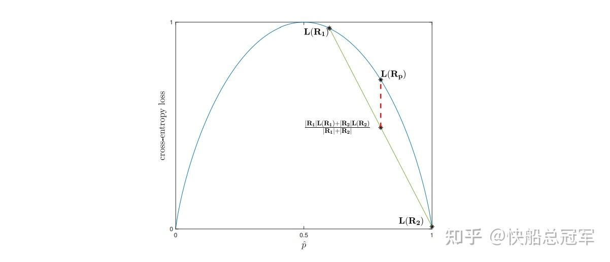

---
title: 'CS229:优化理论（二）——决策树与模型优化，数据量估计'
publishDate: 2026-01-11
updatedDate: 2026-01-11
description: 'CS229:优化理论（二）——决策树与模型优化，数据量估计'
category: tech
tags:
  - cs229
  - ml
language: zh
heroImage:
  src: 'images/background.jpg'
  color: '#D58388'
---

在上一篇文章中，我们介绍了关于数据处理，模型优化的一些基本方法。而接下来接下来我们将会借由决策树这一工具介绍将多种模型融合在一起的方法:集成方法，同时介绍一些关于数据量选取的基本方法。

## 决策树（Decision Tree）

**场景：** 考虑我们要将从（1-12月，纬度）作为输入与是否可以滑雪作为输出的一个散点图进行分类。则其图像如下。要对此进行分类显然可以使用SVM去考虑，但是介于训练时间的缘故，为了解决这种非线性边界的问题，使用一种叫决策树的结构去实现一个分类器。

Decision Tree Presenting

**决策树实现过程**

** Step1**:对于每一个包含n个feature的数据  $x^i=(x^i_1,x^i_2,...x^i_n),i\in [1,n]$  ，设置一个Selecting Region, 记为  $N_1=\{conditions  \ on \ x_i,i\in[1,m]\}$  其中条件为对于每一个feature在边界上的一些限制。

比如  $N_1=\{x_1>10,x_2>0.1\}$

** Step2:**对于训练数据而言，将满足N1条件的数据作为左侧节点的输入，不满足的作为右侧节点的输入。以此类推，对于左右侧的节点分别进行同理的分类操作。直到分类分到叶子节点。

** Step3:**当希望对于某个数据进行预测的话，再根节点处进行判断，如果符合  $N_1$  条件，则传入左侧节点进行预测，反之传入右侧节点进行预测。直到叶节点，最终的预测情况根据叶子节点的预测的均值作为最后的输出。

图形解释见下图。由于每一个节点存储了分类条件，以及与左右节点之间的联系，因此称为决策树。

Decision Tree

我们以及知道了决策树的原理，只需要直到如何得到每一个节点的Selecting Region就能得到一个分类器，实际情况中，如果对于每一个点的Selecting Region涉及到了过多的feature的时候，一方面会有训练时间复杂度上升，另一方面会导致严重的过拟合，因此我们默认对于每个节点只对于一个feature进行分类了。

** 损失函数**

需要训练模型，必然需要一个损失函数。我们考虑这是一个二分类器

我们的原则是希望在每一次分类的过程中，分出来的两类的希望可以将标签为1和0的东西分别归成两类，因此评判标准应当为两类中的正确率。结合过往在逻辑回归的经历，我们记对于Selecting Region  $N$  的正确率为  $p_N=\dfrac{\Sigma1\{y^i=1,y^i\in N\}}{\Sigma1\{y^i\in N\}}$  ,对于其分成了两个子类  $N_1,N_2$  ,损失函数为  $L_{cross}:Loss_N=-(p_{N_1}log(p_{N_1})+p_{N_2}log(p_{N_2}))$

结合图像发现，只要对于  $p_{N_1},p_{N_2}$  相隔更远，那么损失函数的值就应该更小，这符合凸函数的特点，因此理论上对于任何的凸函数我们都应该成立，类似的还有一些别的常见的损失函数

$L_{mini}:Loss=p_{N_1}(1-p_{N_1})+p_{N_2}(1-p_{N_2})$

训练模型时，我们递归对于每个节点划定其边界（二分范围知道继续划分正确率不再改变），通过损失函数确定每一个点的Selecting Region,直到所有节点确定。

Loss Function

### 正则化

举个例子，如果边界是分块的，如左图，那么Decision Tree的表现会非常好，反之，对于一个线性拟合的模型,如右图，那么Decision Tree就会有较强的过拟合，因此就需要进行正则化减小过拟合。

常见的正则化方法有

* 设定叶子节点的最小大小
* 设定最深的深度，在到达一定的深度时停止分类
* 设定节点的最大的个数
* 后剪枝方法：用验证集来评估每个节点的错误率，若将该节点的子节点后正确率上升，那么进行剪枝，时间复杂度:设验证集大小N,测试集合大小为n，f个feature,树深为  $O(logn)$  ,后剪枝的时间复杂度为  $O(Nf(logn)^2)$

## 集成化方法（Ensembling Methods）

### Bagging

基于  $Var(\hat{X})=\dfrac{Var(X)}{n}$  ,我们可以考虑将若干个不同的模型组合起来减小模型的过拟合趋势，方法为将数据集分成n份，对于每一个数据集训练出来一个单独的模型，对于需要预测的数据，我们取**所有模型结果的平均** 。该过程称为**Bagging（Variance Reduction）**

** Random Forest:**由于决策树的过拟合情况严重，使用bagging可以大大** 减小过拟合**，Bagging+Decision Tree就是随机森林（只是对于每一个决策树的特征选取上是使用M个特征中的m个），但是这样做的缺点是失去了每一颗决策树的** 可解释性**。

### Boosting

以上都是为了减少过拟合，但是我们也需要减少bias,这就需要使用boosting

** 核心思想：**通过训练弱分类器，找到其分错的样本，提高这些被错误分类样本的权重，在加权后的数据上训练下一个弱分类器最后将所有分类器的加权结果组合成一个强分类器（类似于强化学习的思想）。优点为减小bias,但是会增加Variance.

常见的算法有Adaboost(改变每样本的权重),FSAModeling(每次改变添加新的tree stump的比例),Gradient Boosting等，这些都有相应的python库且都有一定的应用。

以上我们这篇文章我们从决策树出发，聊到了 Bagging 和 Boosting，这是两种改进模型性能的常见方法，一个降低方差，一个减少偏差，互为补充。将这些方法与上篇文章相结合，必定会有更优良的效果。

