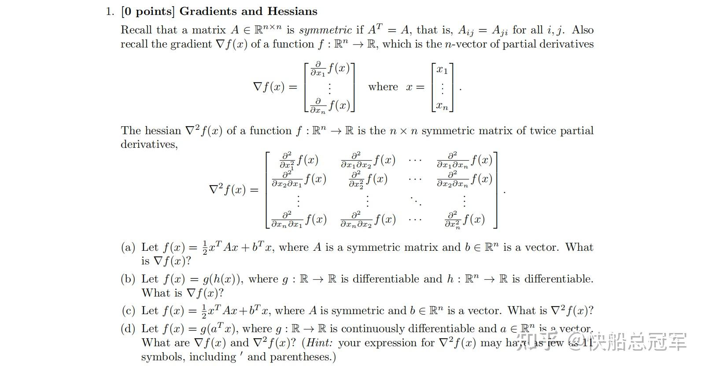
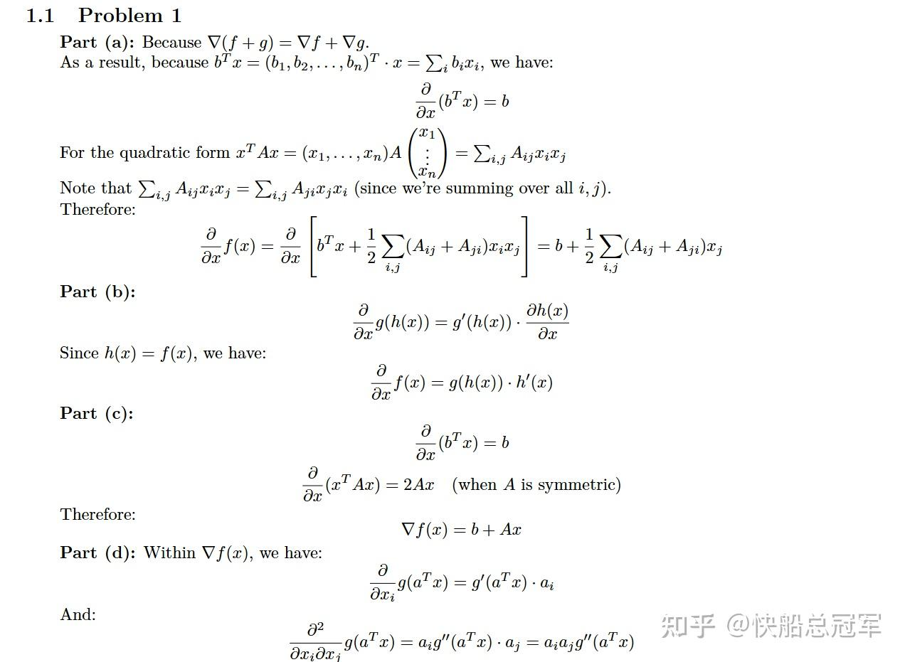
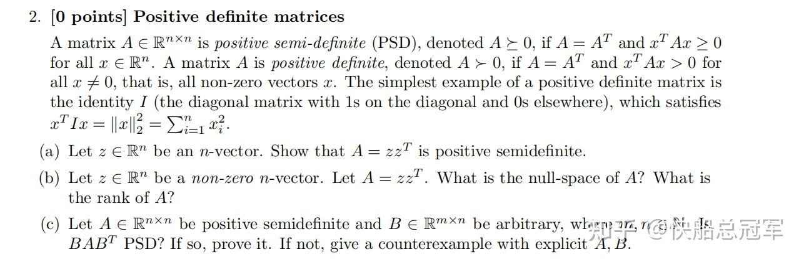
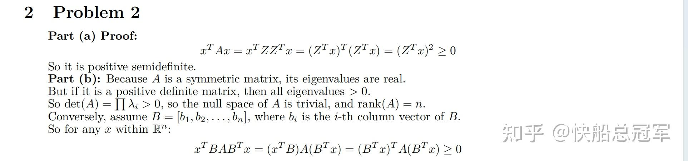
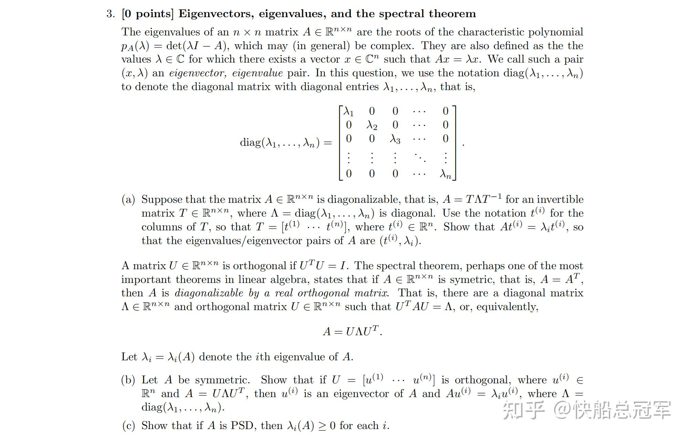

---
title: 'CS229: Ps0解读——矩阵求导与重要矩阵性质'
publishDate: 2026-01-11
updatedDate: 2026-01-11
description: 'CS229: Ps0解读——矩阵求导与重要矩阵性质'
category: tech
tags:
  - cs229
  - math
language: zh
heroImage:
  src: 'images/background.jpg'
  color: '#ca6980'
---

CS229的作业的设置只能用**贴合实际，变化丰富，质量极高** 来形容。包含对于课堂上某些提到的性质，推论的证明与拓展，也有非常多的实践项目，更重要的是，有很多有趣的题目竟然可以将好几个lecture内的知识点穿起来，实在是巧妙至极。

以下答案中可能有错，欢迎大家指正

## Problem Set 0 解读:

### problem 1

1.Problem:

Problem 1

2.分析：

这道题目主要是练习矩阵求导的技巧，(a),(c)可以说是对于Linear Regression中的损失函数  $J(\theta)=\frac{1}{2}(y-\theta^Tx)^T (y-\theta^Tx)$  求导的一个证明，而对于（b),(d)是对于Logistic Regression的损失函数的一个证明，总结下来，对于矩阵求导（一般是对于一个向量）需要掌握以下：

对于  $\textbf{x}= \begin{bmatrix} x_1,x_2,x_3,...x_n \end{bmatrix}^T$  而言，  $f(\textbf{x})$  为  $R^n\rightarrow R$  的函数，则

* 向量求导定义： $\dfrac{\partial f(\textbf{x})}{\partial \textbf{x}}=[\dfrac{\partial f(\textbf{x})}{\partial x_1},\dfrac{\partial f(\textbf{x})}{\partial x_2}...\dfrac{\partial f(\textbf{x})}{\partial x_n}]^T$
* 分配律：  $\dfrac{\partial f(\textbf{x})g(\textbf{x})}{\partial\textbf{x}}=\dfrac{\partial f(\textbf x)}{\partial \textbf x } g(\textbf{x})+f(\textbf{x})\dfrac{\partial g(\textbf x)}{\partial \textbf x } $
* 线性映射求导：  $\dfrac{\partial \textbf{a}^T\textbf{x}}{\partial \textbf{x}}=\dfrac{\partial \textbf{x}^T\textbf{a}}{\partial \textbf{x}}=\textbf{a}$  (证明由定义易证）

由以上的定理(分配律+线性映射)可以得到以下的结论

* 结论1：  $\dfrac{\partial \textbf{a}^T\textbf{x}\textbf{x}^T\textbf{b}}{\partial \textbf{x}}=\textbf{ab}^T\textbf{x}+\textbf{ba}^T\textbf{x}$
* 结论2：  $\dfrac{\partial \textbf{x}^T\textbf{A}\textbf{x}}{\partial \textbf{x}}=\textbf{A}\textbf{x}+\textbf{A}^T\textbf{x}$

以上是一些常见的结论，对于更多的关于矩阵求导的内容可以参考这篇文章

使用以上的结论就可以轻松解决Problem 1

Problem 1 answer(可能有错，欢迎指正)

### problem 2

Problem

problem

分析：

在机器学习中我们常常使用使用到**正定矩阵** 这个东西，像之后几个lecture中的GLM中常常使用的损失函数，以及在决策树中会使用到的损失函数，都和这个正定矩阵的性质有关。因此接下来我们来总结以下对于正定矩阵的性质。

* 正定矩阵定义：A为正定矩阵，若对于任意的  $\textbf{x}= \begin{bmatrix} x_1,x_2,x_3,...x_n \end{bmatrix}^T$  ，有  $\textbf{x}^T A \textbf{x}>0$  恒成立

$\Leftrightarrow X^T AX>0 $  ，其中  $X$  为任意的正交矩阵（使用一个正交变换，通过实二次型即可）

* 正定矩阵：正定矩阵的顺序主子式均大于0，特征值都是正的（证明见USTC线性代数的课件）

使用以上的性质，我们在分析任意的关于**函数的凸性，或者求解损失函数的偏导** 的相关性质（如对于Hessian矩阵的性质）使用正交变换将x向量转换成基向量，再使用正定矩阵的性质去分析。

从而我们可以轻松得到以下答案

Solution to problem 2

### problem 3

problem

problem

对于这个题目主要是对于**正交矩阵** 的性质进行了探讨。对于正交矩阵的最为重要的特点是他保内积，可以将一个欧式空间直接投影到欧式空间中，在training\_input上来看就是将输入转换成了一组基的问题。

对于正交矩阵我们常用的特点有以下几个：

* 定义：对于A为正交矩阵，则有  $\textbf{A}^T\textbf{A}=I$
* 性质1：A的特征值的模长都是1，而且对于复根组成的2\*2的矩阵与别的实特征值可以组成一个Jordan标准型。
* **性质2** ：对于B为一个对称矩阵，则B正交相似于一个对角矩阵。

PS0是为了之后的学习中的各种证明打下了一个比较坚实的基础，包括矩阵求导以及最为重要的两类特殊矩阵的性质。有了他们，之后完成PS1,PS2...就更加容易了。

