---
title: 'CS229：Ps1解读——GLM模型及其变种的编程实现与相关性质证明'
publishDate: 2026-01-11
updatedDate: 2026-01-11
description: 'CS229：Ps1解读——GLM模型及其变种的编程实现与相关性质证明'
category: tech
tags:
  - cs229
  - ml
language: zh
heroImage:
  src: './images/background.jpg'
  color: '#D58388'
---


CS229的前4个lecture讲解了GLM模型，而problem set 1是实现了GLM中的常见的模型：GDA模型，Newton方法，数据集不完整的标签的情况，泊松分布作为GLM模型中的exponential function的离散情况的预测,exponential family的凸性，自权重线性回归模型。若干个题目恰好对应了Lecture中的重要的知识点。下面是我做这些题目的心得体会。

## Problem Set 1 解析

### Problem 1

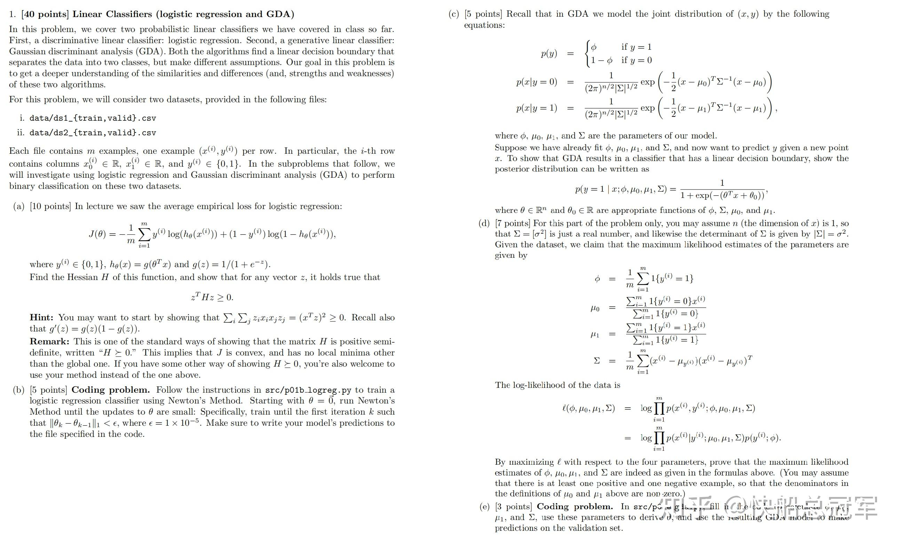

Problem 1

分析：

这道题目是为了说明GDA是一种特殊的逻辑回归，并且对于损失函数的可行性 (损失函数  $J(\theta)$  是凸函数)进行了证明，并使用了牛顿法对于GDA进行了实现。

（a)这一问需要证明交叉熵函数是凸的，在定义域范围内只有一个极值点，从而无论初始值取多少，最后都可以使用梯度下降到所需要的点，而需要证明这等价与**损失函数的Hessian矩阵是正定矩阵** 。使用上一篇文章中的结论，我们可以进行求解。

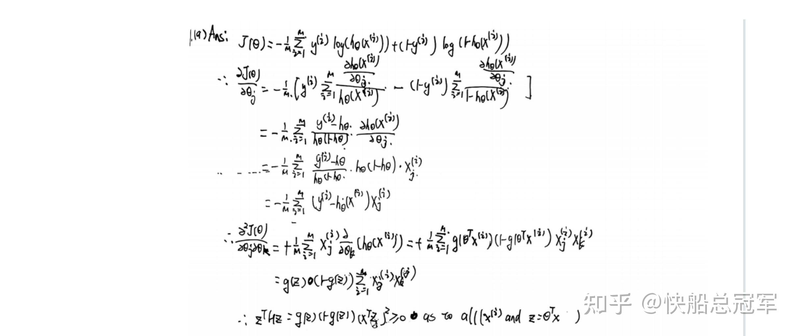

Problem 1/(a)

这一个题目中，可以发现sigmoid函数的一个特殊性质：  $f(x)=sigmoid(x)\Rightarrow f'(\textbf{X})=f(\textbf{X})*(1-f(\textbf{X}))$  这里的\*是按照元素相乘。（**在之后的训练中非常的有用** ）

（c,d)对于（c),我们是使用了Bayes Rules，结合了对于Gaussian假设证明了GDA模型可以化简为逻辑回归，间接说明了生成式回归实际上需要再加上**可靠的假设可以化为逻辑回归** 。而对于（d)，我们对于GDA求其最大似然估计，再进行求导，就得到了GDA参数的表达式，（d)说明了在分析一个问题的时候可以**使用GDA来快速对于数据进行初步分析。** 这两问的证明都是暴力计算。

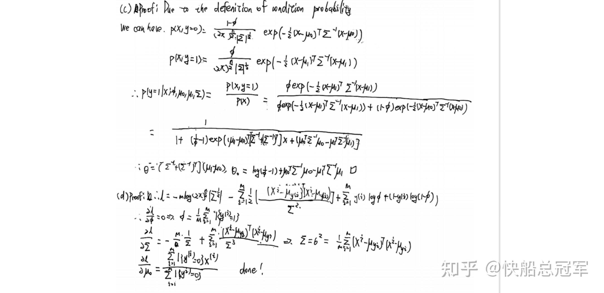

（b，e）编程题，这两个问题实现了Newton法的梯度下降以及GDA预测数据。我在编写这些代码中，发现有些debug中较为易错的点。

* 在计算Hessian矩阵的时候，我们需要注意sigmoid函数求导之后为了保证维数相同，对于输入矩阵A，按元素相乘到x上。（注意维数）

```
Hessian=(x.T*(1-hypothesis)*hypothesis).dot(x)/m
```

* 由于输入x不像习惯中的列向量组成  $X=(x_1,x_2,....x_n)$  ,在numpy中是将每一行视为一个输入，因此在计算  $\theta^T X$  时不需要使用转置

```
W=x.dot(theta)
```

最后关键代码如下

```
#
class LogisticRegression(LinearModel):
    def fit(self, x, y):
        """Run Newton's Method to minimize J(theta) for logistic regression.
        Args:
            x: Training example inputs. Shape (m, n).
            y: Training example labels. Shape (m,).
        """
        self.theta=np.zeros(x.shape[1])# 参数初始化
        m,n=x.shape
        while True :
            hypothesis=1/(1+np.exp(-x.dot(self.theta)))#对于输入计算sigmoid输出
            Hessian=(x.T*hypothesis*(1-hypothesis)).dot(x)/m#Hessian矩阵
            gradient_descent=x.T.dot(hypothesis-y)/m#计算梯度下降
            theta_old=np.copy(self.theta)
            self.theta-=np.linalg.inv(Hessian).dot(gradient_descent)#梯度下降
            #ord refers to L1 or L2 
            if  np.linalg.norm(self.theta-theta_old,ord=1) <self.eps:#判断结束L1条件
                break
    def predict(self, x):
        hypothesis=1/(1+np.exp(-x.dot(self.theta)))
        y=[1 if q>0.5 else 0 for q in hypothesis]#判断条件
        return y

#GDA Predictions
```

GDA中注意使用numpy操作，以下是计算参数的代码

```
        phi=np.sum(y)/m

        mu_0=((1-y).dot(x))/(np.sum(1-y))
        mu_1=(y.dot(x))/(np.sum(y))
        # calculas \sigma
        sigma=np.zeros((2,2))
       # print((x[0]-mu_0).T)
        for i in range(m):
            if y[i]==0:
                sigma+=(np.array([x[i]-mu_0])).T.dot(np.array([x[i]-mu_0]))
            else:
                sigma+=(np.array([x[i]-mu_1])).T.dot(np.array([x[i]-mu_1]))
        sigma=sigma/m
```

### Problem 2

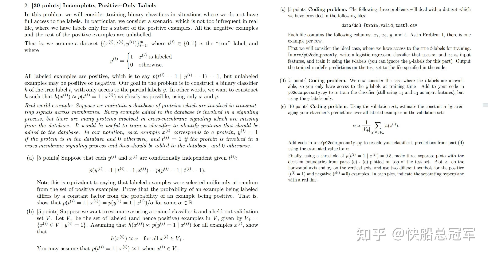

Problem 2

在日常的使用的时候，我们常常会遇到只有部分标签的问题。而这道问题则是证明了使用标签过后的数据来训练模型在实际的预测中是合理的，假设（  $y^i,x^i,t^i$  ）分别表示数据是否被标签，数据内容以及数据真实情况下的分类情况。而其方法就是将**分类情况预测转换成对于标签情况的判定** 。从而可以利用上我们的训练数据。

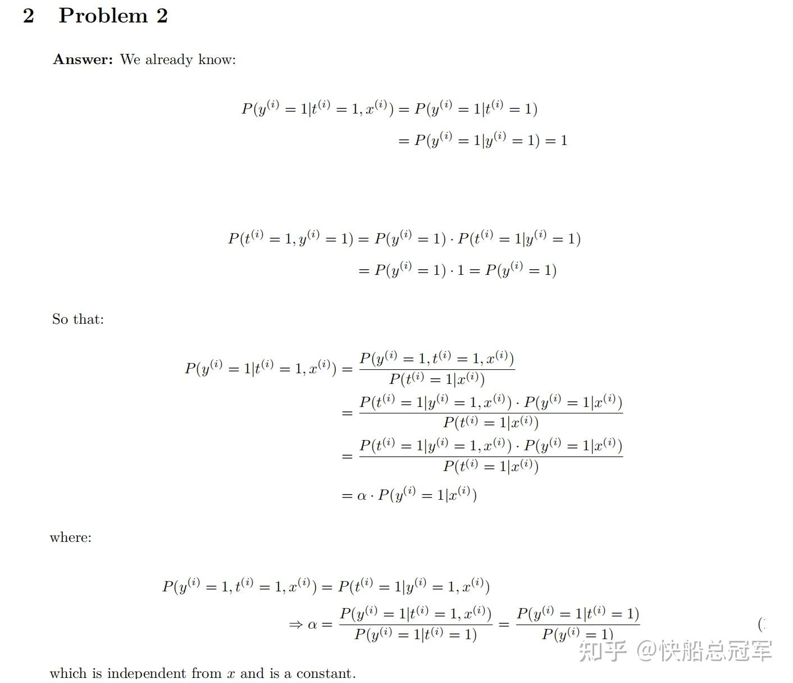

problem 2 solution

在（a)通过假设了一组数据是否标签与其预测值为是还是否无关（y,x与t条件独立），证明了数据的分类情况与其标签与否成比例关系。由于对于标签情况我们是知道的，于是就可以将对于分类的预测转换成数据是否标签的预测。(使用概率统计公式进行变换)

具体实现主要部分：

```
    hypothesis=1/(1+np.exp(-x_valid_new.dot(clf.theta)))
    num_V_positive=np.sum(y_valid_new[y_valid_new==1])
    hypothesis_V_positive=np.sum(hypothesis[y_valid_new==1])
    alpha=hypothesis_V_positive/num_V_positive
```

### Problem 3

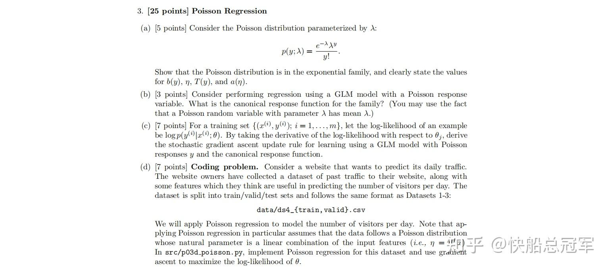

problem 3

对于**Gaussian分布** ，我们可以对实数轴上的东西进行预测（Linear Regression),而对于**伯努利分布** ，可以实现一个分类器，如果我们想要将数据分类到离散的整数上，就可以使用泊松分布。

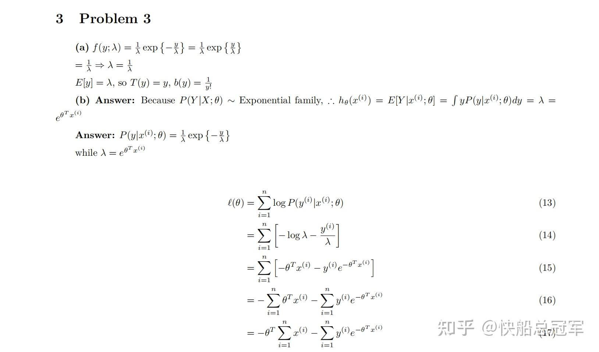

problem 3 solution

在（a)中我们先进行基本变换将其变换成exponential family的形式，（b，c)中则使用P(y|x,params)~exponential family的性质得到响应函数以及损失函数的形式，最后再实现这个代码。

```
class PoissonRegression(LinearModel):
    """Poisson Regression.
    Example usage:
        > clf = PoissonRegression(step_size=lr)
        > clf.fit(x_train, y_train)
        > clf.predict(x_eval)
    """
    def fit(self, x, y):
        """Run gradient ascent to maximize likelihood for Poisson regression.

        Args:
            x: Training example inputs. Shape (m, n).
            y: Training example labels. Shape (m,).
        """
        # *** START CODE HERE ***
        self.theta=np.zeros(x.shape[1])
        print(x[0].T.shape)
        print(y.shape)
        print(self.theta.shape)
        while True:
            theta_old=np.copy(self.theta)
            self.theta=self.theta+self.step_size*x.T.dot(y-np.exp(x.dot(self.theta.T)))/x.shape[0]
            if np.linalg.norm(self.theta-theta_old,ord=1)<self.eps:
                break
            # pay attention to devide the shape of
        # *** END CODE HERE ***
    def predict(self, x):
        # *** START CODE HERE ***
        hypothesis=np.round(np.exp(x.dot(self.theta.T)))
        return hypothesis
        # *** END CODE HERE ***
```

### Problem 4

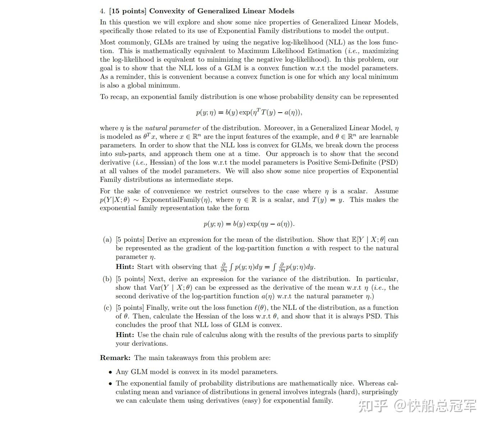

problem 4

我们为何使用GLM模型，有非常大的原因是因为其** 独特的凸性**。而本题中，（a)证明了对于预测函数的均值可以表示为损失函数对于参数的导数，而（b)则证明了预测函数的方差可以看成损失函数对于参数的二阶导。从而可以由方差的性质证明损失函数的凸性。

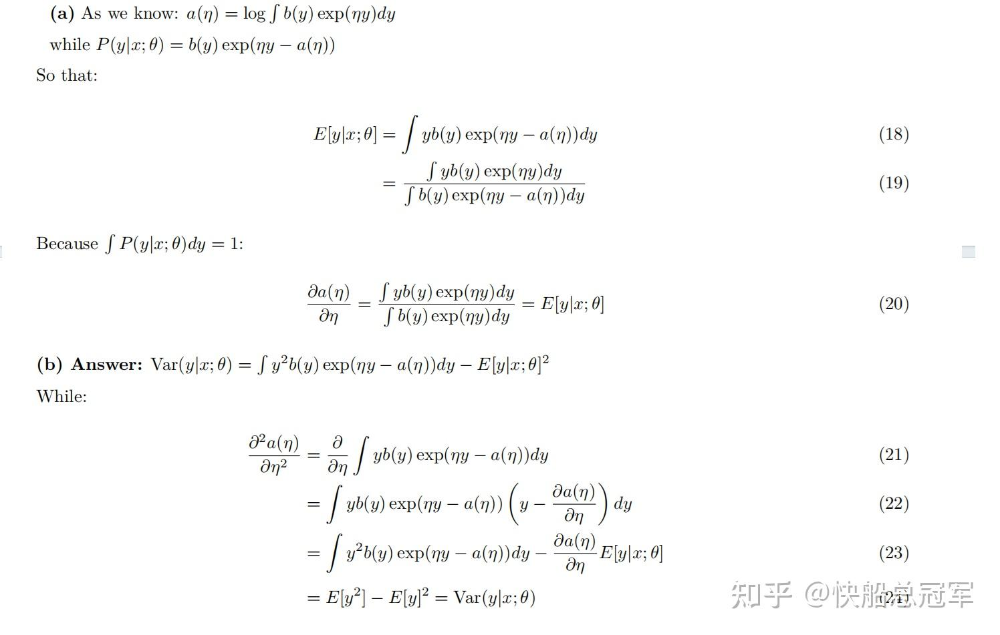

problem 4 solution

于是我们使用** 积分变换**就可以证明该性质，最后利用正定矩阵就可以证明凸性。具体见过程

### Problem 5

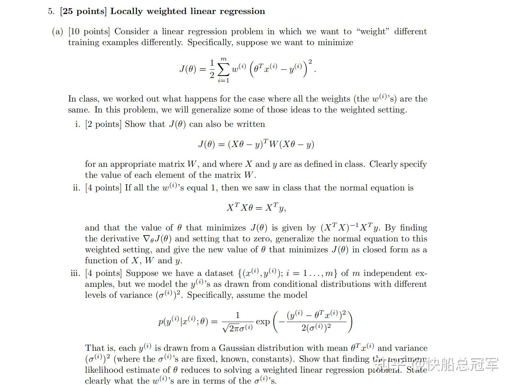

problem 5

上课的时候我们只是描述了自权重回归的模型，但是对于其在梯度，** 一般情况下的normal equation并没有特别的研究。**因此本题中对于一般的  $J(\theta)=\frac{1}{2}\Sigma^m_{i=1}w^i(y^i-\theta^Tx^i)^2$  得到了通解  $\theta = (X^T W X)^{-1} X^T W y$  ，并对于权重取Gaussian分布的情况下进行了代码实现。

以及其过程

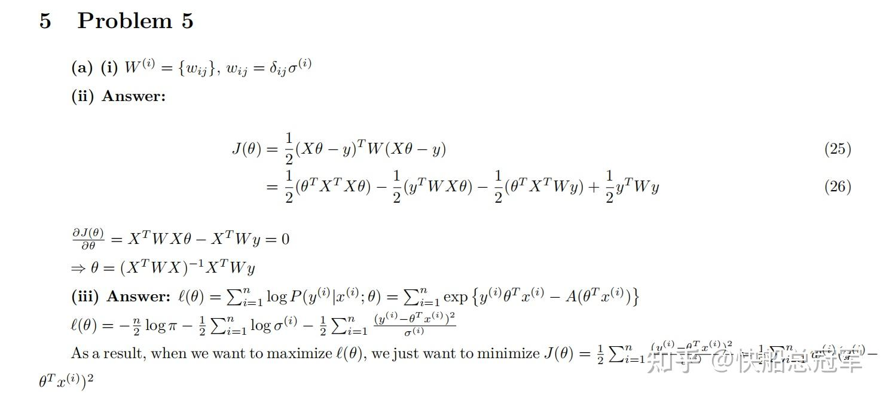

problem 5 solution

以及相应代码实现，尤其注意对于** 大量矩阵乘法时的维数！！！**

```
def predict(self, x):
        m,n=x.shape
        y=np.zeros(m)
        for i in range(m):
            W=np.diag(np.exp(-np.sum((self.x-x[i])** 2,axis=1))/(2*self.tau**2))
            y[i] = np.linalg.inv(self.x.T.dot(W).dot(self.x)).dot(self.x.T).dot(W).dot(self.y).T.dot(x[i])
        return y
```

