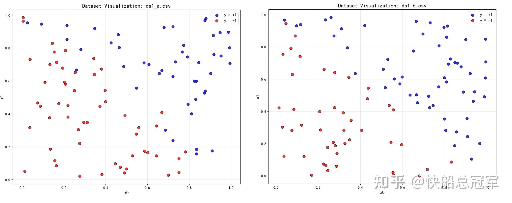
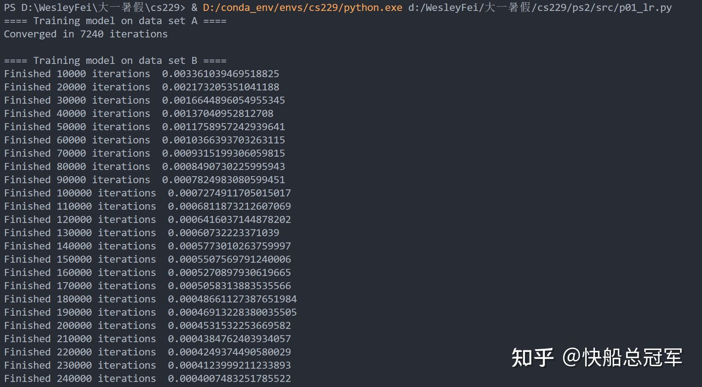
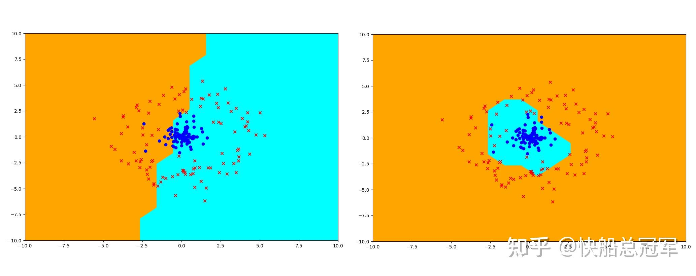

---
title: 'CS229: Ps2解读——正则化深入探讨以及SVM实现'
publishDate: 2026-01-11
updatedDate: 2026-01-11
description: 'CS229: Ps2解读——正则化深入探讨以及SVM实现'
category: tech
tags:
  - cs229
  - ml
language: zh
heroImage:
  src: 'images/background.jpg'
#   color: '#D58388'
---


整体而言，这份作业是对于**正则化** 在数据集异常，实际意义，对于正确率影响上进行了深入的探讨，同时在也实现了SVM的部分。

首先是作业以及作业答案的文档（每一题贴图片粘太麻烦了，开摆了）

## Problem 1

Problem1主要是考察当数据集形状特殊时，如何对于逻辑回归函数进行修改。我们发现，对于逻辑回归，若数据中有**微小的噪声** ，由于偏离边界的错误分类数据对与参数影响较大，每一个iteration对于参数的惩罚相应较大（Dataset A），从而即使精度会有所下降，但是收敛速率会**大大加快** 。反之，如果数据中没有噪声，那么收敛速率会相应变慢(Dataset B)。



A&B



Result

于是我们需要对此，我们训练B数据集的时候，就需要加上一些噪声，而由于是逻辑回归，对于学习率加大，以及正则化都无法帮助我们在训练到100000iteration时快速收敛。

**Problem1 Essence:训练数据决定改进策略**

## Problem 2

Problem 2主要探讨了一个问题：  $h_{\theta}(x)=\sigma(x)$  实际意义的确是二分类中数据集的正确率

通过第一问我们首先证明了当偏置项的均值为0时，我们在（0，1）区间上  $acc=\frac{\sum_{i \in I_{a,b}} P(y^{(i)} = 1 \mid x^{(i)}; \theta)}{|\{i \in I_{a,b}\}|}=\frac{\sum_{i \in I_{a,b}} h_\theta(x)}{|\{i \in I_{a,b}\}|}$  的确可以作为数据集的准确率。而在第二问中我们是将该情况推广到了任意区间上

最后当我们加上正则化之后，我们通过理论上的证明发现正则化会导致整体的均值偏差。  $acc=\frac{\sum_{i \in I_{a,b}} P(y^{(i)} = 1 \mid x^{(i)}; \theta)}{|\{i \in I_{a,b}\}|}=\frac{\sum_{i \in I_{a,b}} h_\theta(x)}{|\{i \in I_{a,b}\}|}$  与实际的正确率会有所偏差。

Problem2进一步告诉了我们：** 正则化会带来正确率损失**，所以对于需要高正确率的问题时要谨慎使用。

## Problem 3

之前我们在处理线性回归时，都是通过MLE(最大似然估计)  $\theta_{\text{MLE}} = \arg\max_\theta p(y|x, \theta)$  ，但是如果加上正则项之后，其解释性不是特别的好，因此我们在本题中通过  $\theta_{\text{MAP}} = \arg\max_\theta p(\theta|x, y)$  与MLE之间的联系，最后给予正则化一个合理的实际意义。

在本题中，(a)告诉了我们MAP就是MLE加上一个分布惩罚项，（b)(c)我们通过假设参数的先验分布（Gaussian,Lasso）验证了不同的正则化在MAP下的等价性。

Problem3 Essence:** 正则化不是“黑箱”技巧，而是我们对模型参数的主观信念的数学表达**

## Problem 4

简简单单的暴力题目，主要是对于** 核函数的性质**的推导

## Problem 5

实现核函数以及SVM预测，对于每一个数据，我们记录了其xi以及一个变换常数，最后做出预测。

```
def initial_state():
    state = []
    return state

def predict(state, kernel, x_i):
    sum=0
    for b,x_j in state:
        sum=sum+b*kernel(x_j,x_i)
    prediction=sign(sum)
    return prediction


def update_state(state, kernel, learning_rate, x_i, y_i):
    if state== None:
        b_new=learning_rate*(y_i-predict([(0,x_i)],kernel,x_i))
    else:
        b_new=learning_rate*(y_i-predict(state,kernel,x_i))
    state.append((b_new,x_i))
```

最后的效果图也是非常的好看的。



线性核以及高斯核

## Problem 6

这道题目是通过比较Bayes Model于SVM的正确率去实现一个垃圾邮件分类系统。其中SVM的效果是通过调用上一个题目的部分去实现的。主要的难点还是在维度的控制，文字的预处理上，包括提取词库，完善字典。

```
def get_words(message):
    str=message.lower()
    lis=str.split(' ')
    #print(lis)
    return lis

def create_dictionary(messages):
    dictionary={}
    for message in messages:
        transform_message=get_words(message)
        for word in transform_message:
            if word in dictionary.keys():
                dictionary[word]+=1
            else:
                dictionary[word]=1
    remove_keys=[key for key,value in dictionary.items() if value<5]
    for key in remove_keys:
        del dictionary[key]
    for i,word in enumerate(dictionary):
        dictionary[word]=i
    return dictionary
def transform_text(messages, word_dictionary):
    transform_matrix=np.zeros((len(messages),len(word_dictionary)), dtype=int)
    print(transform_matrix.shape)
    for i,message in enumerate(messages):
        message_word=get_words(message)
        for word in message_word:
            if word in word_dictionary:
                transform_matrix[i][word_dictionary[word]]+=1
    print(1)
    return transform_matrix

def fit_naive_bayes_model(matrix, labels):
    
    phi_y=labels.sum()/len(labels)
    
    matrix_1=matrix[labels==1]
    matrix_0=matrix[labels==0]
    nominator_1=matrix_1.sum(axis=0)
    denominator_1=matrix_1.sum(axis=1).sum()
    nominator_0=matrix_0.sum(axis=0)
    denominator_0=matrix_0.sum(axis=1).sum()

    phi_1=(nominator_1+1)/(denominator_1+matrix.shape[1])
    phi_0=(nominator_0+1)/(denominator_0+matrix.shape[1])
    return phi_y,phi_1,phi_0
def predict_from_naive_bayes_model(phi_y,phi_1,phi_0, matrix):
    theta=np.log(phi_1)+np.log(1-phi_1)-np.log(1-phi_0)-np.log(phi_0)
    denominator=theta.dot(matrix.T)
    denominator=1/(1+np.exp(denominator)*(1-phi_y)/phi_y)
    predictions=[0 if x>0.5 else 1 for x in denominator]
    return predictions
```

