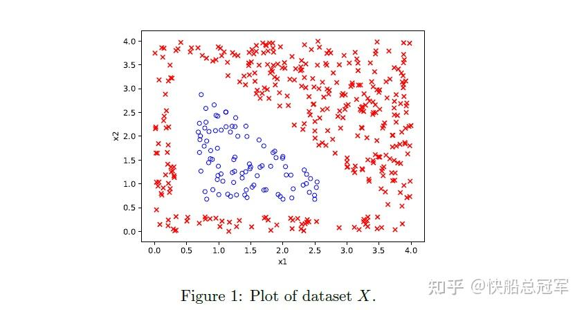
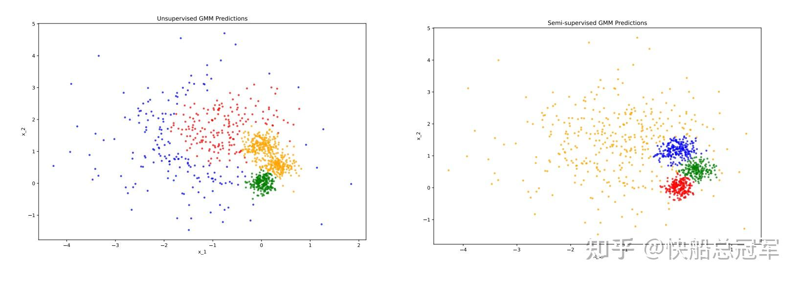

---
title: 'CS229：Ps3解读——NN,自然梯度下降与有趣的案例'
publishDate: 2026-01-11
updatedDate: 2026-01-11
description: 'CS229：Ps3解读——NN,自然梯度下降与有趣的案例'
category: tech
tags:
  - cs229
  - dl
language: zh
heroImage:
  src: 'images/background.jpg'
  color: '#ca6980'
---

problem set3总体是非常有趣的，包括对于神经网络的深层次理解，对于梯度下降在概率流形上的改进——自然梯度下降，以及一些实际的有趣的案例

对于作业以及作业答案如下

## Problem 1

problem 1是手动实现一个神经网络，包括正向传播于反向传播，但特别是第一问，对于如图的一个数据集合，我们想要使用NN来拟合出来边界

（a)中我们需要手动将神经元中的参数给弄出来，我们可以发现三个神经元对应正好三条边界，而又有ReLU这个东西，从而正好我们可以将每一个神经元表示成每一条边界的方程形式，然后通过ReLU将内部分出来。

（b)则是实现了这个东西。具体的代码如下，更加细节的讨论我们留到cs230去考虑

Problem 1告诉我们：**神经网络中每一个神经元都可以表示一个特征（数据组成的高维空间中的一个分割的平面）**

## ** Problem 2&Problem 3**

这一次的problem set中出的最好的感觉就是这两个题目了。由于无监督学习，尤其是Mixture of Gaussian是假设了概率模型，因此本题目通过信息论的角度讨论了在概率流形上无监督学习的合理性。

** problem 2**首先介绍了一些信息论的术语

* 概率分布的信息量  $I(P(x))$  :  $I(P(x_i))=-log2(P(x_i))$  即为如果概率越小，那么含有的信息越多。我们生活中，  $2^n$  的星系可以由n个bit去表示，因此-log2还是比较合理的
* 熵：  $H(P)=E_{X\sim P(X)}I(P(x))=-\Sigma P(x)log_2(P(x))$  表示如果信息是按照P(x)去分布的，那么平均下来需要多少的“bit”去表示一份信息
* 交叉熵：  $H(P,Q)=E_{X\sim P(X)}I(Q(x))=-\Sigma P(x)log_2(Q(x))$  表示使用Q(x)的方式去表示P(x)那么所需要的信息量，实际例子如使用计算机编码去表示语言。
* KL散度  $D_{\text{KL}}(P \parallel Q) = \sum_{x \in \mathcal{X}} P(x) \log \frac{P(x)}{Q(x)}$  ，表示使用Q(x)的方式去表示P(x)那么所多需要的信息量，也可以理解为P(x)于Q(x)之间的“距离”。

因此我们通过代数操作可以发现  $D_{KL}(P||Q)=H(P,Q)-H(P)$  。

Problem 2主要是来验证KL散度作为‘距离’的一些性质(经过了大量的数学计算)

（a)KL散度满足**非负性**  $\forall P, Q,\ D_{\text{KL}}(P \parallel Q) \geq 0$

（b)KL散度的** 链式法则**  $D_{\text{KL}}(P(X|Y) \parallel Q(X|Y)) = \sum_y P(y) \left( \sum_x P(x|y) \log \frac{P(x|y)}{Q(x|y)} \right)$  （类似于全概率公式）

（c)KL散度于MLE:预测模型的概率分布与实际数据的概率分布的KL散度就是MLE,  $\arg\min_{\theta} D_{\text{KL}}(\hat{P} \parallel P_{\theta}) = \arg\max_{\theta} \sum_{i=1}^{n} \log P_{\theta}(x^{(i)})$

Problem 2说明了KL散度可以作为一个模型的损失函数(非负性=存在最优解，链式法则=已知数据集条件下， MLE=说明与之前情况的等价解释)

由于之前我们所有的参数优化都是在** 欧式空间**上的优化，而我们需要优化的是参数，需要用信息论上的** 概率流形**去逼近参数（毕竟我们的评判标准都是选的MLE）,因此我们考虑改变参数对于KL散度的影响=>使用自然梯度下降去逼近参数，** Problem 3**就做了这件事情

（a)首先证明了对于KL散度（距离）下，对于理论上的最优分布时，确实值为0（验证距离=0的** 取等条件**）

（b)，（c)我们使用了Taylor展开，使用Fisher矩阵（ 概率流形下 $\theta$  处的曲率）可以求得对于  $\theta\Rightarrow\theta+d$  时** KL散度的变化**  $D_{\text{KL}}(p_\theta \parallel p_{\theta + d}) \approx \frac{1}{2} d^\top \mathcal{I}(\theta) d$

（d)中，自然梯度下降的中心是为了保证在** 固定分布变化量下最大化损失**。

$d^* = \arg\max_d \ell(\theta + d) \quad \text{subject to} \quad D_{\text{KL}}(p_\theta \parallel p_{\theta + d}) = c$  。

从而我们使用Lagrange Multipliyer,即可得到最后的表达式

$\theta_{t+1} = \theta_t - \eta \, \mathcal{I}(\theta_t)^{-1} \nabla_\theta \mathcal{L}(\theta_t)$

## Problem 4

problem 4中，我们考察了对于semi-supervised Learning的表达式，实际应用时，我们可能有的数据会有标签，有的没有，因此我们结合EM中假设  $w_{ij}=P(z=j|x^i,\theta)$  以及标签数据，在经过大量的计算之后，得到

$\begin{aligned} \phi_j &= \frac{\sum_{i=1}^m w_j^{(i)} + \alpha \sum_{i=1}^{\tilde{m}} 1\{\tilde{z}^{(i)} = j\}}{m + \alpha \tilde{m}} \\ \mu_j &= \frac{\sum_{i=1}^m w_j^{(i)} x^{(i)} + \alpha \sum_{i=1}^{\tilde{m}} 1\{\tilde{z}^{(i)} = j\} \bar{x}^{(i)}}{\sum_{i=1}^m w_j^{(i)} + \alpha \sum_{i=1}^{\tilde{m}} 1\{\tilde{z}^{(i)} = j\}} \\ \Sigma_j &= \frac{\sum_{i=1}^m w_j^{(i)} (x^{(i)} - \mu_j)(x^{(i)} - \mu_j)^T + \alpha \sum_{i=1}^{\tilde{m}} 1\{\tilde{z}^{(i)} = j\} (\bar{x}^{(i)} - \mu_j)(\bar{x}^{(i)} - \mu_j)^T}{\sum_{i=1}^m w_j^{(i)} + \alpha \sum_{i=1}^{\tilde{m}} 1\{\tilde{z}^{(i)} = j\}} \end{aligned}$

最后我们进行了coding任务，结果如下：

发现如果加上了一定的标签数据，那么看上去准确度会大大的提高

具体实现代码见

## Problem 5

在本题中我们主要使用k-means，将一张256色的图片，在保证图片大致效果不变下，变成一张16色的图片。而使用k-means去自主寻找相应的颜色压缩图片感觉还是非常的有意思的。而且实际效果非常好。

左侧为原始图，右侧为压缩图

