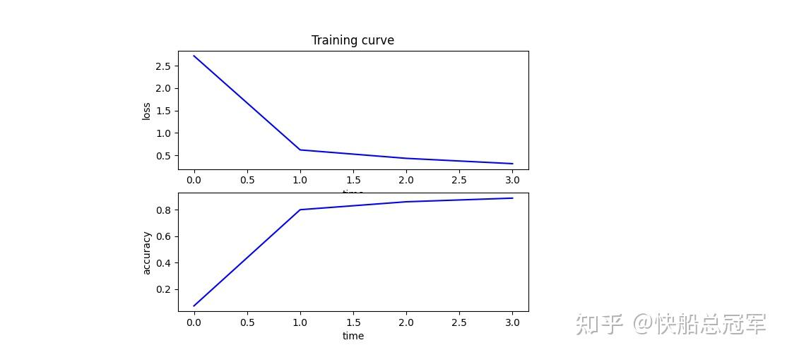
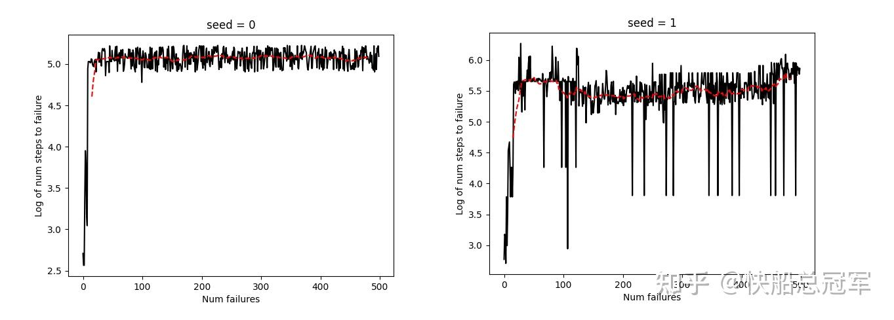

---
title: 'CS229：Ps4解读——强化学习探讨与实现'
publishDate: 2026-01-11
updatedDate: 2026-01-11
description: 'CS229：Ps4解读——强化学习探讨与实现'
category: tech
tags:
  - cs229
  - rl
language: zh
heroImage:
  src: 'images/background.jpg'
  color: '#ca6980'
---

终于终于到了最后一个problem set 啦！！！这一块主要是对于无监督学习的收尾以及强化学习的探讨，虽然我们调程序的时候，见到各种各样的维数不匹配仍然非常的头疼，但是以及有了非常大的改进，这一个problem set的实现结果最后也是非常的漂亮。

具体作业内容以及答案见下

## Problem 1

这道题目主要是用numpy实现了卷积神经网络，具体代码见下

主要难度在于反向传播的实现，对于pool层梯度的传播路径以及conv层的传播都是非常烦的，具体内容之后在cs230的文章中会详细说明

最后使用一个单层卷积层以及一个全连接层的网络，训练结果如下

## Problem 2

强化学习中，在最基本的MDP模型中，两个参数  $\pi(a,s),R(a,s)$  是需要我们训练以及模拟得到的，而实际情况中，训练情况与实际情况关系会较为复杂，导致  $\pi_0(a,s）$  与  $\hat{\pi_0}(a,s）$  差距可能较大，但于此同时R又会相对简单，为了评价  $\pi_1(a,s)$  可能的效果，我们探究了使用过往的  $\pi_0(a,s),R(a,s)$  去评判由(a,s)生成新的  $\pi_1(a,s),R(a,s)$  如何减小误差

（a)(b)(c)中论证了当基于经验模型  $\pi_0(a,s)$  去判断下一个动作时，只需要加上  $\frac{\pi_1}{\hat{\pi_0}}$  的修正，实际的效果和根据  $\pi_1(a,s),R(a,s)$  做出的决策的均值相同，数学上为

$\mathbb{E}_{\substack{s \sim p(s) \\ a \sim \pi_0(s,a)}} \frac{\pi_1(s,a)}{\pi_0(s,a)} R(s,a)=\mathbb{E}_{\substack{s \sim p(s) \\ a \sim \pi_1(s,a)}} R(s,a)$  ，从而将基于新模型进行判断转换为基于旧模型进行判断（

|  |
| --- |
| 重要性采样 |

）

(d)则是考虑了对于经验上R(s,a)与实际上R(s,a)有差别的情况，此时我们考虑对于策略  $\pi(s,a)$  进行泰勒展开，有

$\mathbb{E}_{\substack{s \sim p(s) \\ a \sim \pi_0(s,a)}} \left( \left(\mathbb{E}_{a' \sim \pi_1(s,a')} \hat{R}(s,a')\right) + \frac{\pi_1(s,a)}{\hat{\pi}_0(s,a)} (R(s,a) - \hat{R}(s,a)) \right)=\mathbb{E}_{\substack{s \sim p(s) \\ a \sim \pi_1(s,a)}} R(s,a)$  只要  $R(s,a)=\hat{R(s,a)},\pi_0(s,a)=\hat{\pi_0}(s,a)$  中有一个成立就行。（**双重稳健估计** ）

从而我们发现，如果  $\pi_0$  相对简单，或者是奖励机制简单，使用经验模型去预测就不会有系统误差。

## Problem 3

主要是对于PCA能反映出数据中的特征向量（数据空间中的若干个相互垂直的轴）的理论分析，比较的容易

## Problem 4

ICA中我们通过假设数据本身的分布，实现了对于若干个掺杂数据的分离，而我们当时只是说不能使用Gaussian作为原始分布，这里我们首先证明了这个是不可以的，最后通过假设数据分布为Laplace分布实现了5个数据的分离，实际操作效果下来非常不错。

## Problem 5

这道题目使用强化学习去实现了控制小车，使得小车上方的杆子不要倒下来的一个算法。

在本题中，我们的更新策略是将过往所做过决策以及产生的结果作为“随机实验”的结果，并用来更新  $\pi,R$

而对于每一步的策略的选取，我们通过使用Bellman方程去计算价值  $V(a,s)$  ，并由此更新策略。

最后的结果如图，大概到了60个iteration就收敛了，也就是当杆子摔倒了60次之后终于可以做出比较正确的决策了。（还是有一点点慢的。）

