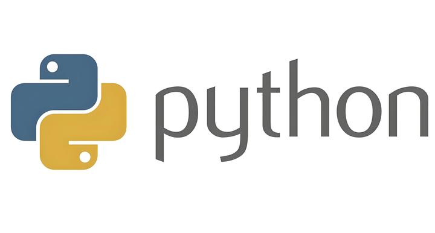

---
title: 'CS229:Python基础用法及常见库(numpy,matplotlib)常见函数总结'
publishDate: 2026-01-11
updatedDate: 2026-01-11
description: 'CS229:Python基础用法及常见库(numpy,matplotlib)常见函数总结'
category: tech
tags:
  - cs229
  - ml
language: zh
heroImage:
  src: 'images/background.jpg'
  color: '#eacd8e'
---




经过长达总时长24h的努力，终于成功的把CS229 Problem Set 1中5道题目给做完了，完成这些题目也是让我略微熟悉了一下python,文件操作和ML中常见的库(numpy,matplotlib)。首先我先来总结一下在我做这些题目中感觉比较常见（容易混淆的）Python及库函数的用法。


## **Python基础用法**

** 基本逻辑结构**

1. ** if语句(常见）**
2. ** 循环：**

```
for i in range(n):
while (condition):
```

for 和while是最为常见的操作，对于从0遍历到n-1的时候，我们一般会使用range，而对于while而言个人习惯于把停止条件放在循环里面

* enumerate用法：如果我们有一个列表/数组/元组，enumerate(array/...)会返回在array里面的元素以及对应的序号例如

```
fruits=[1,2,3,4,5,6]
for index, fruit in enumerate(fruits):
    print(index, fruit)
```

* **遍历一个列表/数组里面的所有元素：** 直接在in之后写上相应的数组

```
students=[ 'aaa' , 'bbb' ,'ccc']
for  student in students:
    print(student)
```

3. 函数&类调用：

重点在于掌握函数参数的调用以及default arguments(初始默认的函数参数的设置）

```
def power(v,p=2):
    return v**p
print(power(10),power(10,3))
```

则输出是100和1000，对于这个求幂次的函数中如果p没有输入，则默认值为2，否则为3（***在机器学习debug的时候非常容易忽略***）

类的结构一般为

```
class LogisticRegression(Father_class):
    def __init__(self, parameters_init):
         self.parameters=parameters_init
    
    def function1(....):
        ....
```

其中Father\_class为继承类，会继承父类中的参数和内部的函数，而对于类内部的参数我们使用self.parameters,(和c语言类中的参数一样）。

* ***注意对于参数的初始化！***下面是一个小小的错误（让人非常的烦躁）

```
class LogisticRegression(LinearModel):
     def __init__(self,parameters):
          self.theta=None
     def fit(self,x_train,y_train):
          self.theta=self.theta+0.01*x_train.dot(y_train-self.theta.T.dot(x_train))
```

如果直接运行的话会报错！因为对于self.theta=None并没有把self.theta像c语言一样变成0（False)，因此我们需要初始化

```
self.theta=np.zeros(x_train.shape[1])# we assume that it is a Linear-Model
```

### Python中主要数据结构

1. int,float,char...这几个非常常见的就掠过了
2. string:

* 字符串的类似于list的性质（这个在通修的C语言课上应该是常识）
* 字符串的分割，粘贴：对于字符串的分割，粘贴在文本的预处理，各种地址的统一化操作中是非常常用的，常见的操作有分割（split,strip)和粘贴（+）
* 字符串中加入变量：使用f'str{parameters}'的操作，或者使用‘str{}’.formet(...)虽然个人更加喜欢前者（easy)

```
str='           123,456        '
str_new=str.strip()#删除字符串头尾的空格以及空行
str1,str2=str.split(',')#按照括号里面的东西将字符串进行分割
str3=str1+'89'+str2 #对于字符串的粘贴我们只要用'+'将一堆东西连起来就可以了
num=5
str4=f'D:/File/problem_{num}.png' #对于将变量加到字符串里面的操作
```

3.list:

对于list的一般的操作，list的定义，元素查找，对于加入，删除元素，list之间的连接这个和C语言非常相似，对于python重点的是几个特殊用法

* ':'以及负数：对于':’我的理解是'从...到’的省略，而对于列表中的负数，表示从列表最后一个元素记为-1，每往左一个为-1，比如如下的例子

```
lis=[1,2,3,4,5,6,7]
lis[:5]#为[1,2,3,4]
lis[5:-1]#为[4,5,6,7]
```

* 列表中的循环

由于python的自由的语言环境，里面的操作也相对自由，在定义列表的时候可以通过列表里面的加上循环&选择来简化我们的过程

```
list_square=[i**2 if i%2==0 else i** 3 for i in range(100)]
```

## Numpy重要用法：关于矩阵

numpy虽然有非常多的函数以及别的操作，但个人感觉numpy最为重要的就是里面的矩阵结构，numpy中包含众多的矩阵（向量）的操作（你在学习线性代数的时候学过的结构在numpy中几乎都有对应的函数，下面我来简介几个最为常用的操作

1. numpy的使用方法：

```
import numpy as np
```

2.numpy矩阵和向量的初始化：

* 对于向量是基于一个一维的数组生成的，而对于矩阵**必须** 通过二维的数组生成,方法都是使用np.array

```
array_1d=np.array([1,2,3])
array_2d=np.array([[1,2,3],[4,5,6]])
```

与此同时，与线性代数中，向量不可以想当然的认为是一个大小为n\*1的矩阵，因此如果你想要对于所有的东西变成矩阵去操作的时候（虽然没有任何必要，因为对于相乘可以用同样的东西）需要使用

```
array_1d_new=np.array([array_1d])
```

* 矩阵和向量大小的提取

对于矩阵是使用A.shape(),将会返回一个列表，而对于向量的大小为使用v.size

```
a=[[1,2],[3,4]]
a.shape()#会输出一个为[2,2]的例子
v=[1,2,3,4]
v.size()#会返回4
```

* 特殊的初始化

对于想要生成一个全为0，1的矩阵以及向量，我们可以使用一些特殊的函数,方法为np.zeros(n/(m,n))

```
a=np.zeros(n)#生成一个大小为n的全部为1向量
a=np.ones((m,n))# 生成一个大小为m*n的全部是1的矩阵
```

3.矩阵的运算：

* 单个矩阵的运算：

对于单个矩阵的运算，比如整体矩阵内部所有元素开根号，求exp，求sin,我们直接使用np.function()就可以了

```
B=np.exp/sqrt/sin/cos/...(A)
```

* 多个矩阵之间的运算

矩阵与单个实数的乘法和加法：直接做就可以了

```
A=[[1,2],[3,4]]
A+5,A*5
```

矩阵相应元素做乘法：直接写乘号**，在这里要特别注意对于矩阵的乘法运算矩阵的大小要相等！！！** 111

```
A,B=[[1,2],[3,4]],[[1,2],[3,4]]
A*B # 30
```

矩阵的乘法：有三种用法，@,.dot(),np.matmul()在实际中最好用的时.dot()因为这个是可以同时进行矩阵，矩阵以及向量之间的运算的。

**特别注意：对于numpy中的向量在乘法运算的时候是看成1行n列的东西，而我们一般的书写习惯是n行1列，所有在乘法的时候要特别注意运算！！！**

```
A.dot(B).dot(x.T)=0 # ABx
```

* 其余的操作

```
A.T #A的转置
np.linalg.inv(A) #A的逆矩阵
np.linalg.det(A) #A的行列式
np.linalg.norm(x, ord=1/2) #对于x的几阶范数
```

至少最近做problem set 1就做到这些东西

## Matplotlib

matplotlib感觉全都是套路，直接贴一段显示一个图片的代码一切都明白了

```
import matplotlib.pyplot as plt
plt.figure()
plt.plot(x_values,y_values,label='line1) #以(x_value,y_value)中点为线，绘制标签为line1的曲线图
plt.scatter(x_values,y_values,'bo') #以(x_value,y_value)中点，绘制blue的形状为o的点
plt.xlabel('x')
plt.ylabel('y')
plt.title('title')#这三条语句顾名思义
plt.savefig(path)#将文件存放在电脑的位置
```

