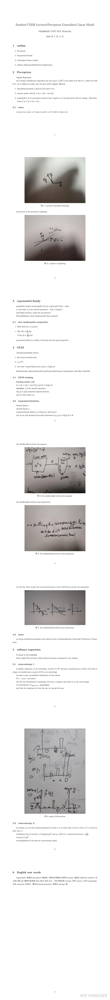

---
title: 'CS229：监督学习(二）—— GLM视角下的模型'
publishDate: 2026-01-11
updatedDate: 2026-01-11
description: 'CS229：监督学习(二）—— GLM视角下的模型'
category: tech
tags:
  - cs229
  - ml
language: zh
heroImage:
  src: 'images/background.jpg'
  color: '#719af1'
---

花了两天的时间把常见的linear regression, binary regression, k-classes regression几个常见的模型学习了一下，Andrew Ng将每一个模型的来龙去脉，包括hypothesis, loss function原因以及不同模型之间的关系进行了详细的说明，并且全部归入了GLM模型中，从而推导了k-classes classification（softmax) 的细节，真的让我大彻大悟。

GLM的核心是通过通过满足Exponential family(指数族函数)的概率分布（pdf) ,并通过这些分布的natural parameters(如  $\sigma, \mu,\lambda$  之类的东西）和  $\eta=\theta^T x$  之间的函数  $\phi=g(\eta)$  建立联系，从而通过  $h_{\theta}(x)=E(y|x,\theta)=\frac{\partial}{\partial \eta_j} a(\eta)$  得出了我们结果在R上的概率分布。（个人认为这个是LR,BR的最核心的地方）

* 取概率分布为Bernoulli分布，则  $P(y|x,\theta)=\phi^{y_i}(1-\phi)^{1-y_i}$ ， 且  $\phi=\frac{1}{1+e^{-\eta}}$

取概率分布为Gaussian分布，则  $P(y|x,\theta)=\frac{1}{\sqrt{2\pi}} exp(-(\frac{(y_i-\mu)^2}{2}))$  ,且  $\phi=\eta$

由于特殊的Exponential family为  $P(y,\eta)=b(y)exp(\eta^T T(y)-a(\eta))$  ，我们可以得到linear regression,以及binary regression 的相应函数。

而对于损失函数而言，对于GLM中的模型，我们都有

$\theta_j:=\theta_j+\alpha (y^i-h_\theta(x^i))x^i_j$

带入即有linear regression 以及binary regression的损失函数。

使用这个方法我们可以得到softmax的响应函数以及损失函数。

对于Exponential family中的函数的性质，由于我Problem set 1 中的东西还没有做，之后再写一篇文章。

以上个人感觉是最为主要的内容，Andrew Ng还讲了一些别的东西，如为什么使用least square, Newton methods, Linear weight regression,以及一些数学上的性质。之后我统一写一篇文章来细说这些东西。

最后附上我的课堂笔记，刚开始尝试使用英文记笔记，可能会有非常多的语法错误，文章中的示意图是我手画的，可能会比较丑陋，大家不要介意。

以及Lecture 4的笔记

