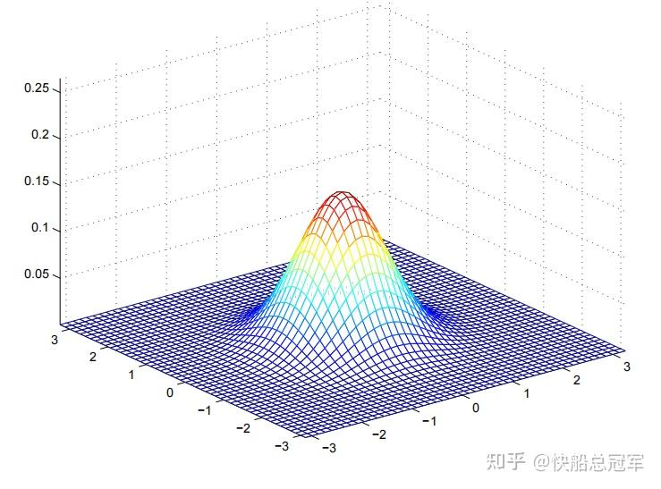
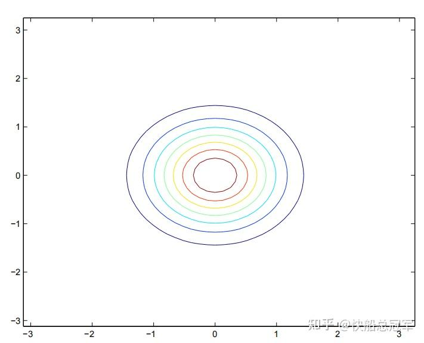
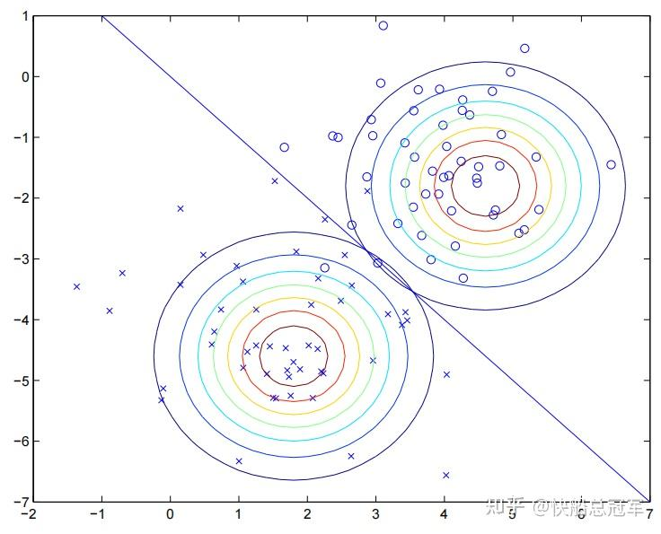
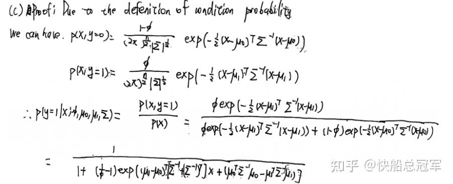
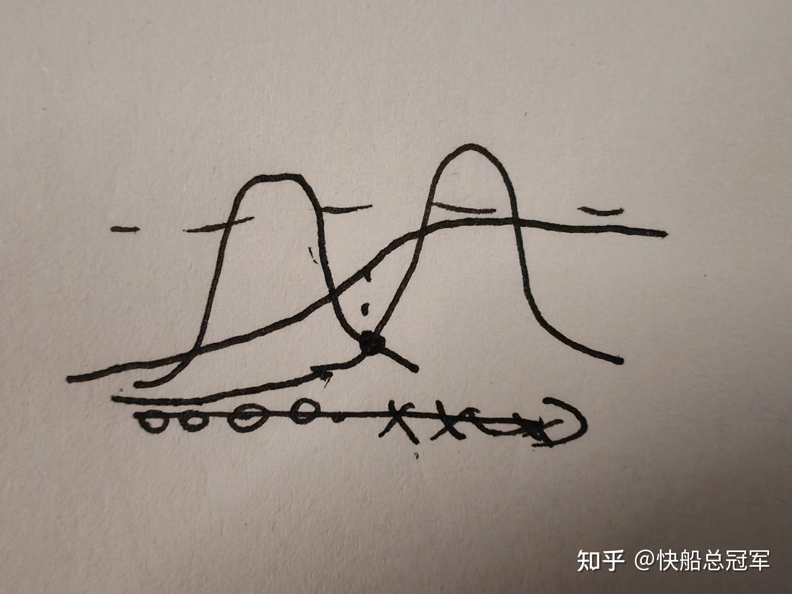

---
title: 'CS229:监督学习（三）—— 简单粗暴的生成式学习算法(1):GDA'
publishDate: 2026-01-11
updatedDate: 2026-01-11
description: 'CS229:监督学习（三）—— 简单粗暴的生成式学习算法(1):GDA'
category: tech
tags:
  - cs229
  - ml
language: zh
heroImage:
  src: 'images/background.jpg'
  color: '#ca6980'
---

拖了2天了，原本想要看完Lecture 6就写这篇文章的，但是Andrew Ng.讲的实在是太好了，搞得我非常想要把SVM给全部学完，结果是看到了Lecture 8, 才发现对于**Generative Learning Algorithm** (生成式学习算法)还没有整理，今天来给大家介绍以下对于一个dataset可以直接使用的**quick and rough** 的算法：GDA和Naive Bayes Method

首先我们来介绍一类全新的模型。

## 生成式学习算法

### Generative Learning Algorithm:

对于我们之前学习的，无论是逻辑回归（Logistic Regression），还是线性回归(Linear Regression)，我们对于求解参数  $\theta $  的方式都是使用对于在满足当前数据集和参数  $\theta,x$  下的最大似然估计  $MLE$  。  $MLE=log(L(\theta))=\Sigma_{i=1}^m log(p(y^i|x^i,\theta))$  （conditional likelihood)。**直觉上看** 就是通过feature去求解在那个class中。这个是之前的中心思想

而由于可以通过feature去求解在那个class中，我们相应的，也可以考虑对于每一个class,可能会在有那些feature,即为考虑  $p(x|y)$  这个就是Generative Learning Algorithm，相应的，在GLA中使用的MLE中的函数

$L(parameters)=\Pi^m_{i=1} P(x^i,y^i;params)=\Pi ^m_{i=1} P(x^i|y^i,params)P(y^i|params)$  (Joint Likelihood)

理解上可以认为是对于conditional likelihood中的  $P(x^i|\theta)=P(x^i)=1$  (虽然不严格）

对于GLA而言，如果我们已知  $p(x|y)$  ，在预测的时候仍然是在给定的  $x,\theta $  下对于y进行预测，那么这个时候对于两者之间联系的桥梁就是Bayes公式：

$P(y|x)=\frac{P(x|y)P(y)}{P(x)}=\frac{P(x|y)P(y)}{\Sigma P(x|y^i)P(y^i)}$

特别的，如果我们是进行一个二分类问题，  $y\in\{0，1\}$  预测的时候即为

$argmax_y(P(y|x))=argmax_y(P(x|y)P(y))$

## GDA(高斯判别分析)

### 理论基础

有了之前的分析，我们想要使用这个方法来进行**二分类问题** ，过去我们是使用Logistic Regression去完成的，如今只需要对于  $P(x|y)$  和P(y)进行求解即可。为此，我们可以做出一些小小的数学假设(已知  $y \in \{0,1\}$  )：

$P(y=1)=\phi_y\\ P(x|y=0)=\frac{1}{(2\pi)^\frac{n}{2}|\Sigma|^\frac{1}{2}}exp(-\frac{1}{2} (x-\mu_0)^T \Sigma^{-1}(x-\mu_0))\\ P(x|y=1)=\frac{1}{(2\pi)^\frac{n}{2}|\Sigma|^\frac{1}{2}}exp(-\frac{1}{2} (x-\mu_1)^T \Sigma^{-1}(x-\mu_1))$

以上的假设对于非常多的情况是成立的，因为对于满足y的特征**在很多情况下** 可以看成是满足一个正态分布（只是这里的正态分布是多元的正态分布）

而对于多元的正态分布，它的两个参数  $\mu_1\in R^n,\Sigma \in R^{n\times n}$  分别表示其均值和协方差，以2维为例子，考虑以  $x_1,x_2,p(x_1,x_2)$  为坐标系建系，其几何图形长成

二维正态分布示意图

考虑它在水平面上的等高线（contour)的投影，长成

其参数的几何意义可以看成

* $\mu$  可以看成是将这个圆环族在水平面上进行平移
* $\Sigma$  对角线上的元素可以看成是将该圆环进行等比例的放大和缩小，而对于非对角线上的元素就是对于对于圆环变成椭圆

### 推导过程

使用以上的假设，参数为  $\phi,\mu_0,\mu_1,\Sigma$  ,我们可以由以上的假设求得

$P(x^i|y^i,params)=\frac{1}{(2\pi)^\frac{n}{2}|\Sigma|^\frac{1}{2}}exp(-\frac{1}{2} (x^i-\mu_{y^i})^T \Sigma^{-1}(x^i-\mu_{y^i}))$

对于参数的求解，使用GLA中的损失函数，  $L(\phi,\mu_0,\mu_1,\Sigma)=\Pi ^m_{i=1} P(x^i|y^i,\phi,\mu_0,\mu_1,\Sigma)P(y^i|\phi,\mu_0,\mu_1,\Sigma)$

带入以上的假设，对于参数进行求导，我们得到

**GDA的参数估计** $\phi=\frac{\Sigma^m_{i=1} y^i}{m}=\frac{\Sigma^m_{i=1} 1\{y^i=1\}}{m} \\  \mu_0=\frac{\Sigma^m_{i=1} 1\{y^i=0\} x^i}{\Sigma^m_{i=1} 1\{y^i=0\}} \\  \mu_1=\frac{\Sigma^m_{i=1} 1\{y^i=1\} x^i}{\Sigma^m_{i=1} 1\{y^i=1\}} \\  \Sigma=\frac{1}{m}\Sigma^m_{i=1} (x^i-\mu_{y^i})(x^i-\mu_{y^i})^T\\$  具体的过程之后在Problem Set 1 的T1中有，过一段时间我会写一篇关于PS1的文章(PS1已经完成了，只差写文章了）。

### 讨论

对于GDA的参数理解，对于  $\phi,\Sigma$  我们可以分别理解为整体中的所有的y的值的一个最大似然估计，以及对于所有给出的值的一个方差。

对于  $\mu_0$  而言即为在y=0这一类中的** 所有x的特征的提取**。对于另外一个也是同样的理解方式。

对于预测的过程中，我们已有的training set即为规定了y=0与y=1对应的类的contour曲线图，而在进行二分类的过程中可以看成y=0,y=1的contour曲线图的交产生的一条直线

GDA示意图

### 与逻辑回归的比较

我们发现对于GDA是产生一条分割的边界线，而对于逻辑回归我们也是产生一条分割线，自然而然的想要考虑在GDA中  $P(y|x,\theta)$  计算出来是多少。

由如下的数学推导和几何直观可以发现

从我的Problem set 1 的solution to T1/(c)中截出来的

手画的图，表示对于y=0,y=1的正态分布在数轴上的投影后P(y|x)的示意图

即有在GDA中，  $P(y|x,\phi,\mu_0,\mu_1,\Sigma)=\frac{1}{1+e^{-\theta^T x}}$  是一个sigmoid函数，因此可以认** GDA是逻辑回归的一个特例！！！**

GDA优点是在使用的时候只需要进行计数的操作就可以求解出其参数，而在进行预测的时候也是直接使用Bayes公式即可，相比于逻辑回归计算量大大下降，也不需要** 非常大**的数据集，就可以快速对于数据集的分布有个大体的认识。

虽然但是GDA对于我们给出的假设** 正态分布**不一定是对的，如果我们把正态分布换成Poisson分布，同样的过程，也可以和逻辑回归进行对应，同样体现了局限性。

总结以下这篇文章，对于GDA和逻辑回归而言，GDA做出了更多的假设，因此只需要相对比较小的数据集，而且在特定的情况下可能准确率还更高，但是逻辑回归没有告诉世界什么信息，这些信息只有数据集才可以告诉我们，从而需要更大的数据集，但也因此有了更好的鲁棒性。对于** 模型假设的信息，数据集的信息，准确性和鲁棒性**此几者的关系是我们认识这个世界的方法之一，这个世界观才是GDA的真正要领

