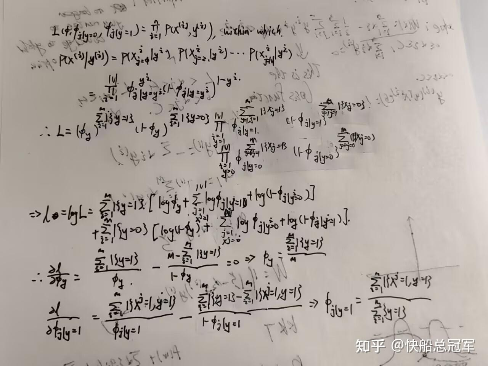

---
title: 'CS229:监督学习(三)——简单粗暴的生成式学习算法(2):Naive Bayes classifier'
publishDate: 2026-01-11
updatedDate: 2026-01-11
description: 'CS229:监督学习(三)——简单粗暴的生成式学习算法(2):Naive Bayes classifier'
category: tech
tags:
  - cs229
  - ml
language: zh
heroImage:
  src: './images/background.jpg'
  color: '#ca6980'
---

在昨天的文章中(今天早上）中，我们使用GLA方法，并使用了Gaussian假设，做了一个GDA分类器。由于GDA中的x都是连续的，接下来我们要来介绍离散情况下的一个分类系统。

## Naive Bayes 分类器

### 模型建立

考虑一个场景：我们想要进行一个文本分类的任务，给定一段文本，判断这是不是垃圾邮件（spam)。对于这个问题，我们由于只是要判断是不是垃圾邮件，所以没有必要使用RNN,Transformer来理解文本的内容，而是考虑以下的几个内容

* 对于文本如何转换成机器可以学习的feature？
* 对于feature转换成分类结果是使用什么分类器？

由于我们只是进行垃圾邮件的分类，我们考虑将字典（dictionary)上不同的字在邮件上的出现情况看成feature，即为对于字典（建立的方法可以是统计自己的过去的1000封邮件中的最常见的10000词，也可以是直接将英文的常见的10000词搬出来），对于需要分析的邮件  $x^i\in[1,|V|]$  其中|V|是字典的大小，对于字典中的序号为j的词如果在邮件中出现，  $x^i_j$  标记为1，否则为0，于是我们将邮件转换成一个向量。

### 参数估计

对于输入  $x^i$  ,由于它是一个大小为  $|V|$  的每一个元素为0，1的向量，因此可以看成是  $\{0,1\}^n$  的|V|的输入。由于需要计算  $L(\theta)=\Pi^m_{i=1} P(x^i|y^i,\theta)P(y^i|\theta)$  ,对于  $P(y|\theta)$  由于这是一个二分类系统，因此在未知  $P(x^i|y,\theta)$  的情况下可以认为y是一个伯努利分布，于是确定参数之一为  $P(y=1)=\phi_y$  。

下面需要计算  $P(x^i|y^i)=P(x^i_1,x^i_2,.....x^i_{|V|}|y^i)=P(x^i_1|y^i)P(x^i_2|x_1^i,y^i)...P(x^i_{|V|}|x^i_1,....x^i_{|V|-1},y^i)$

我们做出一个大胆的假设，即为**Naive Bayes Assumption**,即为假设  $x^i_j$  互相之间是于  $y^i$  条件独立的，写成数学公式即为

$P(x^i|y^i)=P(x^i_1,x^i_2,.....x^i_{|V|}|y^i)=P(x^i_1|y^i)P(x^i_2|x_1^i,y^i)...P(x^i_{|V|}|x^i_1,....x^i_{|V|-1},y^i)=P(x_1^i|y^i)P(x_2^i|y^i)...P(x^i_n|y^i)$ 对于每一个  $P(x_j|y)$  我们由于x是只有两个class，使用伯努利分布，即为  $P(x_j=1|y=1)=\phi_{j|y=1},P(x_j=1|y=0)=\phi_{j|y=0}$

### 结论

通过以下的推导过程，我们得到结论：

$P(x=1|y=1)=\phi_{j|y=1}=\frac{\Sigma^m_{i=1}\Sigma^{|V|}_{j=1} 1\{x_j^i=1,y^i=1\}}{\Sigma^m_{i=1} 1\{y^i=1\}}\\  P(x=1|y=0)=\phi_{j|y=0}=\frac{\Sigma^m_{i=1}\Sigma^{|V|}_{j=1} 1\{x_j^i=1,y^i=0\}}{\Sigma^m_{i=1} 1\{y^i=0\}}\\ P(y=1)=\phi_y=\frac{\Sigma^m_{i=1} 1\{y=1\}}{m}$ 该结论与GDA预测的结果形式类似，对于y=1类的东西的特征提取，都是对于求出** 满足y=1的所有输入的特征的均值，**Naive Bayes Prediction在参数的训练上还是比较容易的。

### 拉普拉斯平滑（laplace smoothing）

在以上的情景中，可能会有如下的情况，就是如果在分析一篇邮件的时候，突然出现了一个在字典中没有出现过的词语，比如说是'Harden',我们在计算参数的时候，由于该词语没有出现过，因此  $\#x|y=1,\#x|y=0$  的个数都是0，于是有  $\phi_{x|y=1},\phi_{x|y=0}$  都是0，在预测的时候

$P(y=1|x)=\frac{P(x|y=1)P(y=1)}{P(x|y=1)P(y=1)+P(x|y=0)P(y=0)}$ 分子分母都是0，这个显然不是特别的合理。

为了解决这个问题，Laplace曾提出过如下想法：假设过去1000天我都能看见太阳升起，那么加上今天的话(太阳升起的概率为1/2）以后太阳升起的概率不低于1000+1/1000+2=1001/1002

因此我们考虑在计数的时候  $\#x|y=0:\#x|y=0+1;\#x|y=1:\#x|y=1+1$  ,这个操作就称为是** Laplace Smoothing。**

因此可以调整

$P(x=1|y=1)=\phi_{j|y=1}=\frac{\Sigma^m_{i=1}\Sigma^{|V|}_{j=1} 1\{x_j^i=1,y^i=1\}+1}{\Sigma^m_{i=1} 1\{y^i=1\}+2}\\  P(x=1|y=0)=\phi_{j|y=0}=\frac{\Sigma^m_{i=1}\Sigma^{|V|}_{j=1} 1\{x_j^i=1,y^i=0\}+1}{\Sigma^m_{i=1} 1\{y^i=0\}+2}\\ P(y=1)=\phi_y=\frac{\Sigma^m_{i=1} 1\{y=1\}}{m}$

对于Naive Bayes Classifier 有的时候也会称为是（Multi-Varient Bernoulli Event Model)

对于以上的生成式学习算法的例子NBC和GDA,我们都是给出了一个比较强的假设，在结果看上去也比较的简单，在对于一个复杂的project分析的时候，用** AndrewNg的话来说就是要先用这些简单的方法完成一些quick and dirty work**然后再具体分析。

下一篇文章讲支持向量机，敬请期待。

