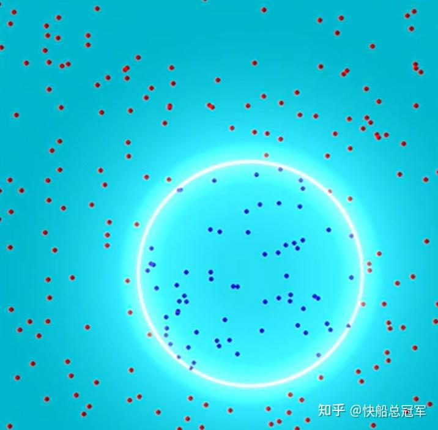
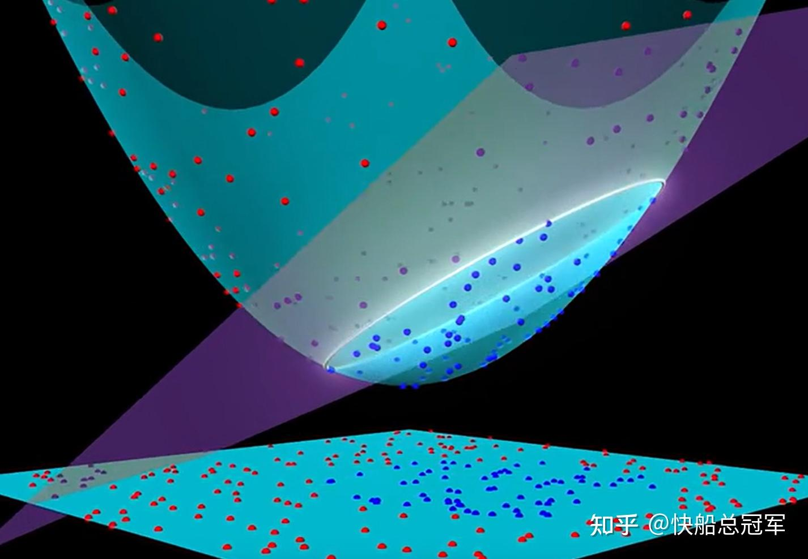
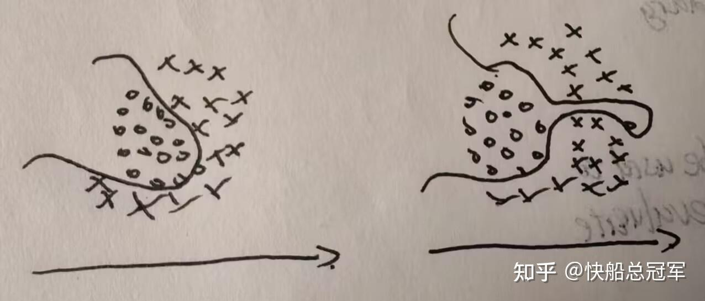
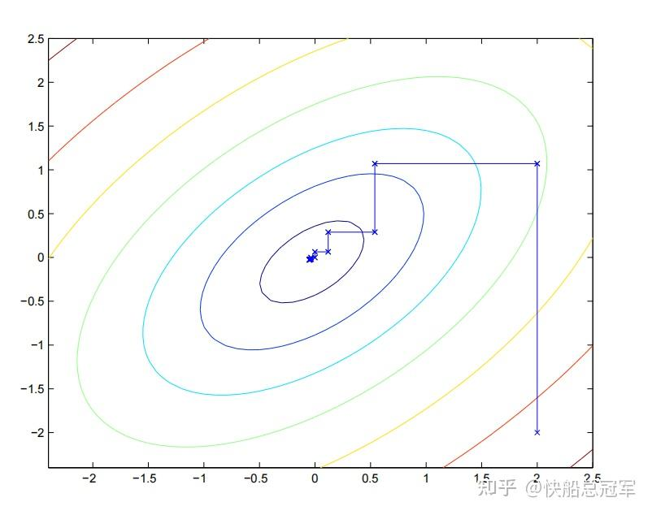

---
title: 'CS229：监督学习（四）——SVM（支持向量机）'
publishDate: 2026-01-11
updatedDate: 2026-01-11
description: 'CS229：监督学习（四）——SVM（支持向量机）'
category: tech
tags:
  - cs229
  - ml
language: zh
heroImage:
  src: 'images/background.jpg'
  color: '#D58388'
---

支持向量机(SVM, support vector machine)是一种全新的模型（形式上），以往的模型都是为了拟合**线性的** 分界（可能对于GDA模型中两个class的方差取不同值的时候分解线的形状不是直线），SVM可以使用核函数空间中的任何一组基来拟合出任何的**非线性边界** 分类，与此同时训练的时候也不容易发生过拟合，可以说这款模型的性能称得上是非常的优秀。

1.hypothesis

2.loss function and the method

3.the mathematic process

4. how to prevent overfitting

5.SMO method to train it.(how to choose the parameters, how to adjust the params)

### 中心思想

问题：给定一组数据集  $\{x^i,y^i\},i\in[1,m],y\in\{-1,1\}$  ，现在需要寻找数据集之间的非线性拟合边界并且对于test\_set进行预测。(y的值-1，1是为了后序方便）

**Essence:** 由于我们仍然想要使用线性模型去拟合，再之前，我们使用的基函数都是  $[x_1,x_2,...x_n]$  ,核心思想是构建一组  $[x_1,x_2...x_n,x_1^2,x_1x_2....x_1^3......x_1^n....]$  的基函数，并将问题转换成**高维上的二分类问题** 再投影到二维平面上，看上去就是非线性曲线边界（所以我们说是形式上）

示意图如下

这是一份我们需要分类的数据，光圈表示边界（理论上长得是一个圆环，待拟合），点表示数据

SVM即为投影到高维，然后对于高维的线性拟合，再投影下来

## 响应函数&损失函数推导

我们先考虑对于  $[x_1,x_2,...x_n]$  这一组基函数进行二分类，由于我们对于基函数之间可能维度不同，因此需要采用一种不同的方法来拟合与边界之间的关系。

**响应函数：** 由于我们仍然是使用线性模型，故响应函数为  $h_{w,b}(x)=w^T x+b$  ，而对于  $\hat{y}=1(h_{\theta}>0),0(otherwise)$

**损失函数推导：**

1. 我们想要借鉴之前逻辑回归的边界判定方法来对于边界进行评估。逻辑回归中，我们有

当  $\hat{y}=1$  的时候，  $\theta^T x>>0$  ，当  $\hat{y}=0$  的时候，  $\theta^T x<<0$  表示模型对于数据的拟合程度比较好（如此取出的边界是比较好的），由此我们对于SVM的损失函数应该有

当  $\hat{y}=1$  的时候，  $w^Tx+b>>0$  ,  $\hat{y}=-1$  的时候，  $w^T x+b<<0$  的特性，从而可以设计

$f_{margin}(x^i,y^i)=y^i(w^Tx+b)$  为损失函数，当f的值比较大的时候说明拟合效果比较好。

话虽如此，如果我们把所有的图像等比例放大

$f_{margin}(x^i,y^i)=y^i(2w^Tx+2b),f_{margin}(x^i,y^i)=y^i(20000w^Tx+20000b)$  这两个的分类效果和原本是一样的，故进行归一化，取  $g_{margin}(x^i,y^i)=\frac{y^i(w^Tx^i+b)}{||w||}$  来评估边界的性能。

2.对于所有的数据，我们的评估函数g(x)再几何角度上可以看成是到每一个数据点到边界的距离，因此对于边界的评估，我们可以用所有的样本的距离的最小值取评估，即为

$\gamma=min^m_{i=1} \gamma^i,\gamma^i=\frac{y^i(w^T x+b)}{||w||}$

### 损失函数形式化简

这一段可能会比较冗长，主要是对于评估函数的等价化化简，下面来细说之。

我们的损失函数为  $max(\gamma),\frac{y^i(w^Tx^i+b)}{||w||}\geq\gamma$  ，令  $||w|| \gamma=t$  ,则化简为  $max(\frac{t}{||w||}),y^i(w^Tx^i+b)\geq t$  ,由线性性，不妨设t=1,则  $max(\frac{1}{||w||}),y^i(w^Tx^i+b)\geq 1$  ，从而只需要证明  $min(\frac{1}{2}||w||^2),y^i(w^Tx^i+b)\geq 1$

我们先来补充一点点的** 数学基础**：

对于  $minf(x),h_i(x)=0,g_i(x)\geq 0$  的问题，由拉格朗日乘数法，考虑

$L_{\alpha_i,\beta_i}(x)=f(x)+\Sigma_{i=1}^m\alpha_ig_i(x)+\Sigma_{i=1}^n\beta_ih_i(x)$  需要考虑L(x)在** 先**求拉格朗日乘子在定义域上的最大值，** 然后**求L(x)对于x在x的定义域上的最值，即为  $ans=min_xmax_{\alpha,\beta}L(x)$

我们考虑什么时候可以交换这两个符号，由** 凸优化理论，**  $min_x max_{\alpha,\beta}L(x)\geq max_{\alpha,\beta}min_xL(x)$  成立当且仅当f，g都为凹函数且h可以写成x的线性组合。

因此要求L(x)的最小值，我们需要有等号成立（等号显然成立），对于  $min_xL(x)$  就可以使用** 拉格朗日乘数法**，结合max的条件，对于  $L_{\alpha,\beta}(x)$  必然存在  $\alpha^*,\beta^*,x^*$  使得

$\frac{\partial L_{\alpha,\beta}(x^*)}{\partial x}=0(1)\\ \frac{\partial L_{\alpha,\beta}(x^*)}{\partial \alpha}=0(2)\\ \frac{\partial L_{\alpha,\beta}(x^*)}{\partial \beta}=0(3)\\ g(x^*)\leq0,\alpha^*>0(4)\\ \alpha^*_ig_i(x^*)=0(5)\\  $

### 损失函数化简

对原损失函数使用拉格朗日乘数法，得到

$L_{\alpha,\beta}(x)=\frac{1}{2}||w||^2-\Sigma^m_{i=1}\alpha^i(y^i(w^Tx^i+b)-1)$  ，将KKT条件带入得到

$\frac{\partial L_{\alpha,\beta}(w^*)}{\partial w}=0\Rightarrow w=\Sigma^m_{i=1}\alpha_iy^ix^i\\  \frac{\partial L_{\alpha,\beta}(w^*)}{\partial \beta}=0\Rightarrow\Sigma^m_{i=1}\alpha_iy^i=0\\ \alpha_i>0(4)\\ \alpha^*_ig_i(w^*)=0\Rightarrow y^i(w^Tx^i+b)=1\\  $

因此我们只需要拟合参数  $\alpha_i$  (由此我们可以发现SVM的参数大小是和训练数据的量密切相关的),使得

$max_\alpha\Sigma^m_{i=1}\alpha_i-\Sigma^m_{i=1}\Sigma^m_{i=1}\frac{1}{2}y^iy^j\alpha_i\alpha_j<x_i,x_j>$  限制条件为  $\Sigma_{i=1}^m\alpha_iy^i=0,\alpha_i>0$  ,其中  $<x_i,x_j>$  为基函数  $x_i,x_j$  之间的内积。

在预测的时候，有  $h_{\alpha,b}(x)=\Sigma_{i=1}^m\alpha_iy^i<x^i,x>+b$  ,由KKT条件有

$y^i(w^Tx^i+b)=1\Rightarrow w^Tx+b=y^i\Rightarrow b=y^i-\alpha_iy^i<x_i,x_i>$

### **核函数（Kernel trick)**

以上的操作都是对于以  $[x_1,x_2,...x_n]$  为基函数的空间进行的线性分类，注意到无论是损失函数还是预测函数我们都是使用基函数的内积去操作的，因此我们只需要建立能计算对于新的基函数  $f_i(x_1,x_2,....x_n)$  两两之间的内积  $<f_i,f_j>$  即可，为此我们使用一个叫做核函数的东西。

设我们的一组基构成的向量为  $\phi(x)=[f_1(x_1,x_2,...x_n)...f_m(x_1,x_2,...x_m)]$  ,由于当我们选择欧氏空间时，内积为  $x^TGx$  ，其中G为其度量矩阵，其计算方式为  $G=[x_1,x_2,...x_n][x_1,x_2,...x_n]^T=I$  ,因此我们仿照即有令  $K(x,z)=\phi(x)^T\phi(z)$  ** 称K(x,z)为核函数**

举个例子

例：  $1.K(x,z)=x^Tx,\phi(x)=[x_1,x_2,...x_n]\\ 2.K(x,z)=(x^Tz+b)^2,\phi(x)=[x_1^2,x_2^2,..x_n^2,\sqrt{2b}x_1,\sqrt{2b}x_2,...\sqrt{2b}x_n,b]$

因此如果我们规定了核函数（核函数需要可以写成  $K(x,z)=\phi(x)^T\phi(z)$  ，可以证明，对于任何的半正定矩阵都可以写成核函数的形式），将  $<x,z>\Rightarrow K(x,z)$  即可将基所在的空间由n维拓展到任意的想要的维度。

常见的核函数

* Gaussian 核：  $K(x,z)=exp(-\frac{(x-z)^T(x-z)}{2\sigma^2})$  无穷维空间
* Polynomial核：  $K(x,z)=(x^Tz+1)^n$  多项式空间
* 线性核：  $K(x,z)=x^Tz$

**为什么我们需要使用核函数** ？对于核函数由以上的形式可以发现，如果对于输入  $x^i=[x^i_1,x^i_2,...x^i_n]$  ，而基为m维的，那么对于基的计算就需要O(m)的复杂度，于是对于  $K(x,z)=\phi(x)^T\phi(z)$  的计算O(m)的复杂度，而如果是使用了核函数的话，在计算的时候，  $x^Tz$  的计算只需要O(n）的复杂度，从而  $K(x,z)$  的计算只需要O(n)的复杂度。

比如对于Polynomial核而言，如果是不使用核函数，就需要  $O(n^d)$  的复杂度，效果非常的明显。

综上所述，我们有了**SVM** 的评估函数以及响应函数

$1.max_\alpha\Sigma^m_{i=1}\alpha_i-\Sigma^m_{i=1}\Sigma^m_{i=1}\frac{1}{2}y^iy^j\alpha_i\alpha_j K(x_i,x_j),\alpha_i>0,\Sigma^m_{i=1}\alpha_iy^i=0\\ 2.h(x)=\Sigma^m_{i=1}\alpha_iy^iK(x^i,x)-\frac{1}{m}\Sigma^m_{i=1}(y^i-\alpha_iy^iK(x_i,x_i))$

以上的情况都是对于数据集分类情况比较良好的情况(如左图），而对于右图(不可分隔的情况），Variance就容易变得非常的大。

不可分隔的数据集的一个例子，手画，勿喷

为了解决过拟合噪声的问题，我们需要对于进行正则化，在本题中，由于距离的定义是与**边界之间的距离** $\frac{y^i(w^Tx^i+b)}{||w||}$  并且是以1为单位的，因此我们只需要对于每一项的的距离用  $1:1-\zeta_i$  去代替即可。

即为  $min(\frac{1}{2}||w||^2+C\Sigma^m_{i=1}\zeta_i^2),y^i(w^Tx^i+b)\geq 1-\zeta_i$

使用同样的方式进行化简，我们即有** 正则化后的SVM模型**

$1.max_\alpha\Sigma^m_{i=1}\alpha_i-\Sigma^m_{i=1}\Sigma^m_{i=1}\frac{1}{2}y^iy^j\alpha_i\alpha_j K(x_i,x_j)\\ 0<\alpha_i<C,\Sigma^m_{i=1}\alpha_iy^i=0\\ 2.h(x)=\Sigma^m_{i=1}\alpha_iy^iK(x^i,x)-\frac{1}{m}\Sigma^m_{i=1}(y^i-\alpha_iy^iK(x_i,x_i))$

而且KKT条件变成了

$\alpha_i=0\Rightarrow y^i(w^Tx^i+b)\geq 1\\ \alpha_i=C\Rightarrow y^i(w^Tx^i+b)\leq 1\\ 0<\alpha_i<C\Rightarrow y^i(w^Tx^i+b)= 1$

而该KKT条件就是损失函数收敛的条件，即可用来进行训练。

### 参数训练（SMO,sequential minimal optimization)

接下来就是如何训练这些  $\alpha_i$  了，我们仍然想要使用梯度下降法，但是这道题目中有两个限制条件，因此我们不能直接使用原来的梯度下降，我们使用类似** 高中数学竞赛中的“调整法”的思路**，每一次选择两个参数  $\alpha_i,\alpha_j$  进行调整，直到全部满足KKT条件

SMO步骤

Step1:选择参数  $\alpha_i,\alpha_j$  。

Step2:对于  $\alpha_i,\alpha_j$  进行调整，控制  $\Sigma^m_{i=1}\alpha_iy_i=0$  不变，调整  $\alpha_iy^i+\alpha_jy^j=-\Sigma_{other}\alpha_ky^k=c$  则有  $\alpha_i y^i+\alpha_jy^j=c\Rightarrow \alpha_i=y^i(c-\alpha_jy^j)$

损失函数  $W=\Sigma^m_{i=1}\alpha_i-\Sigma^m_{i=1}\Sigma^m_{i=1}\frac{1}{2}y^iy^j\alpha_i\alpha_j K(x_i,x_j)$  ,将调整之后的结果带入，结果为

$W=\alpha_j+y^i(c-\alpha_jy^j)+\Sigma_{other} \alpha_k-\frac{1}{2}(y^iy^i (y^i(c-\alpha_jy^j)^2K(x_i,x_i+y^jy^j(\alpha_j)^2K(x_j,x_j)+2y^iy^jy^i(c-\alpha_jy^j)\alpha_jK(x_i,x_j)+2(y^iy^i(c-\alpha_jy^j)K(x_i,x_k)+y^j\alpha_jK(x_j,x_k))\Sigma_{other} \alpha_k+other)\\ =\alpha_j+y^i(c-\alpha_jy^j)-\frac{1}{2}((c-\alpha_jy^j)^2K(x_i,x_i)+(\alpha_j)^2K(x_j,x_j)+2y^j(c-\alpha_jy^j)\alpha_jK(x_i,x_j)+2((c-\alpha_jy^j)K(x_i,x_k)+y^j\alpha_jK(x_j,x_k))\Sigma_{other} \alpha_k+other)$

$\dfrac{\partial W}{\partial \alpha_j}=1-y^iy^j-\frac{1}{2}(2y^j(\alpha_jy^j-c)K(x_i,x_i)+2\alpha_jK(x_j,x_j)-4\alpha_jK(x_i,x_j)+\Sigma_{other}\alpha_k(-y^jK(x_i,x_k)+y^jK(x_j,x_k)))=0\\ $

这是关于  $\alpha_j$  的一元方程，从而可以接的  $\alpha_j=...$ ,记成A。

结合调整之后需要满足的限制条件  $\alpha_i^{new},\alpha_j^{new} \in[0,C]$  ，我们对于  $L<\alpha_j<H$  ,必须满足  $y^i!=y^j,L=max(0,\alpha_j-\alpha_i),H=min(C,C+\alpha_j-\alpha_i)\\ y^i=y^j,L=max(0,\alpha_i+\alpha_j-C),H=min(C,\alpha_i+\alpha_j)$

从而结合限制条件之后，  $\alpha_i=H  \ ,\alpha_j>H\\ =A,L<\alpha_j<H\\ =L, \alpha_j<H$

示意图如下

SMO示意图

Step3:当所有的参数满足KKT条件或者可以看成是kkt条件时,即为

$\alpha_i=0\Rightarrow y^i(w^Tx^i+b)\geq 1\\ \alpha_i=C\Rightarrow y^i(w^Tx^i+b)\leq 1\\ 0<\alpha_i<C\Rightarrow y^i(w^Tx^i+b)= 1(|y^i(w^Tx^i+b)-1|<10^{-5})$

的时候，可以认为收敛

以上我们将SVM的损失函数，评估函数与训练过程给简略的描述了一遍，对于SVM的过程如此复杂的有一部分原因是在有限制条件的时候无法使用传统的距离函数与梯度下降，本方法则为以上的情况提供了一个新的解决思路。

虽然如此，在设计模型的时候，仍然是想要往** 线性回归**上面去思考，而在本题中是通过重新构造了一个评估函数，并使用** 核函数去作为高维到低维的桥梁。**同样是借用了** 逻辑回归**的思路，从** 距离的度量，**到** 损失函数的构建，**到** 数学推导，**到** 最后的模型训练，**将空间换成了** 有限制的无穷维的空间，清晰明了，有解释性的推导**让我们好好品味到了** 机器学习的美。**

