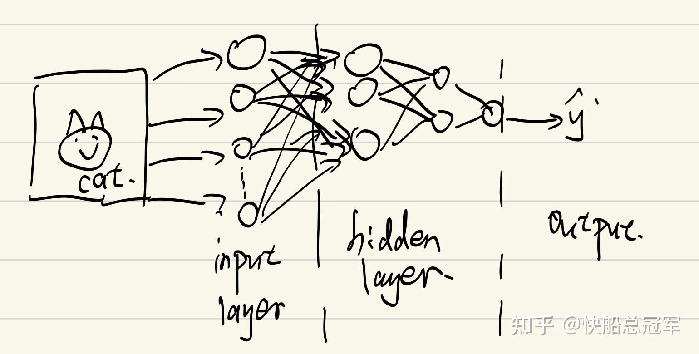
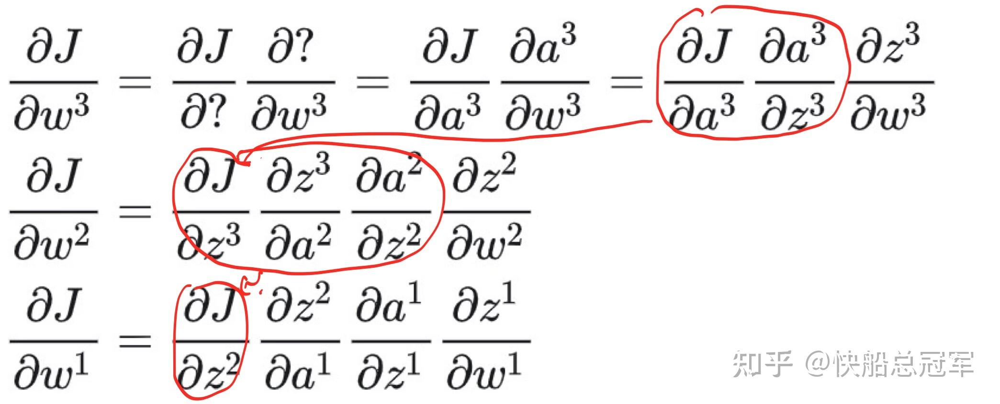
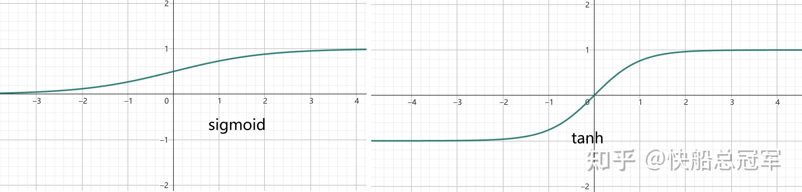

---
title: 'CS229:监督学习（五）——神经网络训练与架构'
publishDate: 2026-01-11
updatedDate: 2026-01-11
description: 'CS229:监督学习（五）——神经网络训练与架构'
category: tech
tags:
  - cs229
  - dl
language: zh
heroImage:
  src: 'images/background.jpg'
  color: '#D58388'
---

在之前的模型中，我们都是有一堆的输入，输入到一个函数当中，得到对于概率的响应函数。但是这些都是只经过一个函数，在这个过程中用到了非常强的假设，对于复杂的模型的拟合效果自然不是特别的好。

在Lecture10，11中我们学习了关于深度学习的基础——**神经网络** 。包括神经网络中的神经元的架构，预测（Forward Propagation前向传播）以及训练参数（Backward Propagation反向传播），训练中的常见问题以及解决方法，以及一些有趣的想法

## 神经网络基本元素

以我们之前学过的逻辑回归为例，我们给了一张  $64\times 64\times 3 $  的图片，想要训练一个模型，判定这个图片中有没有猫。之前我们做的是  $h_{\theta}(x)=sigmoid(\theta^T x)=sigmoid(w^Tx+b)$ 。输出的时候使用这个函数去得出输入的东西有猫的概率，若概率大于0.5，则输出1，反之为0。训练的时候我们使用  $J(\theta)=\Sigma^m_{i=1}logP(y^i|x^i,\theta)$  作为损失函数去计算去拟合参数。

进一步的，我们将这个过程看成对于图片先输入，然后参数输入到  $w^T\alpha+b$  的步骤，再通过sigmoid函数，最后输出的步骤，

**神经元：** 输入的参数通过一个线性层，然后用一个激活函数作用，得到一个输出。这就是一个神经元，数学表示即为  $y=f(w^TX+b)$  ,其中w称为权重，而b为偏置。

**层：** 对于层之中的元素无连接关系，而对于相邻的层之间为两两连接的。

**输入输出层：** 特殊的神经元（至少我是这样理解的），输入层（input layer)可以看成是一个一对一的，激活函数为一次函数，无偏置的一层神经元，将输入传递到网络内。输出层（output layer)中的每一个神经元都会输出一个相应的结果。而隐藏层则为其余的所有的层。

一个简单的神经网络如下图，这是一个输入+3个隐藏层+输出的一个神经网络。

a picture about the Neuron Network

为了方便起见，对于输入我们记成一个矩阵  $X=(x_1,x_2,...x_n)$  ,对于第i层的输出为  $a^i=(a^i_1,a^i_2,...a^i_{n_1})$  为第一层所有的矩阵的输出组成的矩阵，对于第i层的权重与偏置组成矩阵和向量  $w^i,b^i$  因此对于这个网络我们有

* $z^1=w^1X+b^1,a^1=\sigma(z^1)$
* $z^2=w^2a^1+b^2,a^2=\sigma(z^2)$
* $z^3=w^3a^2+b^3,a^3=\sigma(z^3)$
* $\hat{y}=a^3$

如果我们已经得到了所有的参数之后，对于需要预测的向量  $t=(t_1,t_2,...t_n)$  而言，只需要输入到神经网络中，就有输出  $\hat{y}=\sigma(w^3\sigma(w^2\sigma(w^1t+b^1)+b^2)+b^3)$  即为所求，对于每一层的参数不断往前传递的过程我们称为前向传播(Forward Propagation)

## 神经网络参数训练

我们参数训练仍然是参考之前的线性回归和逻辑回归

**损失函数:** 若结果是离散的，则其损失函数为  $J(\theta)=-\Sigma^m_{i=1}y^ilog(softmax(\hat{y}^i)),softmax(\hat{y}^i)=\dfrac{e^{\hat{y}^i}}{\Sigma e^{z_k}}$  ,而如果是连续的，那么其损失函数为  $J(\theta)=\dfrac{1}{2}|y-\hat{y}|^2$  。

**训练原理：** 仍然为梯度下降，对于网络中的参数  $\theta$ ,更新原理仍然为  $\theta:=\theta-\alpha\dfrac{\partial J(\theta,\theta_{other})}{\partial \theta}$  ,只是由于神经网络的特殊的架构，我们可能会使用不同的batch批次去训练（后面再说）

## 反向传播（Backward propagation）

在梯度下降的过程中，我们需要求解  $\dfrac{\partial J(\theta)}{\partial \theta}$  ，但是由于神经网络的特点，参数求导并不像以往的回归模型中直接求导。而借由链式法则求解时，我们又发现在求导的过程中对于不同参数的求解过程中有较多可以存储的地方，从而可以将误差进行传播。

以对权重求导为例，我们有

可以发现，对于每一层的参数求导的时候对于不同层之间的  $\dfrac{\partial J}{\partial z^i}$  都是从  $z^n\Rightarrow z^{n-1}...\Rightarrow z^1$  （由此称为时反向传播)。

使用以上的规则，对于**神经网络的参数训练步骤** 如下：

**Step1:** 在上一个batch中会存储下所有参数的值，  $z^i,a^i,w^i,b^i,X，\hat{y},i\in{[1,n_{layer}]}$

**Step2:** 首先计算  $\dfrac{\partial J}{\partial z^n}$  ,然后由反向传播根据  $\dfrac{\partial J}{\partial z^{n-1}}=\dfrac{\partial J}{\partial z^n}\dfrac{\partial z^n}{\partial a^{n-1}}\dfrac{\partial a^{n-1}}{\partial z^{n-1}}$  。

由于对于  $\dfrac{\partial z^n}{\partial a^{n-1}}，\dfrac{\partial a^{n-1}}{\partial z^{n-1}}$  的表达式我们都直到，因此只需要将上一个batch中的的结果带入即可

同理可以计算出  $\dfrac{\partial J}{\partial z^n},\dfrac{\partial J}{\partial z^{n-1}},....\dfrac{\partial J}{\partial z^1}$

**Step3:** 对于需要求解的参数  $\dfrac{\partial J}{\partial w^i}=\dfrac{\partial J}{\partial z^i}\dfrac{\partial z^i}{\partial w^i},\dfrac{\partial J}{\partial b^i}=\dfrac{\partial J}{\partial z^i}$  由于表达式已知，因此可以直接求解。

**Step4:** 使用  $\theta:=\theta-\alpha\dfrac{\partial J(\theta,\theta_{other})}{\partial \theta}$  对于所有的参数进行更新，并记录  $z^i_{new},a^i_{new},w^i_{new},b^i_{new},X，\hat{y}_{new},i\in{[1,n_{layer}]}$

在实际使用中，我们会将整个数据集合分成若干个batch进行输入，每一次输入的时候会使用上一个batch存储的数据，使用这一次的数据去更新。

这样可以有效的节约内存，但是会导致loss是按照锯齿形状下降，这种方法称为batch-algorithm

## 常见问题以及相应的对策

### 常见的损失函数

之前我们见过了sigmoid函数，线性函数，在实际中还有一些别的函数

* **ReLU函数**

表达式  $ReLU(x)=x(when\ x>0),0 (otherwise)$  ,

对于导数值  $ReLU'(x)=0(when\ x <0),1 (otherwise)$

其特点是计算简单使用** 方便**，且其导数的值正好为1, ** 不容易发生梯度消失或爆炸**的现象，但是缺点是几何意义不是特别的好

* **Sigmoid函数**

表达式  $Sigmoid(x)=\dfrac{1}{1+e^{-x}}$  ,且  $Sigmoid'(x)=\sigma(x)(1-\sigma(x))$

其特点是可以将整个实数轴上的东西压缩到（0，1）上，可以进行** 归一化**，但是缺点是导数容易发生** 梯度消失**的情况。

* **tanh函数**

表达式为  $tanh(x)=\dfrac{e^z-e^{-z}}{e^z+e^{-z}},tanh'(x)=1-tanh^2(x)$

同样的，其特点是可以将实数轴的东西压缩到** （-1，1）**上，缺点也是容易发生** 梯度消失**的情况

以上图像如下

sigmoid&tanh

### 梯度消失/爆炸以及对策

由于我们在计算梯度的时候，对于深度神经网络常常会是几十个东西乘在一起，但是我们知道  $2^{64}$  直接炸掉longlong了，因此我们要对此做出一些对策

** Method1**:使用ReLU作为激活函数，减少使用sigmoid和tanh函数

** Method2**:使用合适的初始化，其原则是使得梯度尽可能的接近于1

结合  $z=w_1x_1+w_2x_2+...w_nx_n$  为倒数第一层的一个神经元，总共有n个输入，那么对于z希望在1附近，就需要  $w_i$  在  $\frac{1}{n}$  附近，从而对于第l层我们有  $w_i\approx\frac{2}{n^{m-(l-1)}}$

* **Simple Initialization** :  $W_i^l=np.random.randn(shape)*np.sqrt(\frac{2}{n^{l-1}})$
* **Xavier Initialization** :改成  $\sqrt{\dfrac{1}{n^{l-1}}}$
* **He Initialization** :改成  $\sqrt{\dfrac{2}{n^l+n^{l-1}}}$

以上就是神经网络的基本内容，包括架构，预测过程，损失函数以及梯度求解中的反向传播，掌握好这些，便可以为之后理解更加复杂的神经网络结构打下基础，对整个世界有更加清晰的认识。

