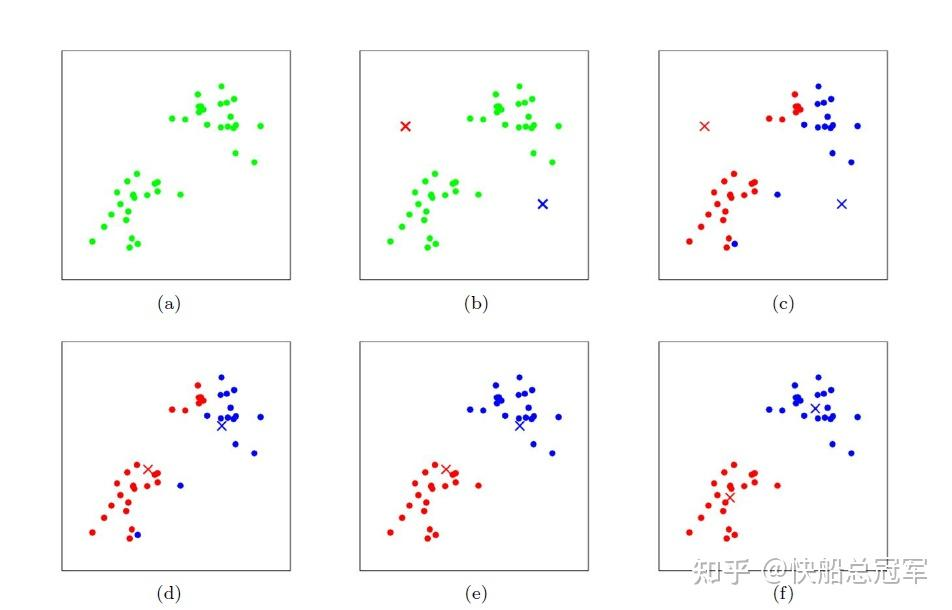
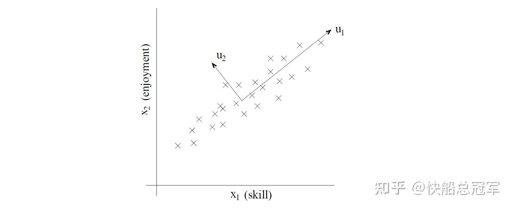
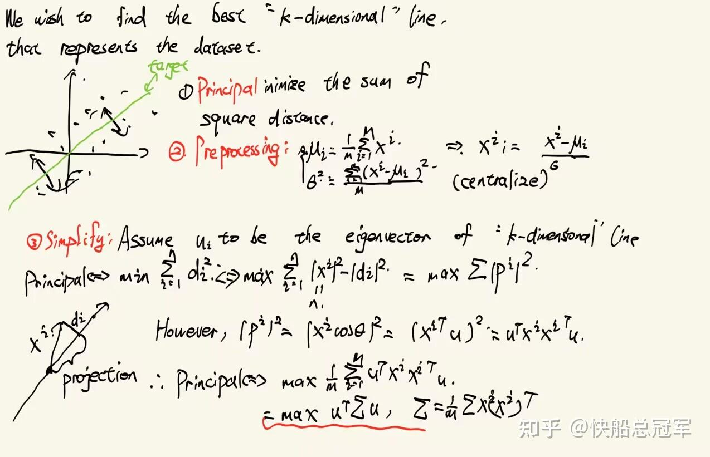

---
title: 'CS229: 无监督学习（一）：从聚类到成分分析——K-means、PCA 与 ICA'
publishDate: 2026-01-11
updatedDate: 2026-01-11
description: 'CS229: 无监督学习（一）：从聚类到成分分析——K-means、PCA 与 ICA'
category: tech
tags:
  - cs229
  - ml
language: zh
heroImage:
  src: 'images/background.jpg'
  color: '#D58388'
---

在之前的课程中，我们学习了当数据集为  $(x^i,y^i)$  的标签数据时的监督学习以及一些优化模型的思想。而在实际生活中，有这样的情况：训练一个大模型的时候，我们只有一个语料库，里面没有说对于《数学分析》标签为1的情况，对于数据集为  $(x^i)$  时进行训练与预测，我们称之为无监督学习。接下来我们将会学习一些无监督学习的方法。

对于无监督学习，我们会使用概率学习（Factor-analysis,Mixture of Gaussian）以及无概率学习(PCA,K-means,ICA)两种模式，以及处理概率模型时的一种常见模型：EM算法。这些模型中的自我迭代，特征值，如何做出假设这些想法为以后我们思考问题提供了一种思考方式

## K-means聚类算法

对于之前我们使用过softmax以及EM处理过多分类以及非线性边界问题，但是当时的训练数据集都有数据的标签，而现在我们给定了一组数据  $(x^1,x^2,...x^n)$  想要将其分成k类。而k-means聚类算法是通过**聚类中心学习** ，通过**距离** 因素去预测。

**k-means 具体步骤** ：

* 对于数据  $(x^1,x^2,...x^m),x^i\in R^n$  ，随机取聚类中心  $(\mu^1,\mu^2,...\mu^k)$  为  $R^n$  上的任意k个点
* 将每一个  $x^i$  的标签记为与其最近的聚类中心的类  $c^i$  ,即为  $c^i=argmin_{j}||x^i-\mu_j||^2$
* 更新数据：将聚类中心位置  $\mu_j$  更新为其类中所有的点的中心，即为  $\mu_j:=\dfrac{\Sigma_{i=1}^m1\{c^i=j\}x^i}{\Sigma_{i=1}^m1\{c^i=j\}}$
* 不断重复以上三个步骤
* 预测的时候，对于数据  $x$  ，预测值  $c=argmin_{j}||x-\mu_j||^2$  即为所求

k-means几何直观上就是我们对于理论上的最佳的分类方式，我们通过迭代一定会让我们分类的中心点不断趋近于每一个理想分类的中心，而使用k-means一定是收敛的，因为  $J(c,\mu)=\Sigma^m_{i=1}||x^i-\mu_{c^i}||^2$  是单调递减的，从而一定收敛

k-means

k-means的原则是对于每一个点的分类只取决距离它最近的聚类中心，每一个点的分类是确定的，而不是通过概率，这也说明k-means在使用的时候**较难与其余的模型结合，拓展性较差** ，但是通过距离去迭代中心的思想是有一定借鉴性的。

以上都是**分类** 问题，而我们常常会涉及到**component analysis**,即为对于一组数据如何找到组成它的重要元素，

* 对于脑电波提取的时候，大量的传感器会传来若干组曲线，我们想要找到这些曲线是由那些部分组成，比如心脏跳动，眼皮跳动之类的，这就是找到相互独立的部分Independent component analysis(ICA）
* 如果我们在房间里面放了若干个传感器来探测温度，我们如何从这么多的数据中去抽象出来温度的曲线？这就需要使用类似与数据压缩的技术：Principal component analysis

这两者一个是为了**还原原本的数据** ，一个是为了压缩数据，**去除噪声** ，共同点都是原本的数据都是混合的，而且提升了数据处理之后的无相关性，实际中都是非常的有用的。

## PCA(Principal component analysis)

所谓的PCA，实际上就是找到数据的子空间并且通过一定的处理将数据维度减少。就像你在一个校园里面各个角落放了1000个温度传感器，你想要找到这些温度曲线是由太平洋气流，工地施工，学生活动这些子空间构成的，希望将找到这些子空间。

一看到子空间，如果你线性代数学的比较好的话，对于一个正交矩阵的特征值以及n个特征向量（考虑Schmit正交化后的），每一个向量都可以分解成这些特征向量的线性组合，而对于特征值则代表了矩阵在这个方向上的缩放效应，如果特征值越大，说明对于一个向量在特征向量上投影占比越大。

**从信息的角度去看** ，就是特征值越大，这个特征向量所占有的信息就越多，从而应该被提取出来。如此一来，应用到原本的案例中，就是对于测试数据集，我们找到最大的k个特征值(计算重数)，使用对应的特征向量去进行预测，而别的特征向量对应的维度我们则认为是噪声。这就是PCA的基本原理。

PCA

当然，这些也只是感性的认识，具体的**数学证明** 如下：

PCA Prooving

于是我们只需要使用k个最大的特征向量去作为k-dimensional line的一组基即可。

总结而言PCA即为（1）预处理归一化 （2）求解矩阵  $\Sigma=\frac{1}{m}\Sigma^m_{i=1}x^i{x^i}^T$  的特征值，将对应的特征向量作为一组基 （3）  $\hat{y}=x^Tu$  作为预测

在这一过程中我们仍然是通过距离这一个要素去作为考量单位为，只是不是考虑与点之间的距离，而是最大化与k-dimensional line 的距离

## ICA(Independent component analysis)

考虑一个场景，对于两个人同时对着面前的麦克风讲话，但是这个麦克风比较低端，没有除杂音设备，因此会将自己面前这个人以及远处的那个人的声音全部录进去，我们的任务就是将这两个声音分开，得到两个独立的声源。

解决这个问题，由于是两个独立的声源以及录音源，可以假设**对于每一个录音源记录的声音是声源的线性组合** 。设录音得到的数据为  $x^i,i\in[1,T]$  ,而对于实际上的讲话的人为  $s^i,i \in [1,T]$  ,于是有  $x=As=W^{-1}s,s=Wx$  。

仍然是希望使用**MLE**,即为  $P(s)=\Pi^T_{i=1} P_s(s^i)$  ，且我们知道  $P(x)$ 以及x与s之间的变换关系

我们假设对于声源x在每一个时刻的声音的概率函数F(x)为sigmoid函数，即有  $g(x)=\sigma(x)(1-\sigma(x))$  ,由概率论的知识，由于有  $s=Wx$  ,有

$g(x)=P_s(Wx)|W|$  (换元，通过概率分布函数求导即可)

从而有  $P(x^i)=(\Pi^n_{j=1}g(w_j^Tx))|W|\Rightarrow MLE:l(W)=\Sigma^m_{i=1}log((\Pi^n_{j=1}g(w_j^Tx))|W|)$

然后对于参数W使用随机梯度下降即可。

ICA即为做出了** 线性组合**这个假设，并对于原始数据进行了一定的假设，得出了分离之后的数据的结果。

以上就是对于无监督学习中的无概率学习，可以发现，对于无监督学习需要做出更强的假设，在无概率学习中是以** “将距离作为衡量标准”作为额外的信息**进行输入，对于K-means以及PCA都是基于此的，而对于ICA看上去和PCA类似都是对于数据的处理，但是本质上却是一个概率论的问题。在这一块中的距离假设以及ICA进行预处理的方法，都是挺有启发性的。

