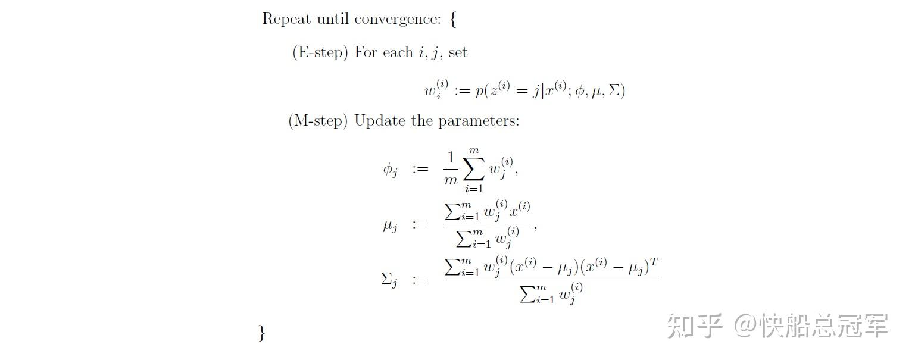
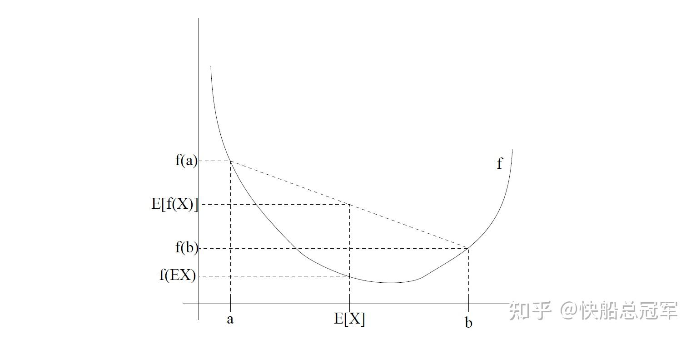
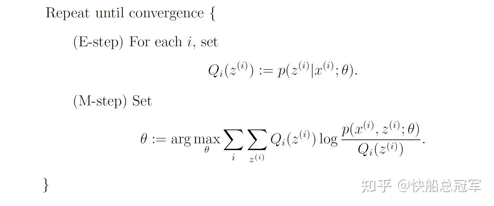
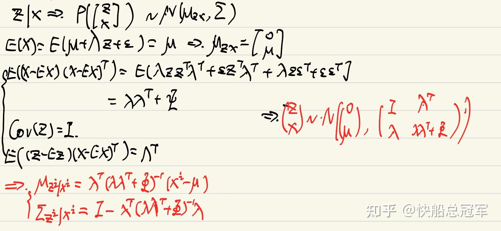
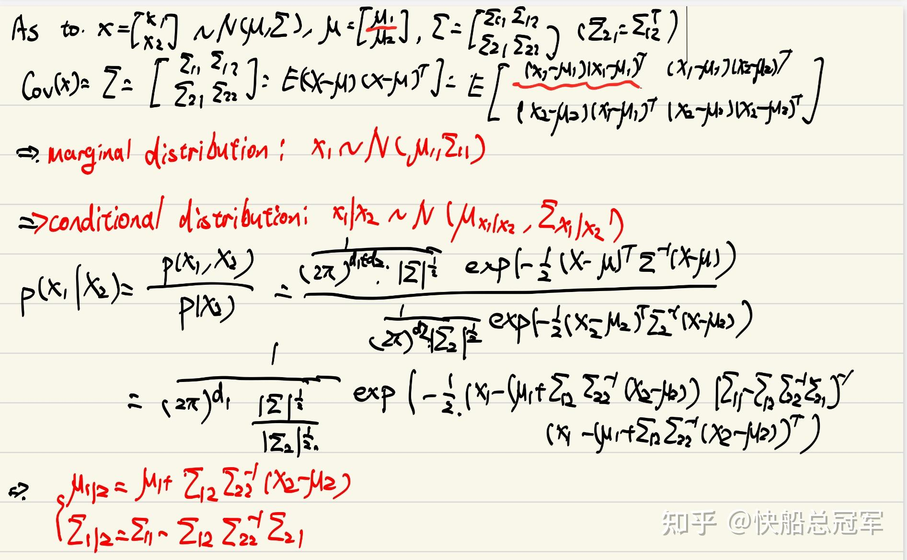
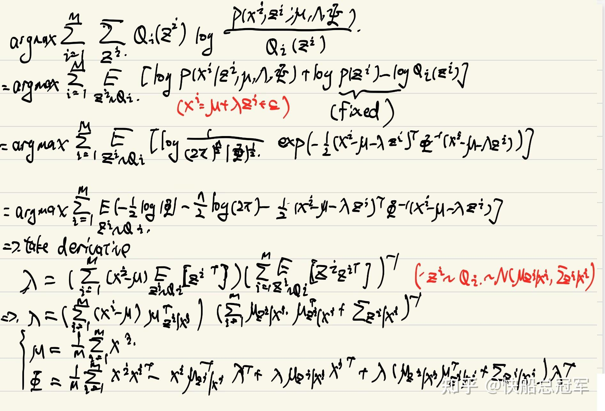

---
title: 'CS229:无监督学习（二）——概率学习：高斯混合算法，EM算法以及Factor analysis'
publishDate: 2026-01-11
updatedDate: 2026-01-11
description: 'CS229:无监督学习（二）——概率学习：高斯混合算法，EM算法以及Factor analysis'
category: tech
tags:
  - cs229
  - ml
language: zh
heroImage:
  src: 'images/background.jpg'
  color: '#ca6980'
---

上一篇文章中我们学习了无监督学习中不含概率假设的部分，但是使用MLE进行预测仍然是非常重要的预测方法，而之前对于无标签数据是通过**假设距离** 作为衡量因素，概率学习则是通过假设给定  $z,\phi$  情况下的  $P(x|z^i,\phi)$  去实现的，为了更加方便计算，我们会使用**EM algorithm** 去简化计算MLE的过程，但我们通过计算发现这只适用于训练数据量较大的情况，而对于数据维度比较大时，我们会使用**Factor analysis** 去代替分析进行特征提取。

## Mixture of Gaussian

仍然考虑对于给定  $(x^1,x^2,...x^n)$  ,将其分成k类的问题

对于之前**Naive Bayes** 的时候，我们是做出  $z^i$  ~  $Ber(\phi)$  的假设，对于  $P(x^i|z,\phi)$  可以通过训练数据去学习，而对于Mixture of Gaussian,我们需要对于  $P(x^i|z,\phi)$  做出更多的假设才能得到相应的模型。

**Assumption**

* $z^i$  ~  $Multinomial(\phi_1,\phi_2,...\phi_k)$  ,其中  $\Sigma^k_{i=1} \phi_i=1$
* $x|z^i,\phi$  ~  $N(\mu_i,\Sigma_i)$  ,这个是合理的假设，对于一般的数据分布都是正态分布

从而代入

$$$ \begin{aligned} l(\phi,x)&=log(\Pi^m_{i=1}P(x^i,\phi))\\ &=log(\Pi^m_{i=1}\Sigma^k_{j=1}P(x^i|z^j,\phi)P(z^j|\phi))\\ &=\Sigma^m_{i=1}log(\Sigma^k_{j=1}P(x^i|z^j,\phi)P(z^j|\phi))) \end{aligned} $$$

### How to solve the parameters?

如果我们已知  $P(z|x^i,\phi)$  在supervised learning 中可以通过训练数据去得到，此时的参数为

$$$ \begin{aligned} \phi_j &= \frac{1}{m} \sum_{i=1}^m 1\{z^{(i)} = j\}, \\ \mu_j &= \frac{\sum_{i=1}^m 1\{z^{(i)} = j\} x^{(i)}}{\sum_{i=1}^m 1\{z^{(i)} = j\}}, \\ \Sigma_j &= \frac{\sum_{i=1}^m 1\{z^{(i)} = j\} (x^{(i)} - \mu_j)(x^{(i)} - \mu_j)^T}{\sum_{i=1}^m 1\{z^{(i)} = j\}}. \end{aligned} $$$

而在此时，我们仍然是使用假设的方法：

求解Mixture of Gaussian

对于每一个循环中我们假设了  $P(z^i=j|x^i,\phi)=\dfrac{P(x^i|z^i=j,\phi)P(z^i=j,\phi)}{\Sigma^k_{i=1}P(x^i|z^i=j,\phi)P(z^i=j,\phi)}$  ,并保持它在该循环不变，更新相应的参数，最后该表达式会收敛到确定的参数值。

通过以上的步骤我们大致的得到了一个结果，但是至于为什么会收敛以及EM steps 的一般形式呢？

## EM algorithm

### 数学原理

$Jenson\ Inequality:E(f(x))>f(E(x))$  对于任何的凹函数成立，反之符号相反

**琴生不等式** 在高中数学竞赛中是一个常识性的结论，对于其数学证明可以参见《数学奥林匹克小丛书高中卷——均值不等式与柯西不等式》第一章的例题部分。

**几何直观** 上，以一个二次函数为例，就是对于凹函数，如果控制x1+x2的值不变，想要将  $f(x_1)+f(x_2)$  的值更大，那么两者就要离得越远

Jenson inequality

### EM algorithm:

假设对于给定  $x^i$  ,  $z^i$  值的分布  $Q_i(z),\Sigma_zQ_i(z)=1$  ,则

$\begin{aligned}  \sum_{i} \log p(x^{(i)}; \theta)& = \sum_{i} \log \sum_{z^{(i)}} p(x^{(i)}, z^{(i)}; \theta) \\ &= \sum_{i} \log \sum_{z^{(i)}} Q_i(z^{(i)}) \frac{p(x^{(i)}, z^{(i)}; \theta)}{Q_i(z^{(i)})} \\ \end{aligned}$

由于log函数为凸函数，而我们想要求MLE的最大值，使用Jenson不等式，有

$ \sum_{i} \log p(x^{(i)}; \theta) \geq \sum_{i}  \sum_{z^{(i)}}Q_i(z^{(i)} )log( \frac{p(x^{(i)}, z^{(i)}; \theta)}{Q_i(z^{(i)})}) $

使用右侧的函数作为损失函数更加方便计算。

对于  $Q_i(z)$  怎么取呢？我们希望对于  $\frac{p(x^{(i)}, z^{(i)}; \theta)}{Q_i(z^{(i)})}$  方便计算，最好为常数，那么就有

$\frac{p(x^{(i)}, z^{(i)}; \theta)}{Q_i(z^{(i)})}$  ~c,结合  $\Sigma_zQ_i(z)=1$  有

$\begin{align} Q_i(z^{(i)}) &= \frac{p(x^{(i)}, z^{(i)}; \theta)}{\sum_z p(x^{(i)}, z; \theta)} \\ &= \frac{p(x^{(i)}, z^{(i)}; \theta)}{p(x^{(i)}; \theta)} \\ &= p(z^{(i)} | x^{(i)}; \theta) \end{align}$

因此**一般的EM algorithm的步骤** 为

EM algorithm

### Validate with Mixture of Gaussian

在Mixture of Gaussian 中，我们就是通过Bayes 公式去计算  $p(z^i|x,\phi)$  作为zi的分布，然后通过Jesnson不等式简化后的损失函数（同样是基于概率假设），使得对于每一个iteration之后，损失函数损失更小，参数更加接近真实值且反映出数据状况。（具体计算过程请见**Problem Set 3 Solution** ）

## Factor analysis

当数据维数大于数据的量时，由线性代数知识可知  $(x^1,x^2,...x^m)\in R^n$  这些向量全部是线性相关的，则对于Mixture of Gaussian时有

$\Sigma_j = \sum_{i=1}^m w^i_j(x^{(i)} - \mu_j)(x^{(i)} - \mu_j)^T $  行列式的值为0，此时在计算Gaussian的概率分布时  $\frac{1}{|\Sigma|^{0.5}}=\frac{1}{0}$  这显然矛盾！这说明我们需要根据此时的数据特点做出些别的假设

**预处理：** 通过均值以及整体的方差将数据归一化

**核心假设：**

* 对于标签  $z\in R^d$  表示认为标签为d类，同之前的总类数，有  $z$  ~  $N(0,I)$  (已经归一化了）
* 数据与标签成线性关系  $x=\mu+\lambda z+\epsilon$  ,噪声  $\epsilon$  ~  $N(0,\Phi)$

仍然是使用EM algorithm

**E step：** 计算  $P(z^i|x^i,\phi)$  ，由我们的假设，这是z和x的一个条件概率分布，也是正态分布，即有  $z^i|x^i,\mu,\lambda,\Phi$  ~  $N(\mu_{z^i|x^i},\Sigma_{z^i|x^i})$  ，我们通过协同概率去计算

对于条件概率我们有

带入已知条件得到条件概率

**M-step:** 这里仍然是暴力计算，得到结果为

从而每个iteration迭代参数即可。对于Factor analysis可以将数据抽象成若干个特征，但是同时也可以反映不同特征的相关性，这点对于PCA是没有的。

在cs229中我们简要的学习了几种的无监督学习的算法，无论是无概率还是有概率，都是一定的假设，包括特征值，距离，高斯假设，以及对于特征的分布的假设并由此可以进行分类，特征提取任务。但个人感觉最重要的还是对于**信息量** 的问题。如果缺少了标签信息，就必须要一定的假设去补充，同样的，我们还可以添加一些别的假设，通过类似的方法，也可以得到新的无监督学习算法。

