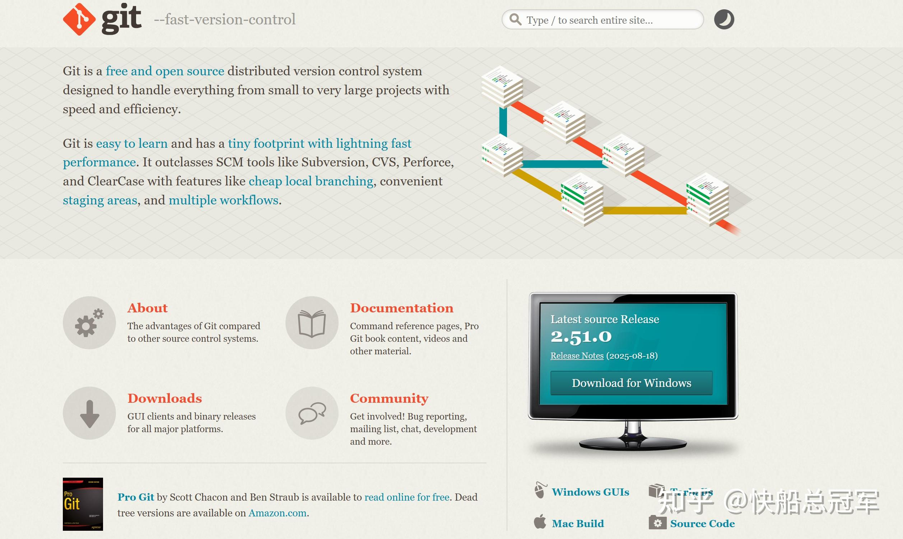
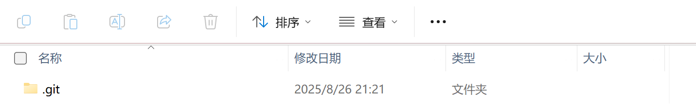
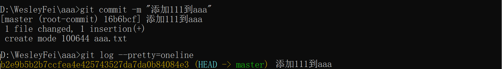
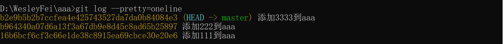
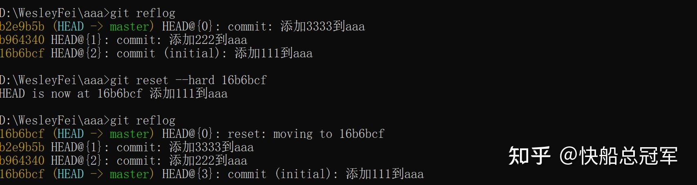

---
title: 'CS230 辅助工具：git使用'
publishDate: 2026-01-11
updatedDate: 2026-01-11
description: 'CS230 辅助工具：git使用'
category: tech
tags:
  - cs230
language: zh
heroImage:
  src: 'images/background.jpg'
  color: '#D58388'
---


今天在更新 [Github-WesleyFei1](https://link.zhihu.com/?target=https%3A//wesleyfei1.github.io) 以及CS230的作业仓库的时候，发现自己原本一直使用的GitHub桌面端突然崩掉了，而且桌面端对于版本的控制，同步仓库非常的不方便，于是我学习了一款新的版本控制设备**git** 的具体使用

## Git安装

首先在google上搜索git的网址，然后点击相应的版本进行下载，进行安装



下载.exe文件，安装。要验证git是否安装成功，打开命令行，输入

```
git --version
```

如果显示“git version 2.45.0.windows.1”的字样那么就是安装成功

## Git重要概念

git作为最为方便的本地&云端文件版本控制工具，主要是使用暂存区，Commit区(个人习惯)，远端仓库这几个元素

* 暂存区：用于暂时存储所有决定存入Commit区的东西。（准备提交）

可以认为我们本地文件就是一堆的材料，我们的暂存区域就是一个箱子，我们想要将材料放到仓库里面，会选取这些材料中的一部分先放进箱子里面。这里涉及到将箱子中的东西放回去，以及将东西放进箱子两个操作

* Commit区：用于进行本地仓库的版本管理

还是使用材料的例子，我们对于暂存区里面的“箱子”会放到Commit区里面，而我们箱子可以放到不同的仓库，仓库之间可以合并等操作。

* 远端仓库：可以与本地的仓库进行互相连接

可以认为是外地的大的厂商与本地的小仓库之间的联系。


从而接下来所有的概念都是对于本地文件夹（想要进行管理的对象）,暂存区，Commit区，远端仓库讨论，一般而言，对于Commit区的“仓库”默认名字叫master(主仓库)，而远端仓库中叫“Origin”在他们下面会有一些的分支，本文称之为dev。而本地的文件夹里面的文件是**与目前的commit区的HEAD指向的文件一致的**

## 本地文件夹与暂存区

首先我们要设置机器上所使用的远端的GitHub的用户名以及邮箱

```
git config --global user.name "...."
git config --global user.email "...@gmail.com"
```

进入所需要管理的仓库

```
cd D:
cd wesleyfei.github.io
```

然后使用git init将这个目录变成可以用git管理的仓库

```
git init
```

结果是这个里面出现了一个.git的东西



本地与暂存区域：

如果我们在本地对于文件** aaa.txt**做出了一些改变，比如我们在里面输入111，想要提交到暂存区里面，则

```
git add aaa.txt
```

如果此时我们将这个命令提交到commit区里，添加注释“添加111到aaa”,那么会有



如果我们在暂存区里面存了一些东西，但是我们不想要要了，可以使用

```
git checkout .
```

则可以清空我们的暂存区

## Commit区与暂存区

git的版本管理本质上是一个指针，我们当前的指针指向master下面的哪一个dev，这个dev下面的哪一个“版本”，就可以在这个版本上进行修改。而暂存区向Commit区中提交的命令会提交到相应的版本中。

我们先考虑不考虑分支dev的情况。

对于暂存区里面我们存放了一些内容，想要提交到master中，使用

```
git comment -m "一些注释"
```

每一次的git comment命令我们称之为一次操作（操作内容存在该文件下面的.git文件夹里面）

如果我们需要查看每一次的操作具体修改了那些内容（与当前的版本相比）

```
git diff .
```

如果我们想要看过去做过的所有的操作，则

```
git log# 按q退出
git log --pretty=oneline #简洁表示
```

此时会显示



可以看到我们现在的HEAD指向的是master的“添加3333到aaa”号版本，我们有的时候想要回退到上一个版本，那么就可以使用

```
git reset --hard HEAD^^ #(对于当前版本指针指向上一次操作，其中^^是由于只有这样才能打出^
```

这样的话就可以进行版本的回退，在执行了这个命令之后，aaa里面的内容就变成了

```
111
222
```

如果我们想要再次回退到最新的版本（撤销上一次的命令）或者回退到指定位置的任意一个版本，首先我们要查询相应的命令

```
git reflog
# 查看之前若干次的若干次的操作指令
```

结果会显示之前的每一个操作的一串号码，我们比如说想要回退到“添加111到aaa”，可以使用



那么此时我们的HEAD就指向了{0}这一行，而aaa里面的内容自然就变成了111.

## 分支系统

分支系统，包括创建分支，如何调整指针的指向以及对于分支到master的合并，这里就体现出来了指针的用处

```
# 创建分支
git branch dev # 创建了一个名字叫branch的分支
git checkout dev  #将暂存区的指针指向目前的dev区域
git merge dev  #将dev合并到目前HEAD所指向的区域里面
git branch -d dev  #删除dev
# 查看状态
git status
# 由于在合并分支的时候，如果是使用merge的话，删除分支后会丢失分支的信息，因此
git merge -no-ff -m "注释" dev#用这个来合并dev分支
```

以上的命令中，** branch**为创建以及删除分支，** checkout**命令是对于指针的操作，对于本地的仓库而言，主要就是创建分支，对于分支上进行操作，然后合并到master上面。

### github拉取与推送

```
#将github上仓库里面的东西给拉取到本地
git pull origin master
#将本地的master内的东西提交到github上面
git push origin master
# 克隆github上的东西
git clone https://.....
```

一般我们都只会用到以上的几种。

以上都是只有一个人，因为我们都是直接提交到了origin上，如果origin上面有分支dev呢，我们有多人合作任务呢，同时需要对于dev操作，然后提交回origin上面

```
# 如何将本地的main/dev分支给提交上origin/dev
git push origin dev
# 当多人合作dev时，先将所有的东西给clone下来
git clone https://.../testgit
# 先在本地创建dev
git checkout -b dev origin/dev #从而在HEAD所指向的分支上面也有了这个分支
git push origin dev#此时会被提交到远程的origin/dev下面
# 如果我们需要将远端的dev合并到origin里面，那么就需要将origin->main然后在本地做合并

# 当我和别人的push冲突了
git pull#然后在本地做合并
```


综上所述，使用git的时候，无论是本地还是云端，好习惯（如果我们要做一个比较大的东西）是** 所有操作在master或origin下的dev里面完成**，对于master，origin实时的更进，而对于dev里面的内容如果经过审核了可以** push到master/origin里面**。

