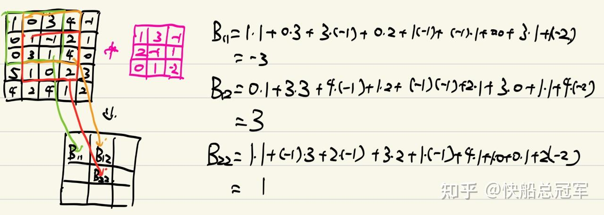
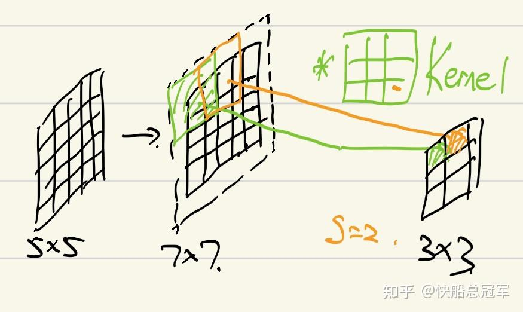
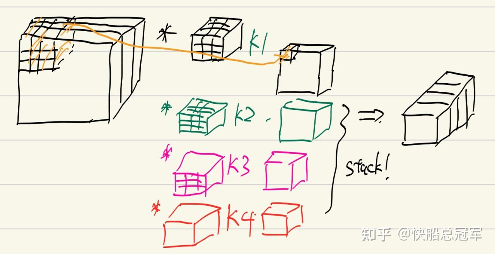
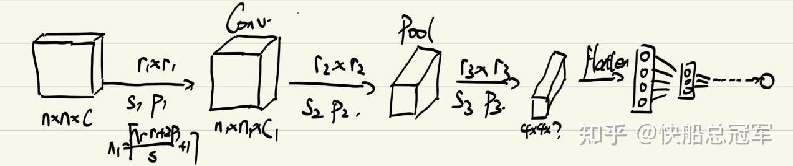

---
title: 'CS230 C3W1:卷积神经网络简介'
publishDate: 2026-01-11
updatedDate: 2026-01-11
description: 'CS230 C3W1:卷积神经网络简介'
category: tech
tags:
  - cs230
  - cnn
  - cv
language: zh
heroImage:
  src: './images/background.jpg'
  color: '#D58388'
---


之前我们对于层与层的连接中基本都是用**全连接层** ，但这样对于一张正常的图片至少为  $64\times64\times3=12288$  个参数，对于第一层的全连接层就至少有1M的参数，因此我们基于图片本身的特点，设计出一种新的网络结构——**CNN** (Convolutional Neural Network).


## 卷积核假设&卷积操作：

对于一般的图片，我们假设：

* 图像的局部区域是**高度相关的** ，即为任何一个区域内部的点之间都会有所关联（需要**Fully Connect** ）
* 任何一个点所要表达的信息与距离其较远的点所传达的信息**无直接关联** 。即为对于Fully Connect只需要考虑一个局部特征。

因此我们需要一种操作，只会对于图像上每一个小的局部区域内进行全连接操作，即为**卷积操作**

对于卷积操作

首先是定义一个** 卷积核**：n\*n的卷积核  $K_{ij},i,j\in[1,r]$  ,如果我们要对于一张2D的图片进行操作，假设图片为  $A_{kl}$  长宽分别为m和n,那么对于结果  $B$  为一个  $(m-r+1)*(n-r+1)$  的矩阵，其中每一个元素为

$B_{i,j}=\Sigma^{k-1}_{x=0}\Sigma^{k-1}_{y=0} A_{i+x,j+y}K_{x,y}$  相当于对于**r\*r内的东西做了一个全连接层**，只是形状有点特殊。

具体而言就是



卷积介绍

用numpy表示就是

```
b[i,j]=np.sum(A[i:i+m-r,j:j+m-r]*K[:,:])
```

有了卷积操作，我们就可以来构建我们的CNN的各个部分了,首先来输入只有2维。

## 卷积神经网络

### Layer Type1:卷积层

**输入** ：一个m*n的图片 **参数** ：一个大小为r \** r的卷积核，间隔的步数stride, 边缘填充格数padding

我们发现如果我们直接进行卷积操作，那么会导致边缘上的数据被卷到的次数较少，因此我们考虑在边缘上添加一些空格，减少** 数据的丢失**。具体操作是：在m\*n的图片的上下左右各添加p行（列）空行（列），则此时图片大小为  $(m+2p)*(n+2p)$  ,这一步称为**填充(padding)**

然后我们对于padding之后的图片进行卷积操作，但是对于  $b_{00}=A[0:r,0:r]*K$  操作之后，对于  $b_{01}=A[0:r,1:r+1]*K$  可以x方向跳过s步（称为**stride** ），然后再将卷积后的结果作为b01，即为

$b_{01}=A[0:r,s:r+s]*K$

因此具体表达式就是进行padding之后  $B_{i,j}=\Sigma^{k-1}_{x=0}\Sigma^{k-1}_{y=0} A_{i*s+x,j*s+y}K_{x,y}$  ，经过操作之后输出的大小为 $[\dfrac{m+2p-r}{s}+1]\times[\dfrac{n+2p-r}{s}+1]$

图像化表示就是



卷积层+padding+stride图形化表示

相应的，每一个卷积层实际上就是一个“全连接层”,因此我们会添加上一个激活函数。

### Layer Type2:池化层

**输入** ：一个m\*n的图片  **参数** ：池化的大小  $r$  , 池化的类型，函数  $f=max/mean/...$

对于池化操作，与卷积操作类似，卷积为点对应相乘然后相加，而对于池化为对于  $r*r$  区域内部用f作用，如取平均值（mean)或者是取最大值（max),即为

$B_{i,j}=f_{0<x<r-1\\0<y<r-1}( A_{i+x,j+y}K_{x,y})$  ,其中f为max或mean

同样的也有填充与间隔（stride,padding）

在池化之后得到结果为  $[\dfrac{m+2p-r}{s}+1]\times[\dfrac{n+2p-r}{s}+1]$

### Layer Type3:归一化层

归一化层（Batch Norm层），故名思意，就是对于经过每一个2D的卷积核卷出来的2D图像中的东西进行归一化，这样可以有效的表面梯度爆炸等，从而可以增加我们的训练的层数。

### 三维操作——通道（channel)

以上我们都默认卷积核，池化（核）以及输入为二维的，实际中，我们的输入常常为RGB三色的输入  $64\times64\times3$  ，而我们想要得到的结果是**若干个可以表示图片在不同方面的特征** 的2D“图片”，下面我们将其拓展到三维。

假设我们的输入为  $m*n*c$  ，接下来只以卷积举例，池化同理

**理解方式1** ：可以将其看成c张  $m*n$  *的图片，我们使用c个*  $r*r$  的卷积核，分别对于每一个图片层进行卷积操作，得到c张大小为  $m'*n'$  的图片层，我们考虑将每一个图片层对应位置的数加起来（将c个图片层拍成一个图片层），最后得到一个  $m'*n'$  的图片

**理解方式2** : 我们就直接对于  $m*n*c$  的图片，将卷积核看成是  $r*r*c$  ,对于卷积的对象，之前是一个  $r*r$  的区域，现在我们是  $r*r*c$  的一个体，具体为

$B_{i,j}=\Sigma^{c}_{o=1}\Sigma^{k-1}_{x=0}\Sigma^{k-1}_{y=0} A_{i+x,j+y,o}K_{x,y,o}$  ,  $i,j\in m'*n'$  而在操作之后的2D图片大小计算和原来一样。

由此我们只能得到一个2D图片，表示在ij位置东西在该方面的特征，而如果我们想要提取结果在**多方面的特征** ，就需要使用  $c'$  个卷积核，最后得到  $c'$  个大小为  $m'*n'$  的图片，输出为  $m'*n'*c'$  的东西，图形表示为



卷积+channels

因此我们将channel=3的图片输入，然后不断通过卷积层/池化层，最后直到一个比较小的图片  $4*4*channels$  ,此时的channels就会提取到图片的较深层次的信息，此时我们直接将其拍成一个一维的向量，然后再通过若干的全连接层，最后得到我们的答案。



CNN

以上我们介绍了基本的卷积神经网络的组成部件，包括卷积层，全连接层，池化层以及通道的概念，除了通道有点难以理解以外，CNN整体上还是非常漂亮的。在之后的文章中我们将会由此介绍若干经典的神经网络（LeNet5,AlexNet,VGG16,ResNet...），以及用于物体识别（YOLO)以及人脸识别算法。

