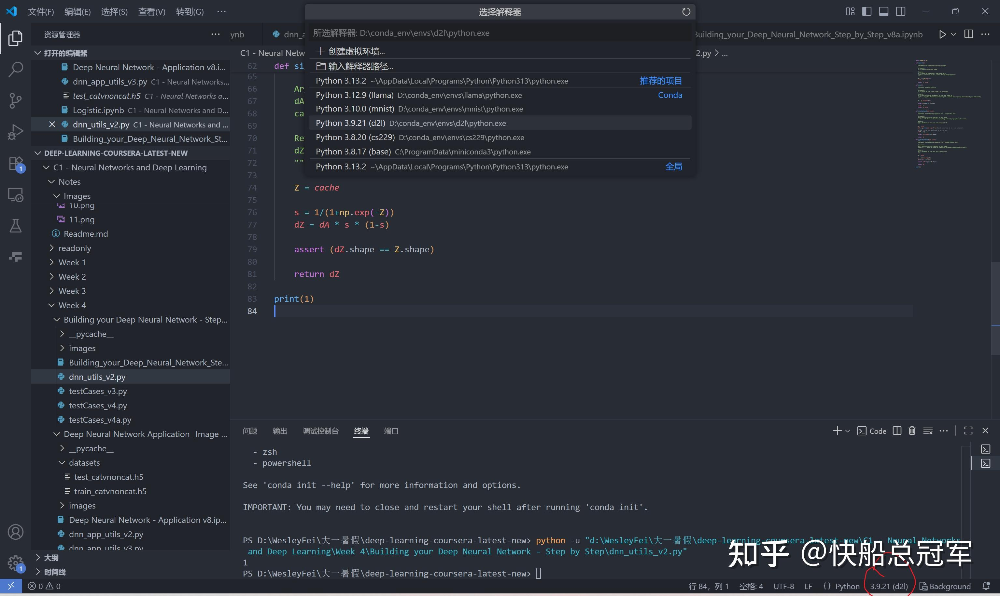

---
title: 'CS230Pre: MiniConda&Python环境配置'
publishDate: 2026-01-11
updatedDate: 2026-01-11
description: 'CS230Pre: MiniConda&Python环境配置'
category: tech
tags:
  - cs230
language: zh
heroImage:
  src: './images/background.jpg'
  color: '#D58388'
---


conda是一款用于管理python环境与包的管理器，尤其是对于不同项目需要使用不同的python环境，conda就可以方便的进行隔离。


## Step 1:安装conda

对于个人应用的话下载miniconda就可以了

个人建议从官网

或者从清华源

上下载和电脑项配的包，将其安装在d盘就可以了。

## Step 2:配置conda环境

这篇知乎文章讲的挺全的

## Step 3:配置开发环境

如果你以及完成了以上的两步，那么在输入了

```
conda create --name myenv python=3.9
```

之后，你就在conda的安装目录同级出现一个\_env文件夹，在这个文件夹里面会有一个叫myenv的文件夹，里面存放着所有的python包

在安装前需要先进入这个环境

```
conda activate myenv
```

退出的话为

```
conda deactivate
```

对于安装python包的话，个人还是喜欢使用pip去安装，比如你想要安装

* 如果是安装numpy包

```
pip install numpy
```

* 如果是需要指定版本，并且通过清华源去安装，为

```
pip install numpy==... -i https://pypi.tuna.tsinghua.edu.cn/simple/
```

* 卸载numpy

```
pip uninstall numpy
```

* 如果你想要安装requirements.txt中的包（注意其中每一行为一个包）

```
pip install -r requirements.txt
```

## Step 4(Optional)Vscode配置python

以下这篇文章中讲了配置的问题

其余的在这篇文章中讲的挺好，但是对于在vscode中激活python环境



点击这个圈的地方，然后就可以在上方发现本电脑的环境以及自己配置的各个隔离的环境。选择好后就对于python文件在VScode中直接执行就可以了。


希望这篇文章可以为想要学习cs230的同学们提供一点点帮助

