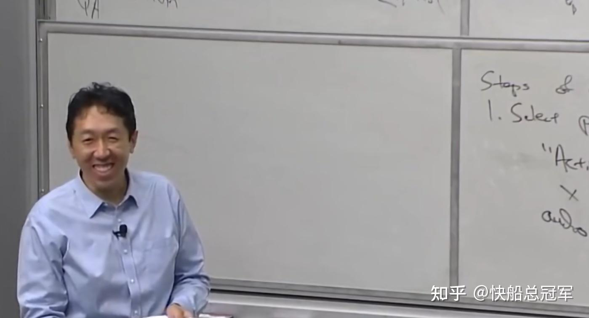

---
title: 'Stanford CS230食用指南'
publishDate: 2026-01-11
updatedDate: 2026-01-11
description: 'Stanford CS230食用指南'
category: tech
tags:
  - cs230
language: zh
heroImage:
  src: './images/background.jpg'
  color: '#ca6980'
---

CS230虽然说是讲关于Deep Learning的，但是这门课程包括了很多的课后资源（coursera上的视频以及作业），上课更多的是关于大局观上的介绍。接下来我就个人的理解来整理一下学习Deep Learning的资源以及食用方法。

## 主要资源

1.CS230 Lecture 2018Fall 视频课（10个lecture）

**视频资源** 为直接在b站上搜cs230第一个就是

**github仓库** 中包含课堂的PPT，期中期末的考试题目，仓库名为cs230-2018-autumn

2.Coursera上的Deep learning specialization (5节课，每节课大概4h左右）

**视频资源** 为b站搜索“Deep Learning Specialization 吴恩达 Andrew Ng”的视频

**github** 仓库中包含written homework（quizzes）以及coding homework(programming assignments),仓库为amanchadha的coursera-deep-learning-specialization

## 食用指南

1.cs230的核心内容（干货）在coursera的课上，具体介绍了

（1）神经网络架构 （2）超参数优化方法 （3）体系化建构 （4）CNN（CNN,Resnet） (5)RNN(RNN, LSTM)

这里的programming assignments写的非常好，一定要认真完成，会让你具体实现这些功能并在课堂的基础上进行拓展，但是从github上clone下来的jupyter notebook中作业都是给你写好了的，只要扔给ai把“start coding”以及“end coding”中间的内容删除就可以了。

2.cs230 Lecture内容：

(1-2）对DL的基本介绍（examples, history）

(3,8) 大局观（水）

(4)GAN介绍

(6,7)如何做研究以及读论文

(9,10)关于NN与强化学习的结合

以上是对于课程内容的总结，希望大家（以及自己）能有所收获。

