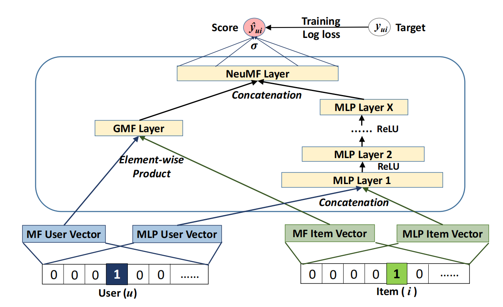
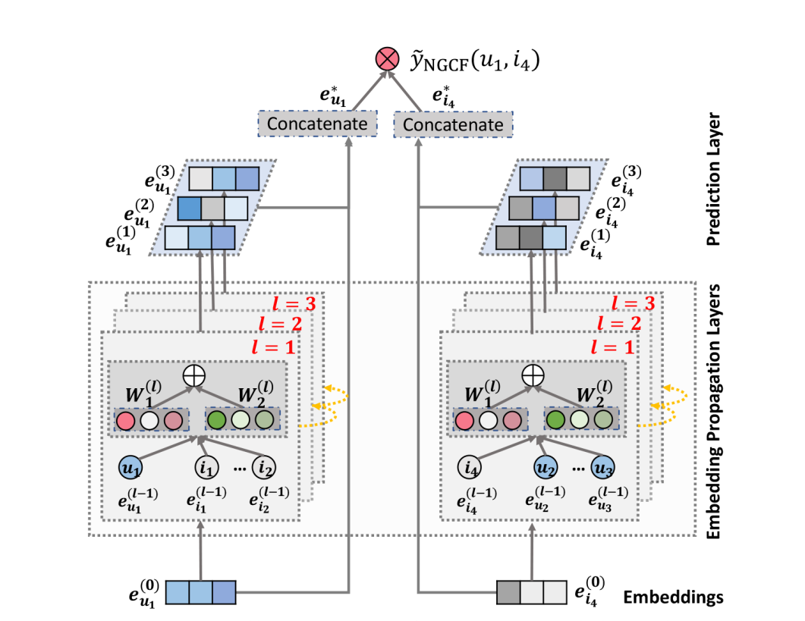
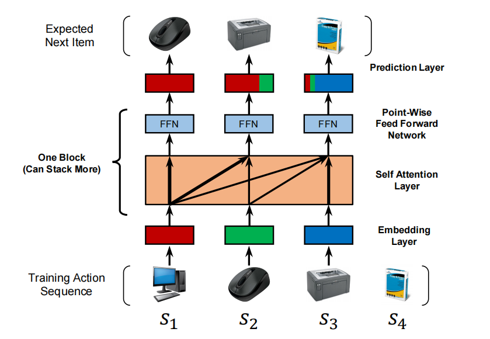

## NCF (Neural Collaborative Filtering)

- arXiv: 1708.05031

- 概览：提出 NCF 框架，用神经网络学习用户与物品的交互函数，替代矩阵分解中的内积形式，并通过多层感知机增强非线性表达。实验显示在真实数据集上显著优于多种传统与深度推荐方法，且更深的网络结构带来更好效果。

## NGCF

- arXiv: 1905.08108

- 概览：将用户-物品二部图结构显式引入嵌入学习，通过在交互图上传播嵌入来捕获高阶连通性与协同信号。大量实验显示 NGCF 在多个公开基准上超过已有方法，并分析了嵌入传播对性能提升的关键作用。

## LightGCN

- arXiv: 2002.02126

- 概览：发现 GCN 中的特征变换与非线性激活对推荐贡献有限，反而增加训练难度。LightGCN 仅保留邻居聚合，以线性传播学习用户与物品表示，并使用多层嵌入加权求和作为最终表示，在相同设置下显著优于 NGCF 等模型。

## MMGCN

- acm: https://dl.acm.org/doi/10.1145/3343031.3351034

- 概览：多模态的用户信息输入然后输出

## SASRec

- arXiv: 1808.09781

- 概览：提出基于自注意力的序列推荐模型 SASRec，通过注意力机制在用户历史中选择相关行为，在捕获长期语义的同时保持对近期行为的敏感性。实验显示其在稀疏与稠密数据上均优于多种序列模型，并具有更高的效率。