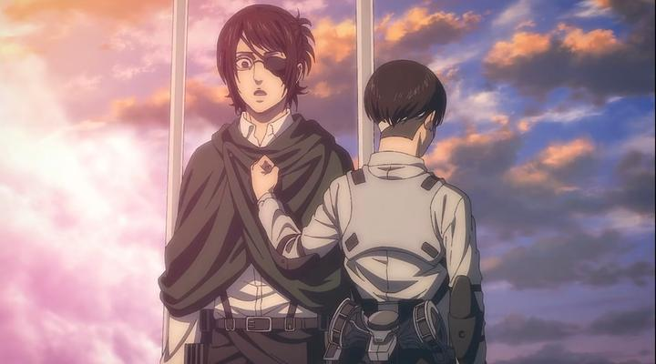

---
title: '大一暑假ai学习总结'
publishDate: 2026-01-11
updatedDate: 2026-01-11
description: '大一暑假ai学习总结'
category: tech
tags:
  - reflection
language: zh
heroImage:
  src: 'images/background.jpg'
  color: '#D58388'
---

这个暑假2个月基本上都呆在了学校里面，每天可以说是摆摆学学，学习计划中的内容基本完成了，但是也有一些做的不好的地方

### AI课程完成情况：

**cs229 Machine Learning:** 从头到尾的完成了所有内容的学习，包括Lecture, problem set并且已经将所有内容push到了github仓库中，欢迎大家点赞收藏。

** cs230 Deep Learning:** 完成了主体的部分：coursera上的线上内容(videos+assignments)，而cs230的Lecture部分更多是观点以及方法论上的指导，下个学期再学啦！

** MIT 6.S184 Generative AI Scratch**: 花了几天的时间干完了这门体量比较小的课程，lecture note写的非常的好（虽然没有学过随机过程的我有点吃力），重点是在于Diffusion model的建立以及实现过程，体验非常好的一门课程。

别的数学课程：随机过程稍微的看了一点点，开摆了。所有课程只能下个学期跟着老师学了（翘不了课了，悲伤）

### 美中不足的地方

1.大致确定了之后会走NLP，Generative AI的方向。

2.实验室的任务完成度为0%（我们需要更为强大的基础）, 觉得等实力足够之后再去联系吧

3.GRE单词背诵量约等于0，下个学期在忙中还是需要抽出来一点点的时间学英语的。

4. cs229 的强化学习部分还没有整理（3篇知乎文章），cs230的CNN,RNN，tensorflow部分还没有整理(7篇文章)，MIT 6.S184的万字长文完成度为30%

总体而言，这个暑假我对自己的学习情况还算满意，虽然知乎上的更新严重不足（整理成自己的语言实在是过于的耗费体力和时间了，一篇文章可能需要写个1.5h+）,但是还是学到了不少的知识。

### 下个学期的任务

** 准备学习**

Stanford cs224n:自然语言处理的神课，不仅介绍了基本的RNN,Transformer等网络结构，更重要的是介绍了关于模型的pre-training,post training以及一些语言学的知识，需要立刻学习的一门课程

Stanford CS336: 一门听说非常好的课程，会具体的教会我们实现一个大语言模型的各个部分，感觉到时候要破费租服务器了

Stanford cs224W: 介绍图神经网络的一门课程，个人感觉使用图的观点去思考神经网络会非常的有趣。

CMU 15-213:大名鼎鼎的csapp,非常硬核的一门课，个人希望可以更加具体的了解计算机的实现过程。

计算机结构方向：先完成cs61c的学习，然后上手csapp的学习,有时间学习分布式系统的话学一下CMU15-418（理解计算机的底层结构，掌握像cuda之类的东西）

数值分析 MIT 18.330：在MIT 6.S184的实现过程中，我深刻体会到了使用计算机去解决ODE&SDE的美妙之处，非常希望可以通过这门课程加深自己对于计算科学的理解。

如果还有时间的话会去更深入的学习LLM的内容，对于cv,rl之类的课程也会进行学习。毕竟所有的知识都是互通的，在经过了这个暑假的学习之后，我深刻的体会到了这一点。

把这些东西给干完了之后个人感觉进组就能稍微的做一点事而不是搬砖了，希望可以把这些东西给学完，同时GPA可以提高到3.95+(万恶的中国近代史纲要毁我大一绩点)，最后还是希望自己可以能在能力范围之内为人类科学做出一点点的贡献。

9.3更

今天在学习cs224n的时候，看了看recommended reading中的论文，发现自己对于数据结构的理解还是太浅了，又担心我们USTC的神奇教学质量，遂决定在准备自学的名单上加上一门叫做UCB cs61B的课程。

