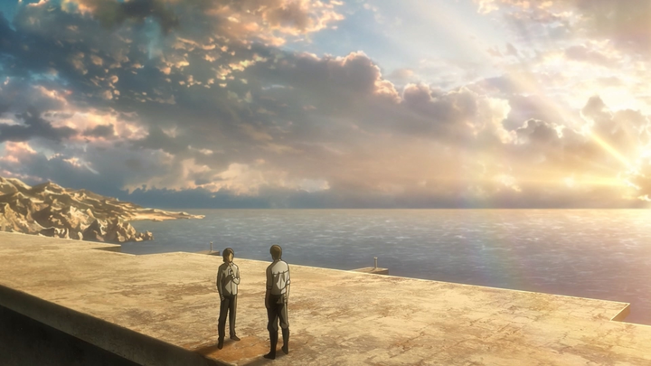
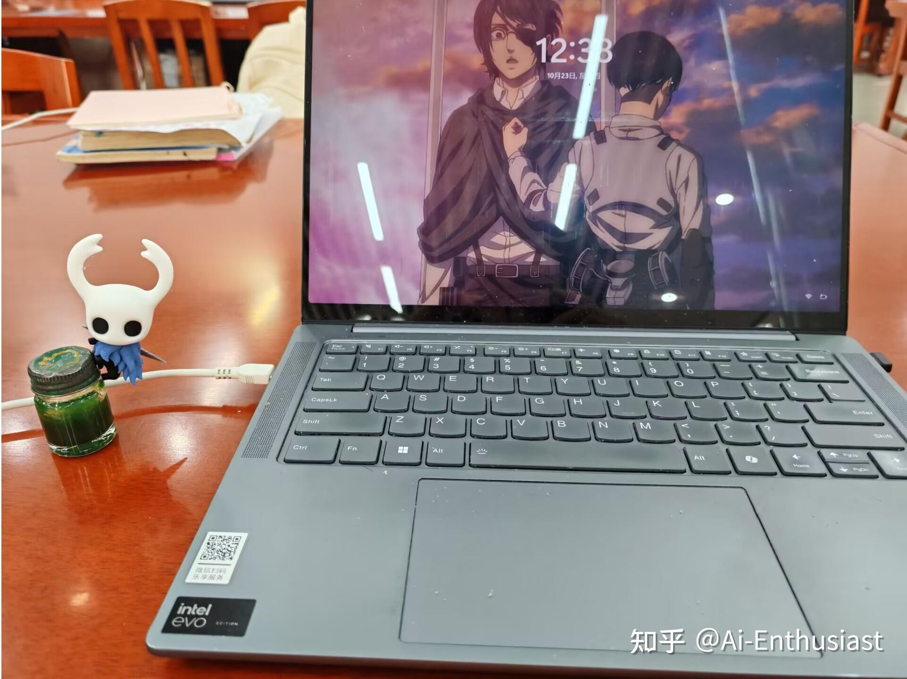

---
title: '工作流反思(1）'
publishDate: 2026-01-11
updatedDate: 2026-01-11
description: '工作流反思(1）'
category: tech
tags:
  - reflection
language: zh
heroImage:
  src: 'images/background.jpg'
  color: '#D58388'
---

今天将**东川路第一伊雷娜** 的反思文章认真拜读了一下，深有感触。感觉有的时候即使我进行了每日日程的记录，但是缺少对于工作流的反思，导致工作效率无法得到质的飞跃。

我是从7月份开始系统性的学习ai的，从7月份到10月份，我完成了大概4门课程的系统性的学习，至少从学习速度上看不如伊雷娜，究其原因，可能还是**学习时长和专注程度不够**

仔细思考了一下学习cs229,230的工作流，大概为

* 每日的有效工作时长是8-9h，日程表为

+ 大概9点开始学习，写一篇知乎学习文章+听课，学到11.45左右
+ 中午结束学习到下午开始学习共1.75h摆烂，但是**实际上我只午睡10min!!**
+ 下午从1.30到5.30学习，然后去打球
+ 打球1.5h，晚上大概7.45开始学习，直到闭馆10.45
+ 晚上1.30睡觉

* 对于**学习日志总结，完成lab/hw,以及听lecture** 几个中间，可能时间分配为**30%,30%,40%**,但是一般而言是等到堆了大概6h需要总结的内容时我再去总结

对于暑假和9月份的时间安排可以发现

* 每日手机使用过长，每日4h+,尤其是xhs上
* 对于知识总结不够及时，导致**总结的时候需要花大量时间回顾**
* 打球前后的时长过长(篮球太有趣了)，前后大概2h进去了
* 饭前饭后的工作流需要简化
* 补充一个最近发现的问题：**找到的关键的论文需要及时阅读**

针对以上问题，我决定

* **篮球时长** 不能少！！！打球时会和同学有海阔天空的交谈，能启发我的思路

​ 但是可以减少前后的时间，比如**提早约球，减少等人时长** ，**打完球立刻回宿舍洗漱，晚上略微少吃点**,这样可以做到大概在7.00前开始学习

* 对于**工作流** 上，及时总结，将写一篇3000字知乎文章的时间压缩到**大概2h以内** ，听完**大概2lecture+1hw/lab** 之后立刻总结

论文问题的话保证**每周至少读两篇论文，要写专业的总结报告**

对于上文化课时，如果老师讲的暂时都会，那么就** 用电脑看slide+完成lab/hw**

* 生活作息上，尽量只有早上起来看一眼消息，中午回一下消息，晚上吃饭时看一眼，晚上回宿舍路上看一眼，别的时间最多**听听歌** ，控制手机使用时长在2h以内

**目标：** 每周完成大概6000字的知乎创作(2 article)+每日有效学习时长在11h以上

关于娱乐

* **音乐** 是必不可少的，最近听的包括

+ 四月是你的谎言，电磁炮，你的名字，丝之歌ost
+ 反复聆听：unravel, 声嘶力竭
+ 音单常客：Animenzzz合集，进击的巨人ost, 鬼灭之刃ost

* **nba** 可以康康，但是仅限于看一眼集锦和比分，数据
* **游戏** 的话，最多打打pvz95放松身心
* 最近还开始学习**唱日语歌** ，包括

+ call of silence, call your name
+ unravel(正在学习)
+ 声嘶力竭，红莲华，红莲的弓矢，炎

娱乐也是非常重要的一部分，不用时刻保持自己处于高强度作息，减少低级的浪费时间的行为才是我应该做的

最后附上一张圣巢一哥的小玩偶，以后它就待在我边上一起学习啦！

