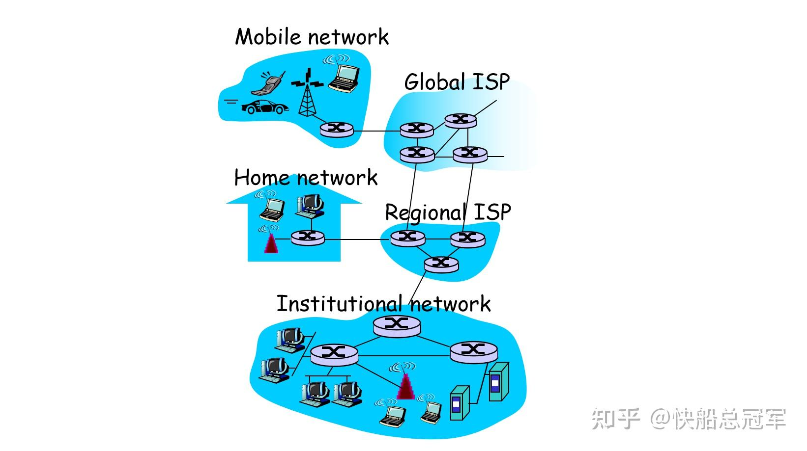
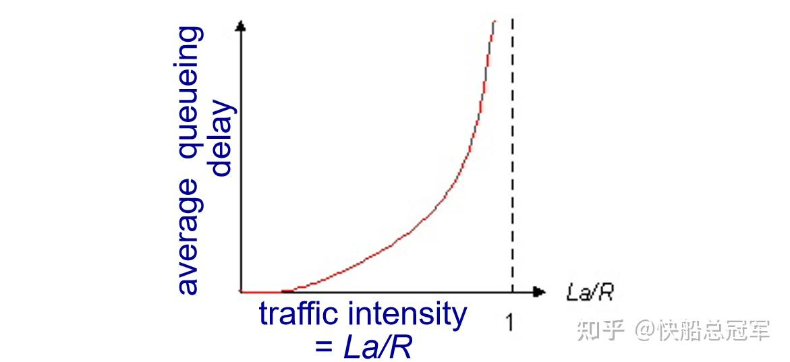
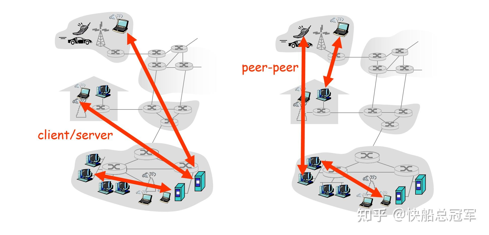
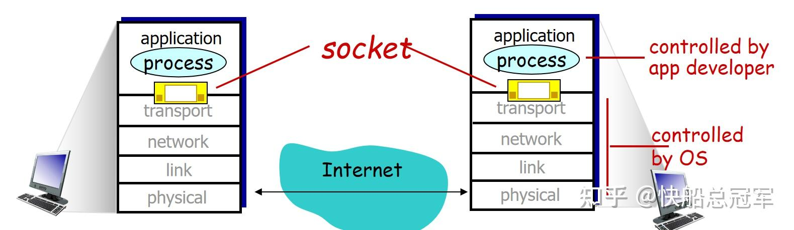
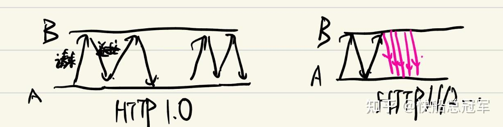
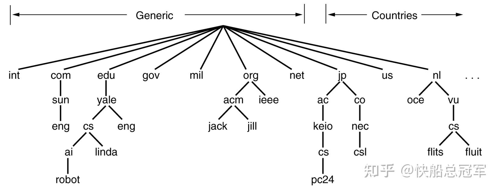
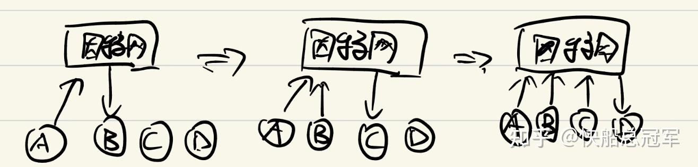

---
title: '计算机网络(1): 计算机网络简介&应用层介绍(chap1,2)'
publishDate: 2026-01-11
updatedDate: 2026-01-11
description: '计算机网络(1): 计算机网络简介&应用层介绍(chap1,2)'
category: tech
tags:
  - computer network
language: zh
heroImage:
  src: 'images/background.jpg'
  color: '#D58388'
---

## 计算机网络(1): 计算机网络简介&应用层介绍(chap1,2)

之前在实验室打螺丝的时候，就有在服务器上进行一堆的操作，而这个过程中，有好多常见的概念, 这些都是计算机网络这么课程所介绍的。而我们USTC的计算机网络个人感觉课程设置还是挺不错的(毕竟在csdiy中都有推荐)，教材使用的是大名鼎鼎的《**计算机网络：自顶向下方法** 》，课程内容也基本是围绕这本书展开的。

Chap1个人在学的时候感觉还是挺新奇的，作者通过物理结构&逻辑结构介绍了整个计算机网络的框架，而Chap2则是从最顶端的“应用”去介绍端与端之间通信时所遵循的原则，以及一些特殊的文件传输方式

## Chap1: 计算机网络简介

### 计算机网络物理结构

** 端系统：** 网络中各种设备，像冰箱，彩电，空调，洗衣机,手机，服务器，计算机等都称为端系统

** 分组交换机：** 进行传输数据的管理的机器，常见的有路由器，链路层交换机等

** 通信链路：** 将各种设备连接起来的路径

** ISP:** 全名为Internet Service Provider, 可以认为是一个“自治”的节点，对于ISP内部可以进行相互的连接，而ISP之间又有连接关系

各种端设备通过通信链路，经过了大量的分组交换机(进行传输数据管理)，并形成大的ISP进行互联，这就是计算机网络的架构，而对于数据进行传输，需要按照响应的** 套接字接口进行连接** （类似于c中的参数传递），并且按照满足一定的** 协议** (类似于人类的语言)，这便是在计算机网络上通信的要求

### 计算机网络逻辑结构

类似于购买机票，我们需要购买(网络应用进行一些操作)，在机场进行转移以及手续办理(将操作变成可以传递的东西)，确定路线图(确定我们需要以什么路径进行传输)，开始飞行（正在运输），以及飞行的过程（怎么飞）。

可以发现，** 模块化的设计** 可以大大的简化我们分析的流程，而对于每一个模块，只要知道如何“对接”以及通过那些接口进行传递，网络设计者以分层的结构设计的网络。每一层会遵守相应的协议。

* **应用层** ：有大量的协议(HTTP,SMTP,FTP…)，我们可以根据协议设计不同的应用，产生需要传递的信息，并且以满足相应协议格式的报文进行传输
* **运输层** ：常见协议有TCP/UDP,他们会将报文分割成报文段
* **网络层** ：通过运输层的报文段确定传输的路径，而确定路径中的每个端系统的位置的“identification”也会满足一定的协议，常见的有IP
* **链路层** ：确定我们对于传输的时候应该如何去传输
* **物理层** ：就是开始传输。

而我们在进行运输的时候，则会用从应用层=>物理层，再从物理层=>应用层，每一层满足上下级之间的接口，这就是我们的传输时的逻辑结构。

以上为chap1的主体内容，而第一章还有一些零碎的内容（接入网，物理层介绍&网络传输的模式）

** 接入网** ：即为从端设备到边缘路由器的网络，这段网络常见有通过

* 数字用户线&电缆：分别借用电视线以及电话线进行传输
* 光纤到户：使用光纤进行型号传递
* 以太网接入技术：使用双绞铜线于一台交换机进行连接，WiFi

### **报文传输以及时延计算**

对于一段长长的东西，传输时我们会将长长的报文划分成小的数据块，称之为分组进行传递，而对于每一个组的传输，多个组的传输方式，以及时延的计算&可能出现的问题便是我们需要研究的对象

** 单个分组的传输：**

假设从源，经过一个分组交换机传输到目的地，假设分组大小L bit,而传输速率为R bit/s(bps)

* 首先经过一个链路：源以R 的满bps将分组进行上传，总共时间为（L/R s)
* **存储转发传输** ：分组交换机进行传递的时候，会在接收完整个分组，存储在交换机里面之后，再进行传输
* 然后再经过一个链路（L/R s)，总共时间为2(L/R)s

同样的，如果有(N-1)台路由器，那么一个分组的时延为N(L/R)s

**多个分组的传输：** 对于每一个分组到达一个分组交换机并且接收完毕之后，只有等到** 前面的分组传输完毕之后才能传输**,这个排队的过程会产生一定的时间延迟

** 时延的分类**

* **处理时延** ：分组交换机处理分组比特并且确定应该导向哪里的时间
* **排队时延** ：分组等待传输所需要的时间

若对于一个分组交换机，每秒到达a个分组，每个分组L bit，传输速率为R bps,则我们每秒有La bit的输入以及R bit的输出，我们记 $\eta=\dfrac{La}{R}$ 为流量强度，来衡量时间延迟，在考虑统计原理之后，我们发现** 当流量强度接近1的时候，平均排队延迟大大增加，直到正无穷**

* **传输时延** ：将分组上传到链路上所需要的时间L/R
* **传播时延** ：信号在链路上传输的时间

从而总的时间延迟为几个时间延迟全部加起来

## Chap 2: 应用层介绍

chap1系统性的介绍了一下计算机网络，而chap2则是系统的介绍了一下应用层于运输层之间的接口以及常见网络应用的协议

### 应用层通信过程

** 服务器** ：一种特殊的端设备，常年开机，来处理来自于客户的请求

** 网络应用体系结构** ：对于我们的信息的传递，常见的体系结构有应对web search之类的客户——服务器体系结构，它可以即时对于客户的要求进行相应，同时还有对于主机之间进行直接通信的P2P结构

** 通信接口** ：有了体系结构(图），对于图中的每个顶点以及边的连接处就是我们的** 通信接口** 。而我们的应用层进行通信时，会将发送请求的进程标志位客户，而请求的对象标识位服务器，他们之间更具运输层的TCP或UDP协议，确定对方的ip地址并且进行通信。

我们知道了通信过程，而对于不同的应用有相应的协议，他们规定了应该发送什么东西以及什么时候发送，也就是对于不同应用之间交互时的** 语言** ，而接下来我们就** 即时相应，存储响应，ip查询以及文件分发** 几个比较常见的功能以及例子进行介绍。

### 即时相应:Web应用

网络应用就是即时相应的典型例子，一个web界面是由大量的** 传输对象** 构成的(HTML文本+若干个应用图片)。而从服务器获得一个网络应用，会遵从HTTP协议。

* **HTTP协议** :规定了请求web页面以及接收的过程
* **单个对象收发过程** ： $A向B请求建立连接(握手)\Rightarrow B给A连接成功/失败响应 \Rightarrow A请求发送对象 \Rightarrow B返回报文/引用的对象\Rightarrow 关闭tcp连接$

http1.0:非持续连接，总共有3次握手，每个对象传输要2个RTT,N个对象2N RTT

http1.1⁄2:持续连接,对于建立连接之后全部传输

而我们的HTTP协议则规定了请求报文以及响应报文的格式以及传输的对象。

web应用还有些别的细节，如使用cookie作为识别用户的表示，使用web缓存器来加快响应速度

### 存储响应：电子邮件

有的时候我们需要将文件进行上传并且存储，而别人也会对此进行访问，像电子邮件。电子邮件的上传遵从SMTP协议。

而** 存储响应过程** ：A給B发电子邮件

$A将邮件发到A的ISP的邮件服务器\Rightarrow A的服务器将邮件发到B的服务器上 \Rightarrow 存储在B的服务其上，供B查询$

### IP查询：因特网目录功能

对于每一个主机我们想要定位到它，那么它必须有自己独特的标识(身份证号码），因此对于每一个主机的位置我们使用** IP地址** 进行标志(114.514.191.8这样的东西)，但是实际上每一个服务器都拥有[http://www.baidu.com](https://link.zhihu.com/?target=http%3A//www.baidu.com)这样的方便记忆的** 域名** ，而将域名与IP地址进行对应查找就非常的重要，而这个查找工作就是DNS的工作

** 分布式数据库** ：dns使用大量的dns服务器，而我们使用** 树的结构** 将dns服务器进行组织。对于每一个父亲dns服务器，都会包含其所有的儿子dns服务器的ip地址供查询。而儿子会知道其父亲的ip

查询的时候(以递归查询为例子)，假设我们主机为cse.nyu.edu,想要查询[http://cs.ustc.edu](https://link.zhihu.com/?target=http%3A//cs.ustc.edu)的服务器的IP，那么我们会

* 主机与本地dns服务器[http://dns.nyu.edu](https://link.zhihu.com/?target=http%3A//dns.nyu.edu)握手建立练习，发送查询请求
* [http://dns.nyu.edu](https://link.zhihu.com/?target=http%3A//dns.nyu.edu)向[http://nyu.edu](https://link.zhihu.com/?target=http%3A//nyu.edu)发送查询请求
* [http://nyu.edu](https://link.zhihu.com/?target=http%3A//nyu.edu)向.edu服务器发送请求
* …最后知道[http://cs.ustc.edu](https://link.zhihu.com/?target=http%3A//cs.ustc.edu)收到请求，然后将自己的IP传给[http://ustc.edu](https://link.zhihu.com/?target=http%3A//ustc.edu)这个东西
* …最后[http://cs.ustc.edu](https://link.zhihu.com/?target=http%3A//cs.ustc.edu)的IP传回给了本地的dns服务器

以上是dns服务工作的流程，而我们也会有一些改进措施来减轻根服务器的压力，如建立**dns数据库** 来存储常见的域名&IP对应，以及** dns缓存** 来存储近期的常见的查询从而节省时间

### 文件分发：P2P结构

与客户-服务器结构相比，P2P的扩展性和响应速度都更快，对于小型的网络非常使用。

** P2P结构** ：传统的客户-服务器结构中，对于客户A想要将文件分发给B,C,D需要上传一份到B,再上传一份给C,再上传一份给D,而P2P结构时对于A上传给了B之后，B与A一起进行上传并且给C，然后A,B,C一起使用上传能力给到D，即为** P2P结构充分利用了在这个网络中的所有成员的上传能力**

而对于文件分发的时候，我们使用BitTorrent 协议利用这种机制实现高效、可扩展的文件分发。

以上便是chap1,chap2的主要内容，之后我们继续研究运输层等层次的相关协议以及工作流程。

