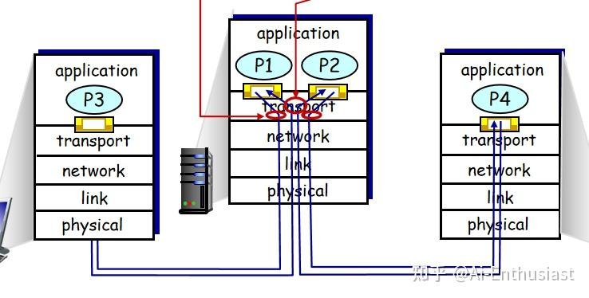
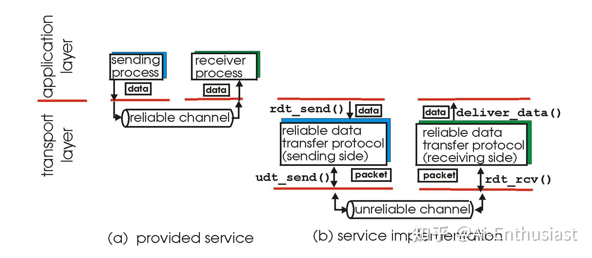
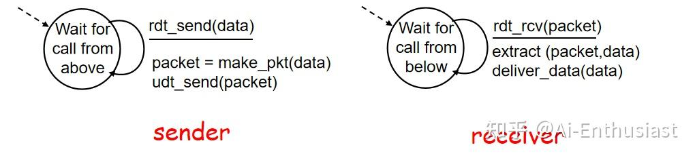
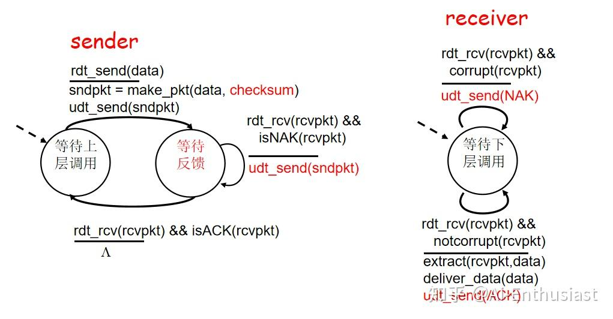
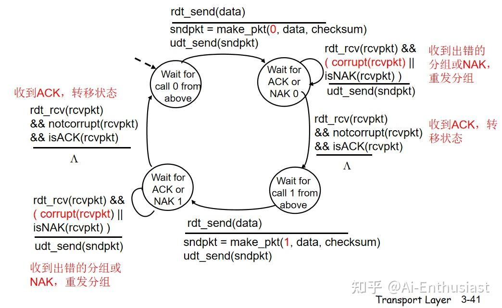
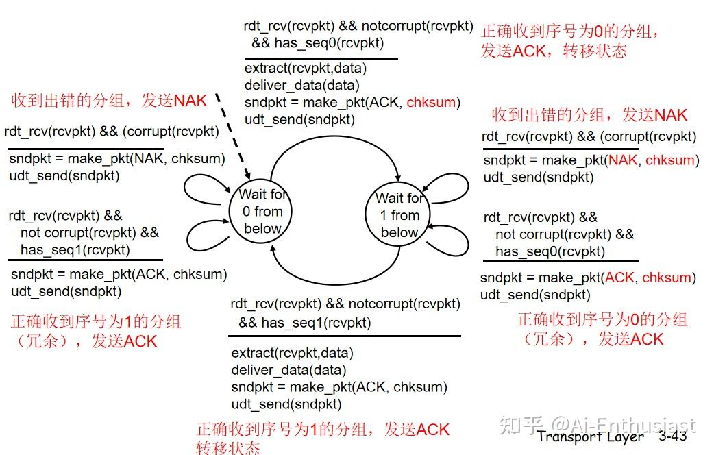
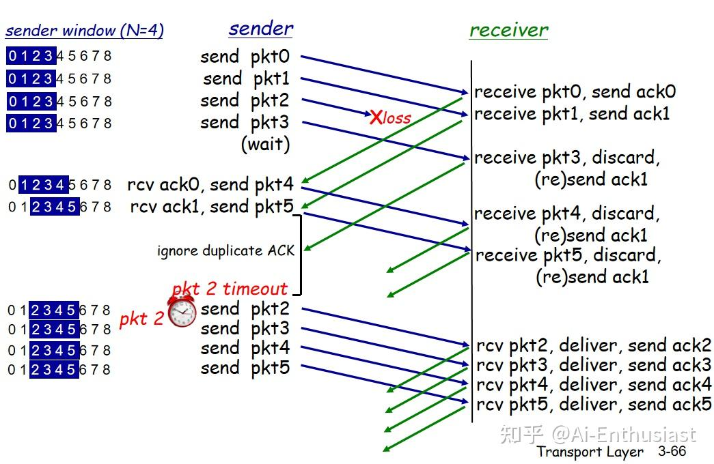
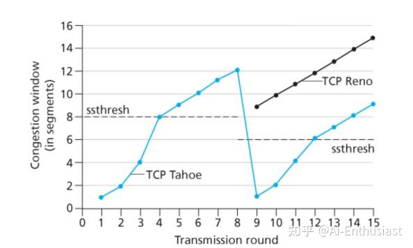

---
title: '计算机网络(2): 运输层简介(UDP&&TCP)'
publishDate: 2026-01-11
updatedDate: 2026-01-11
description: '计算机网络(2): 运输层简介(UDP&&TCP)'
category: tech
tags:
  - computer network
language: zh
heroImage:
  src: 'images/background.jpg'
  color: '#D58388'
---

应用层规定了对于不同类型的应用我们应该以什么方式存储什么样的报文，而**运输层** 则是控制应该如何控制这些报文的传输的，要保证数据**能在规定时间内，不发生错误的进行传输**,同时对于发生** 传输错误**问题的解决方案，就是运输层要解决的问题

常见的运输层的协议有两个，UDP(不可靠，无连接的服务)以及TCP(可靠，面向连接)，他们的任务就是** 将分组以某种方式在不同的进程上进行传输**。

而在讨论运输层本身之前，我们需要考虑运输层与** 上方应用层和下方网络层的接口**

* 应用层接口：多路复用
* 网络层接口：多路分解

而我们对于UDP&&TCP的多路复用分解则是

* UDP:只有目标端口号
* TCP:同时包含目标端口号和源端口号

## UDP报文结构

UDP相比于TCP而言好处有

* 对于那些发送什么数据，何时发送的应用层控制更加友好
* 不用3次握手
* 不需要连接
* 分组简单，减少分组包的大小

因此我们的在线游戏，视频会议，网络管理之类的常常会使用UDP,但是像电子邮件之类的就不行

* UDP结构
* **检验机制** ：虽然UDP不保证可以完美的送达，但是**判断收到的报文是否正确** 还是需要的，就比如在线游戏时你可能理论上你遇到了一个僵尸，这时候传输错误了，你不希望它变成一个末影龙是吧，因此UDP设计了一个最为简单的检验

**检验和：**

* 计算过程：将伪头部，UDP头部，数据拼接，首先将检验和设为0，如果总字节数为奇数，追加一个全0字节使得长度变成偶数，反码求和并且取反就是检验和
* 验证过程:**进行同样的计算过程，校验和字段初始为发送的值，如果传输没有出错，那么全为1**

UDP检验和是一种较为简单的错误检测机制

## 可靠数据传输原理

### Why 可靠数据传输

我们需要给** 应用层提供一条可靠的传输路径**，而网络层会给我们提供一条** 不可靠**的传输路径，因此运输层就需要一个** 可靠数据传输协议**进行这个操作

* **目标:** 接受应用层的报文，并且发送到网络层
* **方式:** 通过一个协议，管理报文的传输**顺序…** ，从而让数据进行可靠传输

而可能出现的问题时

* 直接进行报文传输
* 如果报文发生错误了怎么办
* 如果报文发送丢失了怎么办

接下来我们将会使用**有限状态机** 描述**接收方，发送方** 的协议操作

### Rdt1.0：直接进行报文传输

* 发送端：从上层接收数据，封装成分组送入下层信道
* 接收端：从下层信道接收分组，取出数据交给上层

### Rdt2.0：报文错误查验

非常朴素的想法:**接收方直接喊话发送方** ，如果**接收方发现传错了**,那么就要求发送方重新传一个

因此恢复错误的方式就是

* **肯定确认&&否定确认** (ACK/NAK):接收方告诉发送方你发对了没有
* **重传** ：发送方收到NAK后，重传出错的分组

也就是加上了两者对话的操作，FSM便是

### Rdt2.1: ACK包纠错

如果我们的ACK包和NAK包错了，那么自然会**选择再传一遍** 。

但是接收方会收到**冗余分组** ，接受方由于不知道上一次的ACK/NAK是否正确收到，对于这个分组**是新的还是重传**

这个问题的解决方案是** 加上1bit的标志码**，由于是停等，我们只要区分** 上一次的NAK以及这一次的ACK出**, 而区分两个东西，只要用1bit就可以了

* 发送方：在状态0&1之间进行跳转

+ 状态和当前不符合的就是ACK出错分组
+ NAK为传输出错

如果收到ACK且状态相同，则跳转到下一个状态

* 接收方：也在0，1之间跳转

+ 如果收到正确的序号正确的分组，转移状态
+ 否则发送ACK/NAK

### Rdt2.2:简化Rdt2.1

我们发现再Rdt2.1中，NAK的功能有点少，实际上可以和ACK错误序号规成一类，因此我们**去除NAK这个包** ，得到Rdt2.2

* 发送端：如果收到了与预期不同的ACK/出错的分组，那么重发当前分组
* 接受端：如果收到了出错/非预期的分组，重发最近的ACK

### Rdt3.0:解决丢包现象(停等协议)

理论上我们收到了一个包之后会进行回应，但是如果**中间丢包**,那么就没有回应，接收方和发送方都卡住了，解决方案是** 加一个计时器，如果超时，那么就重新发送包**

### GBN协议:流水线可靠数据传输协议

Rdt3.0看上去已经解决了所有问题，但是考虑

> ** example**:考虑1Gbps link,30ms RTT,1KB packet  
>  我们总共花了 $\dfrac{L}{R}$ =8ms去传输，但是传输的时间为 $30ms$ ,而这30ms中间完全空闲下来，利用率过低！！！

可以发现，停等协议中大量时间花在等上面了，我们需要让** 发送方在有大量分组排队时不要停下来**，具体的解决方案是

* 首先将分组进行**排序**
* **序号范围** ：我们会同时考虑序号范围内部的分组

当前序号范围内，包括未发送，和已发送未确认两种分组，如果收到ACK，那么就去除出我们的序号范围

序号范围的长度(**sliding windows** )，基序号**base**,从而我们的序号范围就是[base,base+sliding windows-1]

而我们的GBN的方式就是:** 考虑移动序号范围，如果丢包，就全部重新传输**

* 每时每刻按照base开始的顺序发送pkt
* 如果收到了**base** 的ACK，那么base+=1;
* 否则等到计时器中止，从base重新开始传输

### SR协议：选择重传

GBN协议的坏处是丢包之后会像sliding windows内的所有的包进行重新传输，这显然有点浪费

可行的思路是:对于当前sliding windows**中所有的包设置一个定时器，当ACK\_base收到之后，移动sliding windows**

## TCP

基于以上可靠数据传输，我们由此改进得到TCP的数据传输模式

### TCP报文结构

与UDP类似，但是加上了一些确定** 分组信息，是否正确接收**的字段，因此一般的TCP报文包括

* 源端口号&&目的端口号: 方便进行ACK传输，校验是否正确收到
* 检验和(同UDP), 接收窗口字段(进行拥塞控制，控制网络流量)
* 序号&&确认号：确定该分组传输的数据是整体报文的那个位置

TCP将数据看成**无结构，有序** 的字节流，在传输前，报文的**每个字节都对应了一个独特的序号** ，而分割时，会以类似**0-1000号字节为报文1，1000-2000号字节为报文2**

* 序号：对于**分组的序号**,就是这个分组** 传输的报文片段的第一个字节对应的序号**，比如对于传输1000-2000号字节的报文，其序号就是1000
* 确认号：**期待收到的下一个分组的序号** ，也就是已经确认的报文序号的下一个，比如我们已经收到了0-1000(分组1)，1001-2000（分组2），3000-4000(分组4)，那么我们的这个报文的确认号**就是2001**

### TCP RTT管理

RTT(超时时间)是定时器的重要组成部分，但是对于网络而言，其网速是动态变化的，因此TCP会根据** 收到的超时信息**动态调整

对于我们的超时的时间限制 $X$ 作为一个随机变量，需要考虑整体的均值&&波动幅度，从而进行动态调整，假设** 对于每一个时刻的RTT的均值方差为 $EstimatedRTT,DevRTT$** , 收到一个新的** Sample RTT**（反映当前时段的网速）我们会使用

* 均值更新： $EstimatedRTT=(1-\alpha)\cdot EstimatedRTT+\alpha \cdot SampleRTT$ 来更新RTT的值
* 方差更新： $DevRTT=(1-\beta)\cdot DevRTT +\beta \cdot |SampleRTT-EstimatedRTT$

并且使用 $TimeoutInterval=EstimatedRTT+4\cdot DevRTT$ 去更新超时的时间限制

### TCP可靠数据传输

TCP的主要特点是在**在接收端可以通过确认号&&序列号进行缓存** ，可以看成是GBN&SR的结合，具体步骤为

**发送方** ：每发送一个报文，启动一个计时器

* 如果收到了ACK，那么中止计时器
* 如果计时器超过RTT,那么重发当前报文

**接收方** ：

* 如果收到了比预期序号大，但是正确的包，进行缓存
* 返回预期序号对应ACK

如果发生连接断开导致的丢包，会使用RTT进行重传。而如果发生因为意外导致的丢包时间，我们使用**快速重传** 机制：**如果收到了3个重复的ACK,那么重发丢失的报文**

> ** 举个例子**：如果发送方要发送1，2，3，4，5几个报文，2号报文丢了  
>  发送方：发送1，2，3，4，5，但是收到了1，2，2，2，2，于是又发送了一遍2  
>  接收方：收到了1，3，4，5于是将3，4，5存了起来，但是还是返回的预期是2

### TCP 拥塞控制

为什么会有拥塞问题？主要是因为

* **在原本的假设中，网络层中的路由器有无限大的缓存** ，但是实际中，有限缓存会产生如上一篇文章中的，**排队时间过长的问题**
* 即使这样，如果有多台路由器，排队时间过长导致缓存溢出，路由器会开始丢包，这就导致**之前路由器传输所画时间全部浪费了**

因此解决拥塞问题便成了改进TCP性能的重要问题，而这个过程有几个问题需要考虑

(1) 发送端** 如何探测到拥塞问题** （2）发送方采取** 什么机制**去限制发送速率 （3）** 机制的具体实现**

** 1.如何探测到拥塞问题**

由于我们发送方检测报文有无收到，只能通过自己的定时器以及接收方的返回信息，因此我们的探测途径有

* 定时器超时
* 收到连续的3个ACK

这就表明没有收到，可以认为是**由于拥塞问题导致的问题**

** 2.采取什么机制限制发送速率**

最为经典的限制速率的方式就是** 运行时添加一个额外的变量拥塞窗口(congestion window)**

$cwnd(congestion window)=发送了，但是没有确认的字节数目$

而我们的发送速率会用 $cwnd/RTT 字节/s$ , 这可以保证** 平均下来，在RTT的时间内，有cwnd的数据可以收到回复**，从而通过控制发送速率，保证能在RTT的时间内收到回复

** 3.机制的具体实现**

* 连接刚刚建立时，cwnd=1mss
* 控制threshold作为分水岭，如果cwnd低于限制，使用慢启动(指数上涨cwnd),否则执行AIMD(线性增长cwnd)
* **如果发生了丢包** ：threshold设置为当前cwnd一半

+ **若收到了3次重复ACK**,令 $cwnd=threshold+3*MSS$
+ **若发生了超时现象** ： $cwnd=1*MSS$

以上就是UDP&&TCP，以及如何得到TCP的基本过程。尤其是对于TCP的推导过程，对于丢包，堵塞控制，检验错误。。。这种对于一个应用，需要实现若干功能，逐步实现并且提升性能的过程，能为我们之后的研究有更多启发性的思路。

