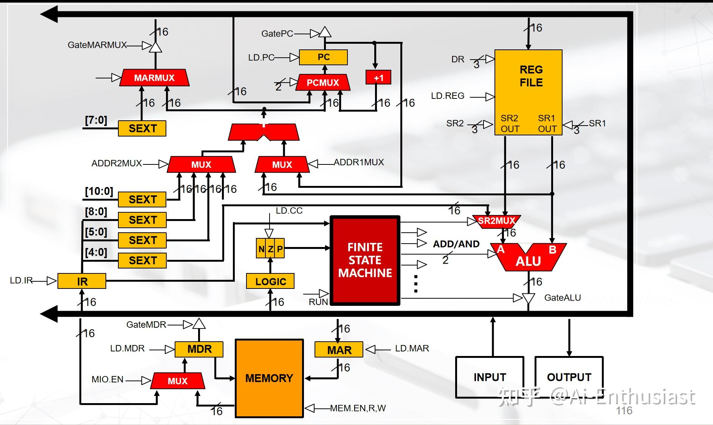
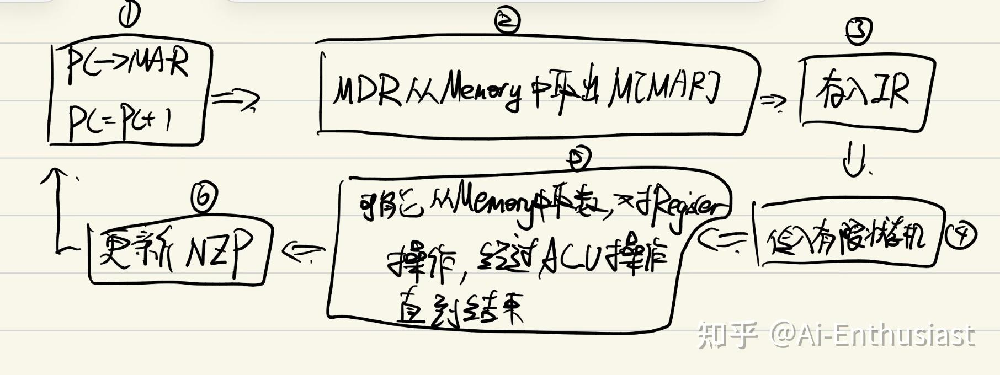
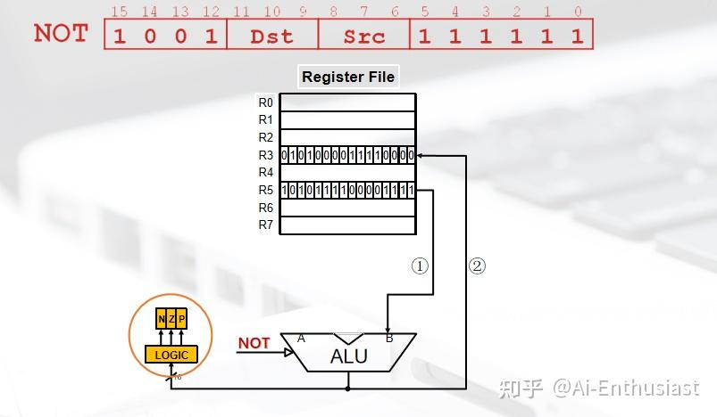
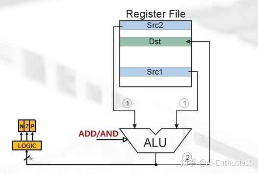
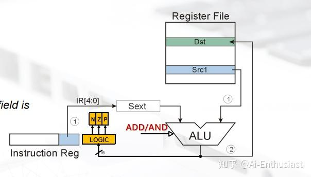
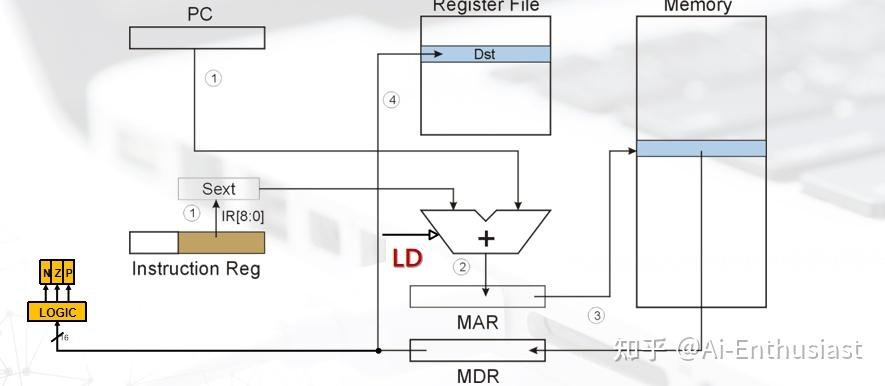
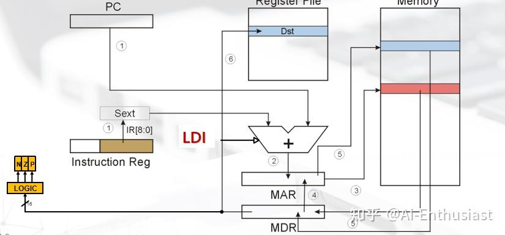
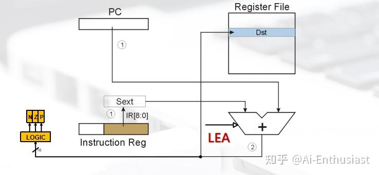

---
title: '计算系统概论2：LC-3基本指令以及数据传输'
publishDate: 2026-01-11
updatedDate: 2026-01-11
description: '计算系统概论2：LC-3基本指令以及数据传输'
category: tech
tags:
  - ics
language: zh
heroImage:
  src: './images/background.jpg'
  color: '#d2b992'
---

LC-3是冯诺依曼机的一个简单样例，也是考试的重点，下面来整理一下LC-3的基本结构，指令以及有趣的例题

## LC-3基本结构

### 存储器

Memory部分主要包括

* **Memory** :总共为 $2^{16}$ 个16bit的单元，用来存储数据，形式如 $x3000: 0001 010 000 000 001$
* **MAR** :存储需要拿取数据的地址，比如如果我们需要拿取 $x3000$ 位置的数据，那么MAR中就是 $x3000=0011\ 0\times 12$
* **MDR** :存储我们MAR对应地址的值，同样的例子，有 $MDR$ 中为 $0001\ 010\ 000 \ 0 \ 00 \ 001$
* **IR** :存储当前的数据，可以是MDR传过来的值，也可以是ALU传过来的值

以及**PC** :特殊的寄存器，存储下一条要执行的指令在内存中的地址，比如我们要执行 $x3000$ ,那么PC中就是 $x3000$ ,执行完成之后变成 $x3001$

### 中央处理器部分

LC-3的中央处理主要包括

* **FINITE-State machine** ：用来解析从Memory取出来的指令，并且对于数据进行代数操作
* **NZP&&Logic** ：存储当前数据状态，每一次指令操作后会根据结果进行更新。(用于条件判断)
* **Register** :寄存器，暂时保存数据，LC-3中总共有R0-7共8个寄存器unit，可以使用3bit标志那个unit
* **ALU** :根据有限状态机，以及Register传过来的值进行操作

以上就是LC-3的主要元器件，对于别的MUX（选择器),以及SEXT(加长)属于细节，不太需要考虑。

对于一个cycle的基本操作：需要注意，对于LC3中所有的指令也是16bit的数据，同样也会存储在Memory中，**数据就是指令，指令就是数据**

## 具体的指令

了解了基本的工作流程，我们就需要介绍具体的指令了，我们LC3的指令包括：** 运算指令(对于register)，控制指令（控制整体运行），数据移动指令(控制Memory&&register)**

### 运算指令

** 1.NOT**

LC3： $1001,Dst(3bit),Src(3bit),111111$

表示not指令的opcode是1001，将 $R_{src}$ 中的数据取反，存入 $R_{dst}$ 中

对于5中的数据通路就是: $从Register中取出R_{Src}\Rightarrow ALU接受取反指令并且进行取反 \Rightarrow 经过数据总线存入R_{Dsr}$

** 2.ADD/AND**(Register模式)

** ADD**: $0001,Dst(3bit),Src1(3bit),000,Src2(3bit)$

** AND**: $0101,Dst(3bit),Src1(3bit),000,Src2(3bit)$

表示ADD/And(Register mode)是将 $R_{Src1},R_{Src2}$ 中的数据进行ADD/AND操作，并且将结果存进 $R_{Dst}$ 中

其数据通路于NOT类似，就不细说了

** 3.ADD/AND**(Immediate模式)

** ADD**: $0001,Dst(3bit),Src1(3bit),1,Imm5(5bit)$

** AND**: $0101,Dst(3bit),Src1(3bit),1,Imm5(5bit)$

表示ADD/And(Immediate mode)是将 $R_{Src1}$ 中的数据,与** 经过符号扩展的 $Imm5$** 进行ADD/AND操作，并且将结果存进 $R_{Dst}$ 中

要注意，这里的Imm5是有符号数，因此其范围是**-16-15**

### 数据移动指令

数据移动指令，涉及到从Memory与Register之间的数据转换，而具体操作包括** 取地址，取地址对应的数，取地址对应的地址处的数，取特定位置的数**，以及相应的存储操作

** 1.LD/ST**:取地址对应的数

** LD**: $0010,Dst(3bit),PCoffset9(9bit)$

** ST**: $0011,Dst(3bit),PCoffset9(9bit)$

LD表示将 $M[PC_{+1}+PCoffset9]\Rightarrow R_{Dst}$ ,而ST则是正好相反

如图所示，LD的数据存储过程中

* $MAR=PC_{+1}+PCoffset9$
* $MDR=M[MAR]$
* 最后 $R_{Dst}=MDR$ ，并且根据**MDR的值去更新NZP**

同样的道理，对于ST而言

* $MAR=PC_{+1}+PCoffset9,MDR+R_{Dst},Memory[MAR]=MDR$

**2.LDI/STI** :取地址对应的地址里面的数

如果前一步可以认为是c语言中的 $a=x$ ,那么这一步可以认为 $a=*x$

**LDI** : $1010,Dst(3bit),PCoffset9(9bit)$

**STI** : $1011,Dst(3bit),PCoffset9(9bit)$

LDI表示将 $M[M[PC_{+1}+PCoffset9]]\Rightarrow R_{Dst}$ ,而STI则正好相反

对于LDI的**MAR,MDR** 的变化为

* Step1: $MAR=PC_{+1}+PCoffset9$
* Step2: $MDR=M[MAR]$ ,然后将MDR的值赋予MAR
* Step3: $MDR=M[MAR]$ ,最后有 $R_{Dst}=MDR$ 并且更新NZP

同样的道理，对于STI就是 $M[M[PC_{+1}+PCoffset9]]=R_{Dst}$

**3.LDR/STR** :取特定位置的数

由于之前我们只能取出 $PC_{+1}+PCoffset9$ 的数，但是 $PCoffset9$ 只能表示**-256-255** 的数，这个范围有限，而LDR/STR的目的就是**将M[存储在register中的一个数]赋予Destination**

** LDR**: $0110,Dst(3bit),Base(3bit),offset6(6bit)$

** STR**: $0111,Dst(3bit),Base(3bit),offset6(6bit)$

LDR表示 $M[R_{Base}+offset6]=R_{Src}$ ,STR则正好相反。

对于LDR中的** MAR,MDR**变化为

* Step1: $MAR=R_{Base}+SEXT[offset6]$
* Step2: $MDR=M[MAR],R_{Dst}=MDR$

**4.LEA** :存储地址

**LEA** : $1110,Dst(3bit),PCoffset9(9bit)$

LEA表示的就是将 $R_{Dst}=PC_{+1}+PCoffset9$ ,计算出这个结果之后**直接存储进 $R_{Dst}$ ,并没有经过MDR/MAR**

### 控制指令

** BR**: $0000,nzp(3bit),PCoffset9(9bit)$

其过程就是** 若NZP中有符合nzp中的东西，那么跳转到 $PC_{+1}+PCoffset9$**

同样还有像TRAP指令，这个基本就是背诵指令，主要用的就是** TRAP**

以上就是我们最基本的LC3的指令，我们需要** 熟练掌握数据通路，MAR/MDR的值，以及每条指令的过程**,之后我们会进行更多相关例题的训练。

