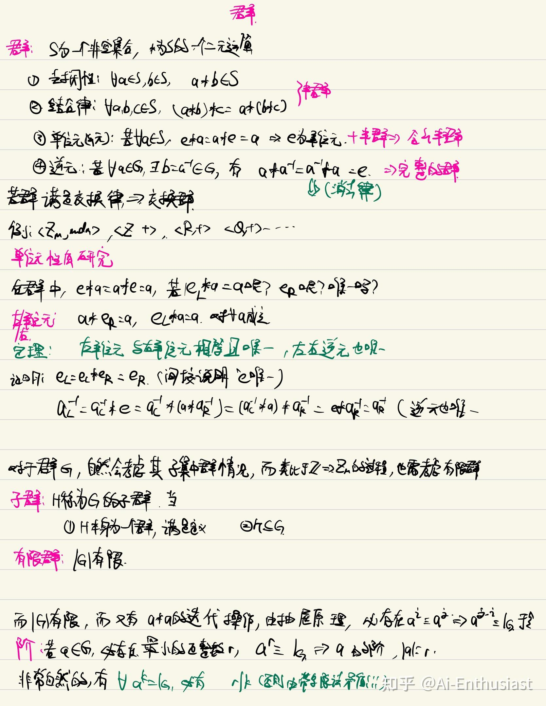
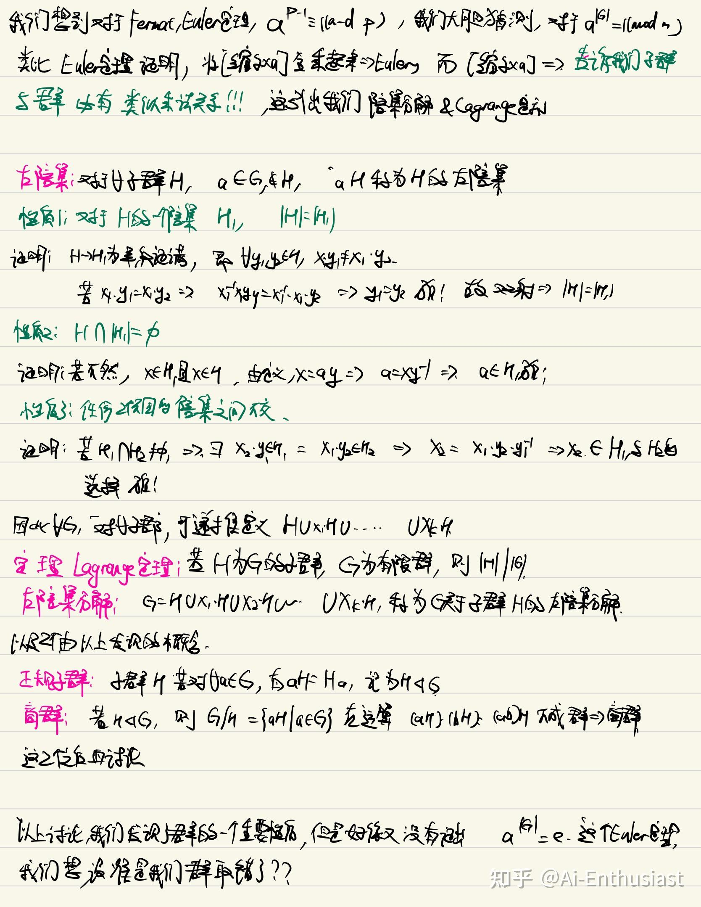
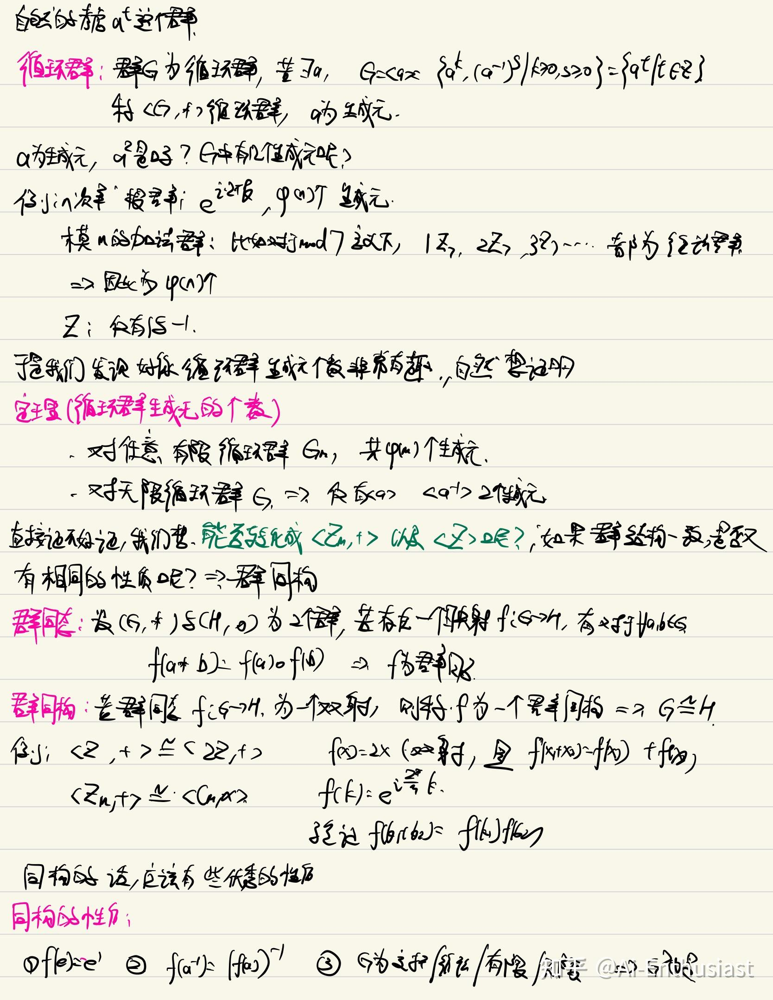
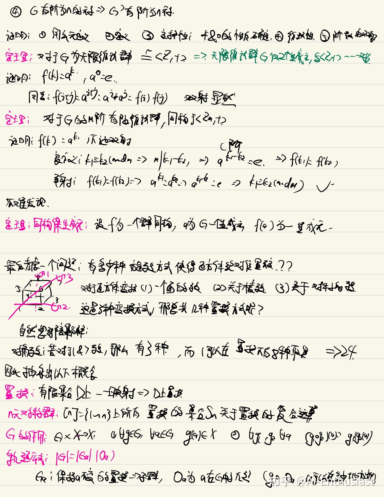

---
title: '离散数学(3):基于欧拉定理研究群'
publishDate: 2026-01-11
updatedDate: 2026-01-11
description: '离散数学(3):基于欧拉定理研究群'
category: tech
tags:
  - discrete math
  - math
language: zh
heroImage:
  src: './images/background.jpg'
  color: '#d8df95'
---

邵老师将群论的方式非常的特别，对于每一个概念的引入做的非常非常的清晰，美中不足的就是对于课程中的主线不是特别的明晰。

在回顾了一下讲义之后，突然发现如果以**欧拉定理** 类比去一步步推导群的性质会非常自然，对于每个概念对应的最重要的性质也会有更好的理解。

从群，到研究有限群的性质，然后到考虑阶的性质，我们的目标是**发现一个类似于欧拉定理的东西** ，然后迁移了**缩系的乘法的概念** 到陪集分解，最后到使用循环群引入群同构的概念。

