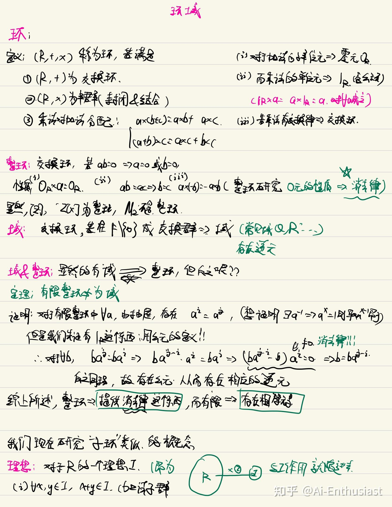
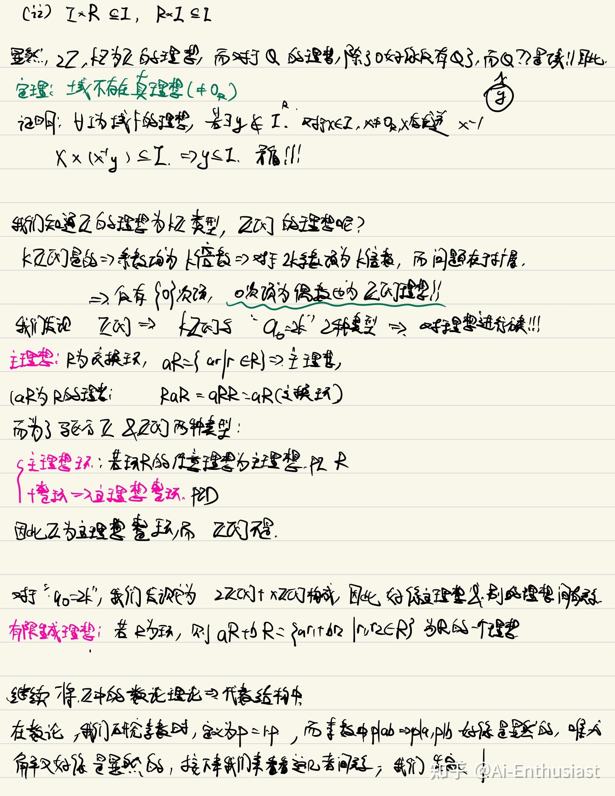

---
title: '离散数学(4):环域&理想初步'
publishDate: 2026-01-11
updatedDate: 2026-01-11
description: '离散数学(4):环域&理想初步'
category: tech
tags:
  - discrete math
  - math
language: zh
heroImage:
  src: 'images/background.jpg'
  color: '#D58388'
---

**环** 是更为广泛的，将Z上的加法和乘法抽象出来的概念，**域** 则是环加上可逆条件。

研究0元引出了整环的概念，而研究”子环”让我们进一步思考理想的问题。而通过研究理想(**Z,Z[x]** 两个例子的理想的特性)，我们抽象出了主理想的概念，这对应着**初等数论中的最大公约数** 概念。

最后，我们为了研究“素数”这个概念，引入了素元和不可约元的概念，这个会在后续的文章中进行深入研究

