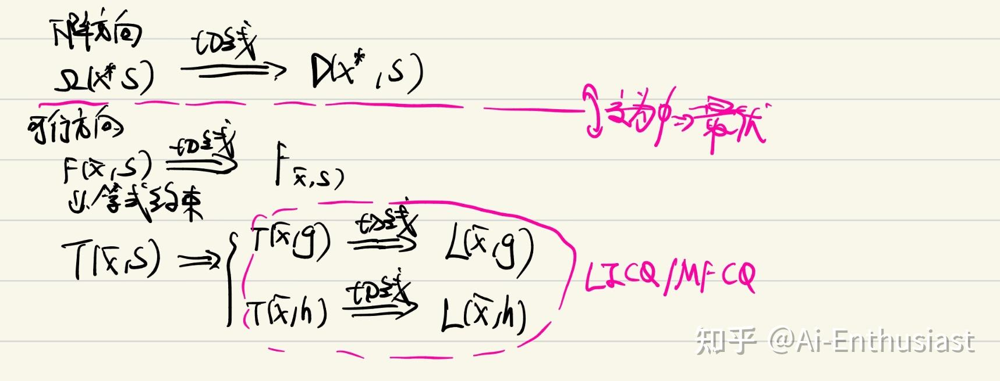
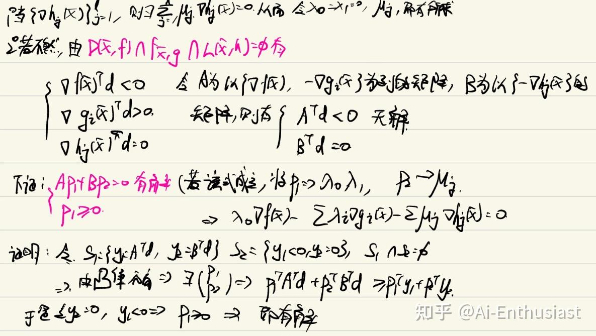
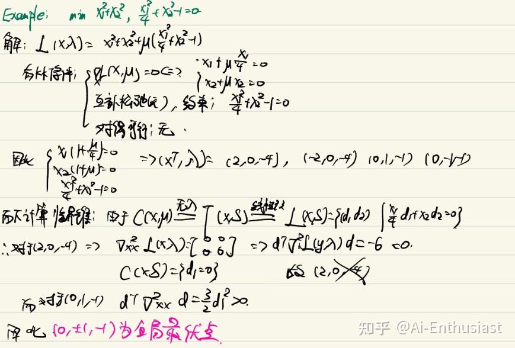

---
title: '运筹学 Part 2——非线性规划基础'
publishDate: 2026-01-11
updatedDate: 2026-01-11
description: '运筹学 Part 2——非线性规划基础'
category: tech
tags:
  - operation-research
  - math
language: zh
heroImage:
  src: 'images/background.jpg'
  color: '#D58388'
---

在线性规划中，所有的等式约束条件，不等式约束以及目标函数都是线性函数，我们是通过**先研究约束条件中点的性质，最后和目标函数的target连起来** 的思路，而非线性规划我们也会使用类似的思路局部最优解满足条件推导

对于非线性规划问题

$ \begin{aligned} \min_{x \in \mathbb{R}^n} \quad & f(x) \\ \text{s.t.} \quad & g_i(x) \le 0, \quad i = 1, \dots, m, \\ & h_j(x) = 0, \quad j = 1, \dots, p. \end{aligned} $

## 下降方向

所谓的下降方向，就是要寻找**往那个方向改变x可以让f(x)** 更小，于是自然有如下定义

* **定义** ：设f(x)为 $R^n$ 上的实函数， $\bar{x}\in R^n$ ，d为非0向量，如果存在 $\delta>0$ 使得 $f(\bar{x}+\lambda d)<f(\bar{x}),\forall \lambda \in (0,\delta)$ 称d为f(x)在 $\bar{x}$ 处的**下降方向** ，下降方向组成的集合为 $\Omega(\bar{x},f)$

进一步我们的约束以及目标都是可微的，可以发现**当 $\nabla f(\bar{x})^T d<0$ 时，此时d显然为下降方向** ，所以对于目标函数的梯度**可以作为下降方向的重要衡量标准**,于是有

* **一阶线性下降方向** ： $D(\bar{x},S) = \{ d \in \mathbb{R}^n \mid \nabla f(\bar{x})^\top d < 0 \}$ 称为一阶线性下降方向

## 可行方向集合

下降方向是规定了**往那些方向改变x会让f(x)减小** ，而**对于约束条件也划定了一个区域，我们的x只能在这个里面游动** ，因此改变x的是皇后就需要在可行方向集合里面改变

* **可行方向集合** ：设 $\bar{x} \in S,d\in R^n$ ,为非0向量，若存在 $\delta>0$ 使得

$ \bar{x}+\lambda d \in S,\forall \lambda \in (0,\delta) $

称d为S在 $\bar{x}$ 处的可行方向，将所有的在x处的可行方向记为 $F(\bar{x},S)$ 。

同样的，如果我们假设所有的h,g都是可微的，那么对于使用Taylor展开，我们仍然可以使用梯度作为衡量标准，于是

* **一阶不等式可行方向** ： $F_{\bar{x},S} = \{ d \mid    \nabla h_j(\bar{x})^\top d = 0,~    \nabla g_i(\bar{x})^\top d \le 0,~ i \in A(\bar{x}) \}$

我们可以证明，对于局部最优解，有

* **Theorem 1:** $D(\bar{x},S)\cap F_{\bar{x},S} =\Omega(\bar{x},f) \cap F(\bar{x},S)=\phi$ （证略，反证法易证)

## 切锥&&LICQ条件

但是这样定义的可行方向集中，如果我们有等式约束，那么可行方向中能使用连续的一条”线段“去刻画可能的点，只存在** 一条弯曲的线**，因此改进可行方向集合的定义方法

* **切锥：** 我们称方向  $d \in \mathbb{R}^n$  属于可行点  $x \in S$  处的切维，如果存在序列  $\{x_i\} \subset S$ ，和实数序列  $\tau_i \searrow 0$ ，使得

$ \frac{x_i - x}{\tau_i} \to d, \quad i \to \infty.  $

记其切锥集合为  $ T(x, S) := \left\{d : \exists \tau_i \searrow 0, \{x_i\} \subset S, x_i \to x, \quad \text{s.t.} \quad \frac{x_i - x}{\tau_i} \to d\right\}. $

进一步的，我们将S分成不等式约束以及等式约束两部分，有 $T(x,g_i),T(x,h_i)$ 于是有 $T(x,S)=T(x,g_i)\cap T(x,h_i)$

可以类似证明， $T(x,g_i)\cap T(x,h_i) \cap \Omega(\bar{x},f) =\phi$

对于这两个可行方向集合的讨论,同样考虑对于可微时，如果我们只考虑**切线方向** 有，

使用Taylor展开，有

* 对于等式约束  $\mathcal{E} := \{h_i(\bar{x}) = 0, i = 1, ..., \ell\}$ ，若  $d \in T(\bar{x}, h)$ ，这里  $T(\bar{x}, h)$  表示  $h_i(\bar{x}) = 0, i = 1, ..., \ell$  的切锥，则存在序列  $\{x_k\} \subset \mathcal{E}$ ， $\tau_k \searrow 0$ ，且  $x_k \to \bar{x}$  使得  $\frac{x_k - \bar{x}}{\tau_k} \to d$ 。令  $d_k = \frac{x_k - \bar{x}}{\tau_k}$ ，则  $ \nabla h_i(\bar{x})^T d = h_i(\bar{x}; d) = \lim_{k \to \infty} \frac{h_i(\bar{x} + \tau_k d_k) - h_i(\bar{x})}{\tau_k} = 0.  $
* \_同理，对于不等式积极约束集 (active set)，记  $\mathcal{A}(\bar{x}) = \{i \mid g_i(\bar{x}) = 0, i \in \{1, \cdots, m\}\}$ ，\_  $\nabla g_i(\bar{x})^T d = g_i(\bar{x}; d) = \lim_{k \to \infty} \frac{g_i(\bar{x} + \tau_k d_k) - g_i(\bar{x})}{\tau_k} \geq 0, i \in \mathcal{A}(\bar{x}).  $

因此我们有

* **等式的线性可行锥方向** ： $L(\bar{x}, h) := \{\mathbf{d} \mid \nabla h_j(\bar{x})^T \mathbf{d} = 0, j = 1, \cdots, \ell\}. $
* **不等式的线性可行锥方向** : $L(\bar{x}, g) := \{\mathbf{d} \mid \nabla g_i(\bar{x})^T \mathbf{d} \geq 0, i \in \mathcal{A}(\bar{x})\}.$

对于线性可行锥的方向是容易刻画的，我们猜想，**什么时候可以用切线的约束代替切锥约束呢** ，从而可以用更简单的方式刻画**全局最优解** ，从而有以下条件

* **MFCQ条件** ：所有的等式约束梯度线性无关，且存在方向d满足 $\nabla h_j(x^*)^\top d = 0, \quad \nabla g_i(x^*)^\top d < 0, \forall i \in \mathcal{A}(x^*).$
* **LICQ条件：** 所有的约束条件的梯度线性无关

可以证明，

* **Theorem 2** :在**LICQ或MFCQ** 条件下，有 $L(\bar{x},h)\cap L(\bar{x},g)=T(\bar{x},g)\cap T(\bar{x},h)$

于是有在LICQ/MFCQ条件下，有 $L(x,g_i)\cap L(x,h_i) \cap \Omega(\bar{x},f) =\phi$ ,成功的给出**局部最优解** 的合理的刻画

## KKT条件推导

在证明KKT条件之前我们有

* **Lemma 1** ：如果 $\bar{x}$ 为原问题的局部最优解，且f,g,h可微，满足MFCQ条件，则有 $D(\bar{x},f)\cap F_{\bar{x},g}\cap L(\bar{x},h)=\phi$
* **Fritz-John条件** ：若f,g,h可微， $\bar{x}$ 为局部最优解，则存在不全为0的数 $\lambda_0,\lambda_i,i\in\mathcal{A}(\bar{x})$ 以及 $\mu_j,j=1,2,...l$ 使得

$ \lambda_0 \nabla f(\bar{x}) - \sum_{i=1}^{m} \lambda_i \nabla g_i(\bar{x}) - \sum_{j=1}^{\ell} \mu_j \nabla h_j(\bar{x}) = 0,\lambda_i\geq 0 $

**证明：**

利用 $\lambda_0!=0$ ,可以左右同时除以 $\lambda_0$ ,同时加上lagrange函数定义以及约束条件 $\lambda_i\geq 0,g_i(\bar{x})\geq 0(i\in \mathcal{A}),h_j(\bar{x})=0$ ,最后对于 $i!\in\mathcal{A}时，\lambda_i=0$ ,有** 我们的KKT条件**

** KKT条件**：若  $\bar{x}$  为问题局部最优解，且  $\bar{x}$  处满足 LICQ 条件。此时，** 一阶必要条件**可表达为

$ (\text{KKT}) \begin{cases} \text{稳定性条件} & \nabla_x \mathcal{L}(\bar{x}, \lambda, \mu) = 0 \\ \text{原始可行性条件} & g_i(\bar{x}) \geq 0, i = 1, \cdots, m; h_j(\bar{x}) = 0, j = 1, \cdots, \ell. \\ \text{互补松驰条件} & \lambda_i g_i(\bar{x}) = 0, i = 1, \cdots, m \\ \text{对偶可行性条件} & \lambda_i \geq 0, i = 1, \cdots, m \end{cases} $

## 局部最优解判定条件

模仿我们使用二阶导数判断** 函数的极值点**的方法，我们有

* **临界锥** ：如果 $(x^*,\lambda^*,\mu^*)$ 为满足KKT条件的对子，有临界锥为 $C(x^*, \lambda^*, \mu^*) = \{d \in L(x^*, S) \mid \nabla g_i(x^*)^T d = 0, \forall i \in \mathcal{A}(x^*) \text{且} \lambda_i^* > 0\}$

沿着临界锥进行优化，所有的等式约束和不等式约束会保持不变，而对此产生的可行方向d可以导出**局部最优解判定条件**

* **必要性** ：若 $x^*$ 为一个局部最优解， $(x^*,\lambda^*,\mu^*)$ 满足KKT条件，则 $d^T \nabla_{xx}^2 L(x^*, \lambda^*, \mu^*) d \geq 0, \quad \forall d \in C(x^*, \lambda^*, \mu^*).$
* **充分性** ：若 $d^T \nabla_{xx}^2 L(x^*, \lambda^*, \mu^*) d > 0, \quad \forall d \in C(x^*, \lambda^*, \mu^*).$ 严格成立，那么 $x^*$ 为严格的局部最优解

一个使用以上方法解题的例子

以上时线性规划问题求解局部最优解的案例，主要是**通过研究可行方向性质并且于下降方向结合** ，最后得到KKT条件并使用Hessian矩阵求解的方法。

